# 

<center>

[](https://wro-association.org/wp-content/uploads/WRO-2025-Future-Engineers-Self-Driving-Cars-General-Rules.pdf)
[](https://youtu.be/sFFOtyM4Csk)
[](https://youtu.be/ECOkZw3vB8I)
[](https://youtu.be/03gVkXfrZpo)

</center>

---

> [!NOTE]
> The team highly recommends the readers of this repository to use light default mode when viewing this engineering documentation.

## 🧭 Abstract

&nbsp;&nbsp;&nbsp;&nbsp;&nbsp;&nbsp;&nbsp;&nbsp;&nbsp;&nbsp;
This repository documents the complete engineering development of a **self-driving robot** created by the **Junior Engineers Exploring Possibilities (J.E.E.P.)** team of Batangas State University – Integrated School, representing the **Philippines** in the 2025 World Robot Olympiad – Future Engineers category. The robot is designed for **autonomous navigation**, **obstacle avoidance**, and **traffic sign detection**, integrating an [**LMS-ESP32**](https://www.antonsmindstorms.com/product/wifi-python-esp32-board-for-mindstorms/?srsltid=AfmBOopfdoKXv4-t9PTAc_VNohW6cx7w24SMns8QDY4nlufSxlDntJdL) to enable seamless communication between LEGO® SPIKE™ Prime components and custom Arduino-based electronics. High-accuracy vision detection is achieved using the [**OpenMV Cam H7 Plus**](https://openmv.io/products/openmv-cam-h7-plus), supported by a reliable system of sensors and control modules.

&nbsp;&nbsp;&nbsp;&nbsp;&nbsp;&nbsp;&nbsp;&nbsp;&nbsp;&nbsp;The project incorporates several notable engineering factors that strengthened performance, mechanical reliability, and system efficiency. Multiple **custom 3D-printed** components were developed, beginning with a **slide-lock OpenMV camera case** that ensures secure mounting while allowing rapid removal during testing and rewiring. A dedicated **3D-printed case for the LMS-ESP32** was designed to prevent movement and disconnection, featuring precise dimensions, ventilation slots, and Technic-compatible mounting points. A **compact enclosure for the UPS-18650 module** was also produced to improve cable management and component stability. To adapt third-party hardware to LEGO® systems, a **3D-printed HC-SR04 ultrasonic sensor case** was designed with side-mount holes for accurate alignment and consistent distance readings. At the system level, a **fully 3D-printed chassis** was engineered through multiple iterations across different CAD platforms and printers, resulting in a lightweight, structurally accurate frame capable of supporting all electronic and mechanical assemblies.

&nbsp;&nbsp;&nbsp;&nbsp;&nbsp;&nbsp;&nbsp;&nbsp;&nbsp;&nbsp;Beyond structural enhancements, the robot features a **rotating sensor mechanism** powered by a Technic™ Large Angular Motor, allowing both the OpenMV camera and Technic™ Distance Sensor to sweep in both directions for expanded field coverage, wall detection, and situational awareness. A **one-button power mechanism** was implemented to meet Future Engineers competition requirements, allowing the SPIKE™ Prime Hub, LMS-ESP32, and UPS-18650 power module to activate simultaneously with a single input through a regulated serial connection.

 You may view the full performance of the team's robot through the link provided below. Watching the complete run will offer a clear understanding of how the mechanical design, sensor integration, and code execution come together in real-time to accomplish each task.   

 The video showcases the inspiring journey of the Future Engineers team as they prepare for the upcoming 2025 World Robot Olympiad. It highlights the team members, the self-driving robot they built, and provides an in-depth look into its design, functionality, and programming. Featured segments include the Open Challenge and Obstacle Challenge, where the team's strategies and technical innovations are put to the test.   

> [!IMPORTANT]
> ***[BatStateU-IS World Robot Olympiad 2025 - Future Engineers](https://youtu.be/03gVkXfrZpo)***

***

<!-- Table of Contents -->
## 📑 Table of Contents

[📖 Introduction](#-introduction)  
[👥 Team Profile](#-team-profile)  
[🤖 Robot Specifications](#-robot-specifications)  

⚙️ **[1. Mobility Management](#1-️-mobility-management)**  
&nbsp;&nbsp;&nbsp;&nbsp;1.1 [Motor Selection](#11-motor-selection)  
&nbsp;&nbsp;&nbsp;&nbsp;1.2 [Steering and Driving Mechanism](#12-steering-and-driving-mechanism)  
&nbsp;&nbsp;&nbsp;&nbsp;1.3 [Mechanical Design](#13-mechanical-design)  

🔋 **[2. Power, Microcontroller, and Sense Management](#2--power-microcontroller-and-sense-management)**  
&nbsp;&nbsp;&nbsp;&nbsp;2.1 [Power Management](#21-power-management)  
&nbsp;&nbsp;&nbsp;&nbsp;&nbsp;&nbsp;&nbsp;2.1.1 [Technic™ Large Hub Rechargeable Battery](#211-technic-large-hub-rechargeable-battery)  
&nbsp;&nbsp;&nbsp;&nbsp;&nbsp;&nbsp;&nbsp;2.1.2 [Raspberry Pi UPS-18650 Battery](#212-raspberry-pi-ups-18650-battery)  
&nbsp;&nbsp;&nbsp;&nbsp;2.2 [Microcontroller Management](#22-microcontroller-management)  
&nbsp;&nbsp;&nbsp;&nbsp;&nbsp;&nbsp;&nbsp;2.2.1 [Technic™ Prime Large Hub](#221-technic-prime-large-hub)  
&nbsp;&nbsp;&nbsp;&nbsp;&nbsp;&nbsp;&nbsp;2.2.2 [LMS-ESP32](#222-lms-esp32)  
&nbsp;&nbsp;&nbsp;&nbsp;2.3 [Sense Management](#23-sense-management)  
&nbsp;&nbsp;&nbsp;&nbsp;&nbsp;&nbsp;&nbsp;2.3.1 [Technic™ Distance Sensor](#231-technic-distance-sensor)  
&nbsp;&nbsp;&nbsp;&nbsp;&nbsp;&nbsp;&nbsp;2.3.2 [HC-SR04 Ultrasonic Sensor](#232-hc-sr04-ultrasonic-sensor)  
&nbsp;&nbsp;&nbsp;&nbsp;&nbsp;&nbsp;&nbsp;2.3.3 [Gyro Sensor](#233-gyro-sensor)  
&nbsp;&nbsp;&nbsp;&nbsp;&nbsp;&nbsp;&nbsp;2.3.4 [OpenMV Cam H7 Plus](#234-openmv-cam-h7-plus)  

🚀 **[3. Open Challenge Strategy](#3--open-challenge-strategy)**  
&nbsp;&nbsp;&nbsp;&nbsp;3.1 [Determining Drive Direction](#31-determining-drive-direction)  
&nbsp;&nbsp;&nbsp;&nbsp;3.2 [Wall Detection and Avoidance](#32-wall-detection-and-avoidance)  

🚧 **[4. Obstacle Challenge Strategy](#4--obstacle-challenge-strategy)**  
&nbsp;&nbsp;&nbsp;&nbsp;4.1 [Traffic Sign Detection](#41-traffic-sign-detection)  
&nbsp;&nbsp;&nbsp;&nbsp;4.2 [Traffic Sign Avoidance Strategy](#42-traffic-sign-avoidance-strategy)  
&nbsp;&nbsp;&nbsp;&nbsp;4.3 [Perpendicular Parking Strategy](#43-perpendicular-parking-strategy)  
&nbsp;&nbsp;&nbsp;&nbsp;4.4 [Semi-Machine Learning Strategy](#44-semi-machine-learning-strategy)  

🐞 **[5. Problems Encountered](#5--problems-encountered)**  
&nbsp;&nbsp;&nbsp;&nbsp;5.1 [Improper Printing](#51-improper-printing)  
&nbsp;&nbsp;&nbsp;&nbsp;5.2 [Faulty Power Source](#52-faulty-power-source)  
&nbsp;&nbsp;&nbsp;&nbsp;5.3 [Spray Painting](#53-spray-painting)  
&nbsp;&nbsp;&nbsp;&nbsp;5.4 [Uneven and Unclean Field](#54-uneven-and-unclean-field)  
&nbsp;&nbsp;&nbsp;&nbsp;5.5 [Constant Necessity of Cleaning the Wheels](#55-constant-necessity-of-cleaning-the-wheels)  
&nbsp;&nbsp;&nbsp;&nbsp;5.6 [Postponed Training Due to Sudden Calamities](#56-postponed-training-due-to-sudden-calamities)

🖨️ **[6. 3D Printing Management](#6-️-3d-printing-management)**  
&nbsp;&nbsp;&nbsp;&nbsp;6.1 [3D Modeling](#61-3d-modeling)  
&nbsp;&nbsp;&nbsp;&nbsp;6.2 [Material Selection](#62-material-selection)  
&nbsp;&nbsp;&nbsp;&nbsp;6.3 [3D Printing Settings](#63-3d-printing-settings)  
&nbsp;&nbsp;&nbsp;&nbsp;6.4 [Printing](#64-printing)  

📐 **[7. Engineering Factor](#7--engineering-factor)**  
&nbsp;&nbsp;&nbsp;&nbsp;7.1 [One-Button Power Mechanism](#71-one-button-power-mechanism)  
&nbsp;&nbsp;&nbsp;&nbsp;7.2 [3D-Printed OpenMV Cam H7 Plus Case](#72-3d-printed-openmv-cam-h7-plus-case)  
&nbsp;&nbsp;&nbsp;&nbsp;7.3 [3D-Printed LMS-ESP32 Case](#73-3d-printed-lms-esp32-case)  
&nbsp;&nbsp;&nbsp;&nbsp;7.4 [3D-Printed UPS-18650 Case](#74-3d-printed-ups-18650-case)  
&nbsp;&nbsp;&nbsp;&nbsp;7.5 [3D-Printed HC-SR04 Ultrasonic Sensor Case](#75-3d-printed-hc-sr04-ultrasonic-sensor-case)  
&nbsp;&nbsp;&nbsp;&nbsp;7.6 [3D-Printed Robot Chassis](#76-3d-printed-robot-chassis)  
&nbsp;&nbsp;&nbsp;&nbsp;7.7 [Rotating Camera and Distance Sensor](#77-rotating-camera-and-distance-sensor)  

🔧 **[8. Mechanical Improvements](#8--mechanical-improvements)**  
 8.1 [Weight Reduction through 3D Printing](#81-weight-reduction-through-3d-printing)  

🛠️ **[9. Construction Guide](#9-️-construction-guide)**  
 9.1 [Guide for Constructing the Robot](#91-guide-for-constructing-the-robot)  
 9.2 [Guide for Programming the Robot](#92-guide-for-programming-the-robot)  
  9.2.1 [Programming the OpenMV Cam H7 Plus](#921-programming-the-openmv-cam-h7-plus)  
  9.2.2 [Programming the SPIKE™ Prime Large Hub](#922-programming-the-spike-prime-large-hub)  
  9.2.3 [Programming the LMS-ESP32](#923-programming-the-lms-esp32)  
  9.2.4 [Programming the UPS-18650 Battery](#924-programming-the-ups-18650-battery)  
 9.3 [Final Reminders and Optimization Tips](#93-final-reminders-and-optimization-tips)  

💡 **[10. Recommendations and Future Work](#10--recommendations-and-future-work)**  
 10.1 [Recommendations for Mobility Management](#101-recommendations-for-mobility-management)  
 10.2 [Recommendations for Power and Sense Management](#102-recommendations-for-power-and-sense-management)  
 10.3 [Recommendations for Strategies](#103-recommendations-for-strategies)  
 10.4.[Recommendations for Mechanical Design](#104-recommendations-for-mechanical-design)

📎 **[11. Appendices](#11--appendices)**  
 11.1 [Robot Actual Photos](#111-robot-actual-photos)  
 11.2 [Robot 3D Model](#112-robot-3d-model)  
 11.3 [Pictorial Wiring Diagram](#113-pictorial-wiring-diagram)  
 11.4 [Bills of Materials](#114-bills-of-materials)  
 11.5 [Timeline](#115-timeline)  

📜 **[12. Robot Design History](#12--robot-design-history)**

📑 **[13. References](#13--references)**

***
## 📖 Introduction

 &nbsp;&nbsp;&nbsp;&nbsp;&nbsp;&nbsp;&nbsp;&nbsp;&nbsp;&nbsp;Engineering is the heart of innovation that gives life to initiatives. It bridges science, technology, and creativity to provide solutions for real-world problems. In the field of robotics, engineering allows everyone to think and design beyond the current possibilities, highlighting that a future with numerous solutions can be made. Thus, through this, the team were able to challenge themselves to integrate various engineering concepts in autonomous navigation. As a team of student innovators and future engineers, the team embraced this opportunity to create a self-driving robot that exemplifies the spirit of modern engineering.   

 &nbsp;&nbsp;&nbsp;&nbsp;&nbsp;&nbsp;&nbsp;&nbsp;&nbsp;&nbsp;This engineering documentation provides a comprehensive record of J.E.E.P. BatStateU-IS’s design process, program construction,  problem-solving strategies, and technical decisions throughout the development of J.E.E.P's self-driving robot. This provides insight into the robot’s architecture, programming approach, strategies, and the challenges encountered. Intended for the Future Engineers Category in the 25th World Robot Olympiad, this documentation reflects the dedication and initiative of the team to produce an innovation that goes beyond the boundaries of autonomous technology.  

 &nbsp;&nbsp;&nbsp;&nbsp;&nbsp;&nbsp;&nbsp;&nbsp;&nbsp;&nbsp;The team featured key aspects involved in the development of the robot such as the <b>Robot Specifications</b> which provides information about the architecture of the robot, and selection of sensors, motors, and mechanical components with consideration to aspects like speed, power, and specifications; <b>Mobility Management</b> that focuses on the specific movements that the robot can do; <b>Power, Microcontroller, and Sense Management</b> that is responsible for the description of the programming language and libraries utilized, algorithm explanations, and program logic flow; <b>Challenge Strategies</b> which features code snippets with explanations of its purpose, and the strategies we came up for the Open Challenge, Obstacle Challenge, traffic sign avoidance, and parking; and performance testings which includes setup conditions, observed issues, and video demonstrations. In addition, the <b>engineering innovations</b> integrated into the robot and a <b>guide for its construction</b> were added. To further support the technical information, the team added <b>visual documentation</b> that features actual and 3D model images of the robot. With these, J.E.E.P. continuously aims to demonstrate engineering discipline rooted in teamwork, determination, rigorous testing, and excellence with a purpose of being able to think of and design an innovative and modern solution as future engineers.  

***

## 👥 Team Profile
 &nbsp;&nbsp;&nbsp;&nbsp;&nbsp;&nbsp;&nbsp;&nbsp;&nbsp;&nbsp;J.E.E.P. is a group of passionate and curious young engineers from Batangas State Univeristy, The National Engineering Univeristy - Integrated School driven by a shared goal: to innovate through robotics. Each believes that learning through doing, as well as failing, has shaped the members into better innovators, thinkers, and collaborators. Together, the team have combined their skills and passion for robotics, engineering, and programming to create an innovation of a self-driving robot for the Future Engineers category. 

 &nbsp;&nbsp;&nbsp;&nbsp;&nbsp;&nbsp;&nbsp;&nbsp;&nbsp;&nbsp;The team came up with the name J.E.E.P. (BatStateU-IS), which stands for Junior Engineers Exploring Possibilities, as it symbolizes the members' journey during the preparation for one of the most prestigious robotics competitions, World Robot Olympiad International Finals 2025. It is inspired by the Filipino term “biyahe” as well as the traditional Filipino vehicle, Jeepney, which emphasizes the members’ path as they innovate and forge onward, excelling in engineering. Throughout, J.E.E.P. held on to the belief that every route and stopover is an opportunity to grow and learn. 

<center>

| <center> **John Angelo M. Bautista** | |
| --------------------------- | ------ |
| 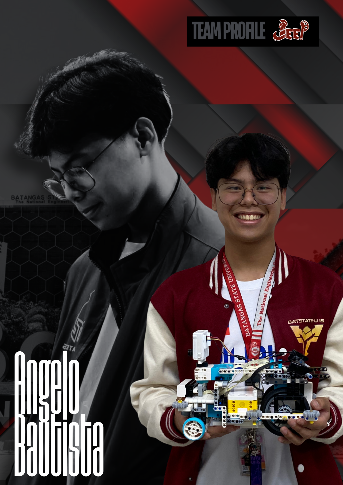 | Angelo is a Grade 12 student at Batangas State University - The National Engineering University - Integrated School and is currently 18 years old. This year marks his third time participating in the World Robot Olympiad (WRO) and his second time in the Future Engineers category. Drawing from his previous experiences, he ensures that the robot is built with consideration to its efficiency and functionality, making him a key pillar of the team. |

| <center> **Airvin James L. Medina** |  |
|----------------------------| ------ |
| 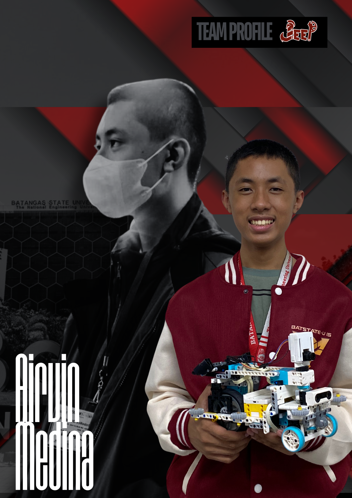 | Airvin is stepping into his first journey at World Robot Olympiad this year. At 15 years old, this Grade 10 student has shown a remarkable interest in robotics and programming. His enthusiasm for solving problems and thinking critically allow him to develop and troubleshoot codes effectively, bringing the robot’s function to life. |

| <center> **Cshenizylle Nicole M. Ligayada** </center> |  |
|------------------------------------| ------ |
| 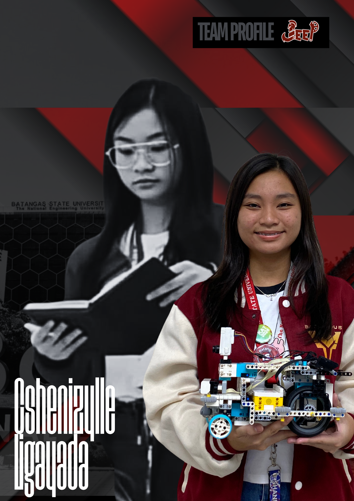 | Cshenizylle is a 16-year-old Grade 11 student at Batangas State University - The National Engineering University - Integrated School who is also participating in the World Robot Olympiad for the first time. With a strong interest in research and writing, she takes on the role of documenting the team’s engineering journey. She looks forward to gaining new experiences and growing alongside her teammates. |

</center>

> The following pictures feature the members of J.E.E.P. (BatStateU-IS) participating in the Future Engineers category along with their robot.

|  |  |
|:---------------------:|:---------------------:|

**Team Members (Left to Right):**  
- **Airvin James L. Medina**, 15  
- **Cshenizylle Nicole M. Ligayada**, 16  
- **John Angelo M. Bautista**, 18

---

## 🤖 Robot Specifications

&nbsp;&nbsp;&nbsp;&nbsp;&nbsp;&nbsp;&nbsp;&nbsp;&nbsp;&nbsp;The team, J.E.E.P., introduces a self-driving robot that is developed for the 2025 World Robot Olympiad International Finals, under the Future Engineers category. This robot represents the team's vision of combining creativity and technical skill to design a robot capable of autonomous navigation and real-time decision-making. Through teamwork, perseverance, and continuous improvement that has shaped the robot's development, it was ensured that this was carefully engineered to meet the demands of the competition. 

&nbsp;&nbsp;&nbsp;&nbsp;&nbsp;&nbsp;&nbsp;&nbsp;&nbsp;&nbsp;The following specifications provide a detailed overview of the key physical and mechanical characteristics of the team’s self-driving robot. This was designed while giving importance to precision, agility, and durability, so the features of the robot have been carefully optimized to balance speed and stability during runs. 

<center>

**Table 1\. Robot Specifications**
  
| <center>Specification</center> | <center> Details </center> |
| ----- | ----- |
| Dimensions | 300 mm (L) x 150 mm (W) x 193 mm (H)  |
| Weight | 913.79 g |
| Maximum Speed | 837.6 mm/s |
| Maximum Steering Angle | + 45° and -49° |
| Steering Torque | 100 Ncm |
| Operating Voltage | 8.3V – 7.6V |
| Drive System | Rear-Wheel Drive (RWD) |
| Steering Geometry | Parallel Steering |
| Material | LEGO® Technic™ and PLA Filament |

</center>

 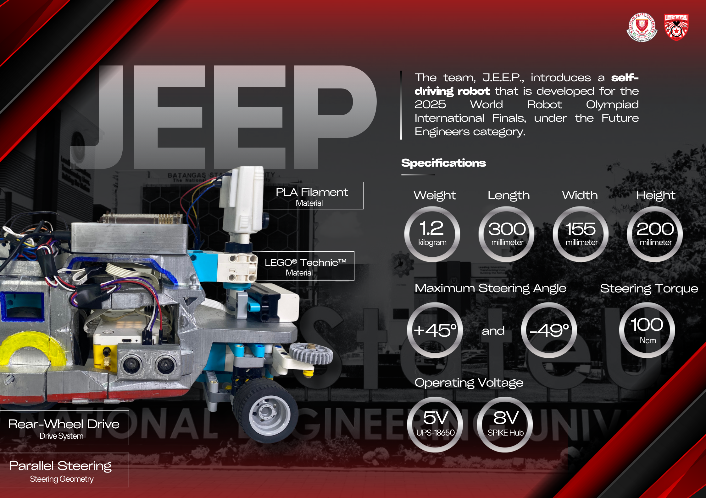

</center>

&nbsp;&nbsp;&nbsp;&nbsp;&nbsp;&nbsp;&nbsp;&nbsp;&nbsp;&nbsp;Additionally, the team’s selection of materials and electronic components is intended to create a rigid yet lightweight robot platform, designed to deliver both reliable and consistent performance. The list of the main components and its corresponding description presented in the table below emphasize these critical design choices and technical details that enhance the robot’s overall functionality. 

<center>

**Table 2\. Main Components**

| <center> Components </center> | <center>Quantity</center> | <center>Description</center> |
| :---: | :---: | ----- |
| 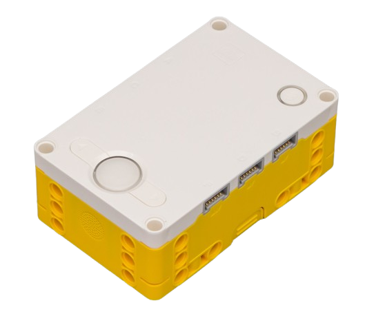 | 1 | The **Technic™ Large Hub** was chosen as the main controller because it can connect to multiple sensors and motors. Its support for Python-based programming made it easier to create accurate and flexible control systems for navigation and obstacle avoidance [[1]](#ref1). |
| 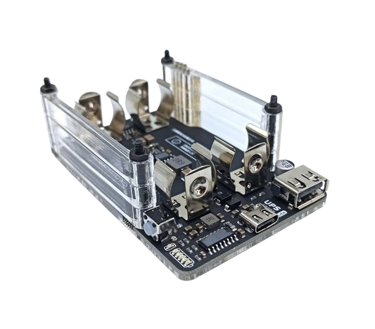 | 1 | The **Raspberry pi UPS-18650 Battery** provides a stable 5 V regulated power supply for the LMS-ESP32, ensuring continuous operation during power fluctuations. It includes built-in protections against over-charge, over-discharge, over-current, and short circuits, making it a reliable and safe power source for the system [[2]](#ref2). |
| 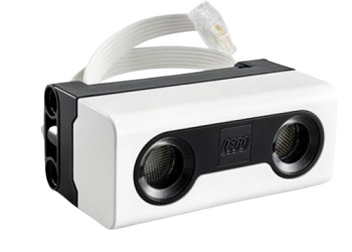 | 1 | The **Technic™ Distance Sensors** were used to measure how far the robot is from nearby walls. It helped the robot avoid collisions by detecting obstacles in front and behind the path of the robot and triggering turning or straight movements based on the distance detected. |
| 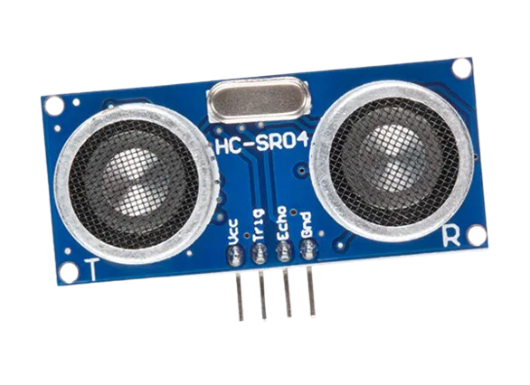| 3 | The **HC-SR04 Ultrasonic Distance Sensors** were added around the robot to allow for navigation in handling wall obstacles around the game field in the Open Challenge round. Meanwhile, it was used to provide vision for the robot to efficiently perform parallel parking without collisions with the parking walls in the Obstacle Challenge round. |
| 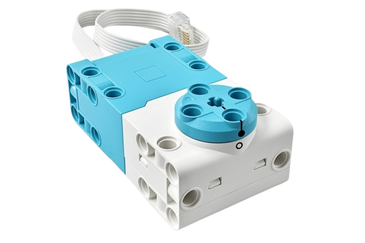  | 3 | The **Technic™ Large Angular Motor** is used to turn the steering wheel and drive the robot. Additionally, it controls the rotation of the distance sensor and camera, enabling the robot to scan its environment from different angles for obstacle detection and navigation. |
| 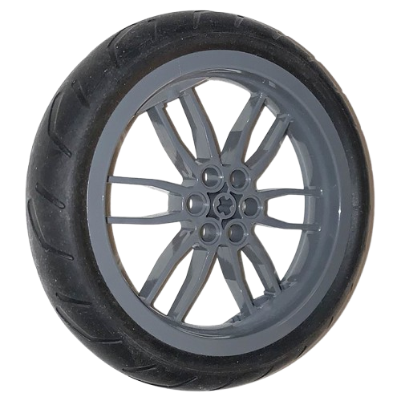  | 2 | The **LEGO® Wheel 75 mm x 17mm with Motorcycle Tire 94.2 mm x 20 mm** is connected to one of the Large Angular Motors, providing stability for the robot. This setup ensures smooth and controlled movement as the motor powers the wheel to drive the robot forward and backward. |
| 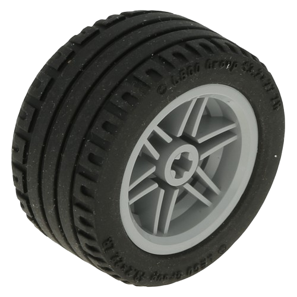 | 2 | The **LEGO® Wheel 30.4 mm D. x 20 mm with Black Tire 43.2 mm x 22 mm** is used as the steering wheel for the robot. It is connected to the Large Angular Motor, allowing the robot to make precise and smooth turns for better control during movement. |
| 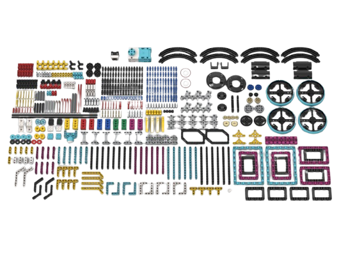 | Multiple pieces were used | **LEGO® Technic™ Elements** such as beams, axles, gears, and multiple connectors were utilized to construct the steering and driving mechanism of the robot. Their precision, modularity, and durability makes them ideal for creating mechanically reliable structures while allowing easy integration with other electronic components.  |
| 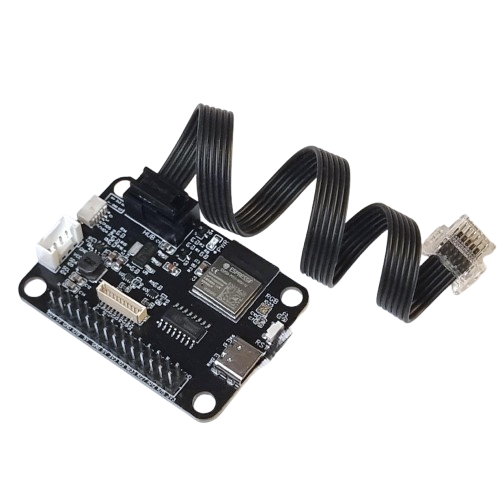| 1 | The **LMS-ESP32** serves as an interface module between the Arduino ultrasonic sensors and the SPIKE™ Prime Hub, managing serial communication and data transfer. It ensures synchronized, low-latency transmission of distance readings to the main controller for accurate obstacle detection and responsive movement control. |
| 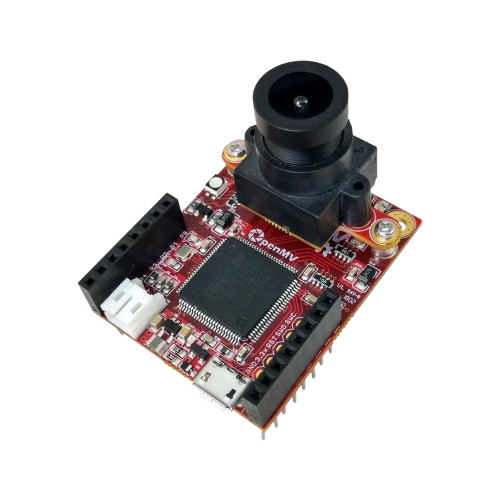| 1 | The **OpenMV Cam H7 Plus** was used as the robot’s vision system to detect traffic signs and understand its surroundings. It processed images in real time and sent data to the main controller, helping the robot decide when to turn or react to visual cues during the Obstacle Challenge. |
| 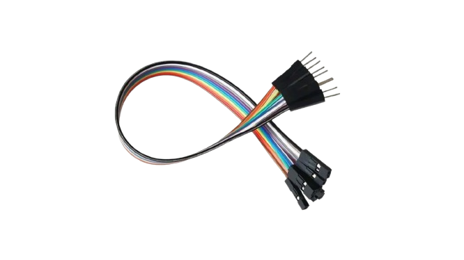 | Multiple pieces were used | **Jumper wires** were used to connect the OpenMV Cam H7 to the main controller, the SPIKE™ Prime Hub. They ensured that the data processed by the camera was transmitted to the Python-based program running on the hub.  |
| 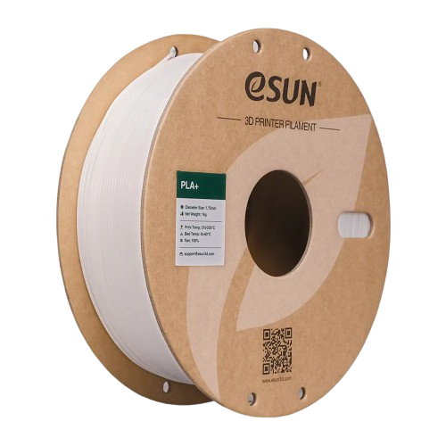 | Multiple were used | **PLA 3D Printing Filament** was utilized to create the 3D-printed components of the robot, sepcifically the chassis, and the cases for the OpenMV Cam H7 Plus, HC-SR04 Ultrasonic Distance Sensors, UPS-18650 Power Module, and LMS-ESP32. White filaments are said to produce designs with great strength [[3]](#ref3). PLA filament is also popular in 3D printing because of its ease of use, biodegradability, and versatility [[4]](#ref4).  |

</center>

---

## 1. ⚙️ Mobility Management

&nbsp;&nbsp;&nbsp;&nbsp;&nbsp;&nbsp;&nbsp;&nbsp;&nbsp;&nbsp;This section will highlight the important aspects of the hardware system that constitutes the mobility and movement specifications of the self-driving robot developed. This includes the reasons behind the selection of the drive system, steering mechanism, wheels, motor, and their respective placements, which all play a vital role in ensuring the robot moves smoothly, accurately, and reliably throughout the challenges. 

### 1.1. Motor Selection

&nbsp;&nbsp;&nbsp;&nbsp;&nbsp;&nbsp;&nbsp;&nbsp;&nbsp;&nbsp;One of the most important things considered to enhance the maneuverability of the self-driving robot is to properly select motors that meet the requirements needed for the Open Challenge and Obstacle Challenge. Within the LEGO® Education SPIKE™ Prime Set, there are two primary motor options to choose from: the Medium Angular Motor and the Large Angular Motor. To determine the most suitable motor, key specifications such as speed (RPM), torque (rotational force), connectivity, and the intended application in the design were evaluated. 

<center>

**Table 3\. Comparison of Motors**

| Specifications  7.2V power supply | Technic™ Large  Angular Motor | Technic™ Medium  Angular Motor |
| ----- | ----- | ----- |
| Voltage Range | Min: 5V and Max: 9V | Min: 5V and Max: 9V |
| Speed<sup>1</sup> (RPM) | 135 RPM to 175 RPM | 135 RPM to 185 RPM |
| Torque<sup>2</sup> (Ncm) | 8 Ncm to 25 Ncm | 3.5 Ncm to 18 Ncm  |
| Connectivity | Attachments on either side | Attachments to the front only |
| Applications | High-power, high-torque applications | Lower-load, fast-response applications |

<sup>1</sup> ***RPM*** = rotations per minute  
<sup>2</sup> ***Ncm*** = newton centimeter&nbsp;&nbsp;&nbsp;

---

</center>

&nbsp;&nbsp;&nbsp;&nbsp;&nbsp;&nbsp;&nbsp;&nbsp;&nbsp;&nbsp;Table 3 shows the difference between the large motor and medium motor in terms of different specifications, with all performance data being based on a <b>7.2V power supply</b>. The Technic™ Medium Motor, while more small and lightweight, offers faster rotation speeds but lower torque [[5]](#ref5). This makes it ideal for lightweight mechanisms, low-profile design with limited space or tasks requiring quick response but low-resistance motion. In addition to wheels, it is ideal for driving attachments like arms, lifts, or actuators on robots. However, for driving the entire robot, where it must carry multiple components, handle tight turns, and maintain stability over long distances, more torque and control are required. This makes the <b>Large Motor</b> more appropriate for its strength and ability to handle resistance. 

&nbsp;&nbsp;&nbsp;&nbsp;&nbsp;&nbsp;&nbsp;&nbsp;&nbsp;&nbsp;After comparing both options, the team decided to integrate the Technic™ Large Angular Motor for the robot’s driving and steering system. This features a built-in advanced Rotation Sensor that can report speed, angle changes, and absolute position within a range of -180° to +180° [[6]](#ref6). It can also sense direct user input or manual rotation which allows responsive input during calibration or testing. While powered by a 7.2V system, the motor can achieve a torque of 25 Ncm at stall, and performs most efficiently at 8 Ncm with 135 RPM. Its speed with no load reaches up to 175 RPM. Its sensor offers a resolution of 360 counts per revolution, an accuracy that is less than or equal to ±3 degrees, and a fast update rate of 100 Hz for real-time feedback [[7]](#ref7). In terms of design, the motor has a Technic build geometry and includes a 250 mm LEGO® Power Functions 2.0 (LPF2) cable and dual crosshole outputs, making it easy to integrate securely into complex builds [[7]](#ref7). 

&nbsp;&nbsp;&nbsp;&nbsp;&nbsp;&nbsp;&nbsp;&nbsp;&nbsp;&nbsp;Overall, it provides higher torque which is essential for maintaining a consistent speed while carrying the weight of the hub, sensors, camera, LEGO, and 3D-printed components. This motor also offers smoother acceleration and deceleration, and more responsive driving system, helping the robot to maintain its stability when turning. Thus, three Technic™ Large Angular Motor were utilized in the self-driving robot, with the first one being connected to the steering wheel, second for the drive system, and the third motor for the rotating camera and distance sensor. 

### 1.2. Steering and Driving Mechanism

&nbsp;&nbsp;&nbsp;&nbsp;&nbsp;&nbsp;&nbsp;&nbsp;&nbsp;&nbsp;After carefully evaluating several options, the team decided to use a rear-wheel drive (RWD) system combined with a parallel steering mechanism. This combination closely resembles the movement of a real car, which can provide consistent and reliable results.

<center>

| 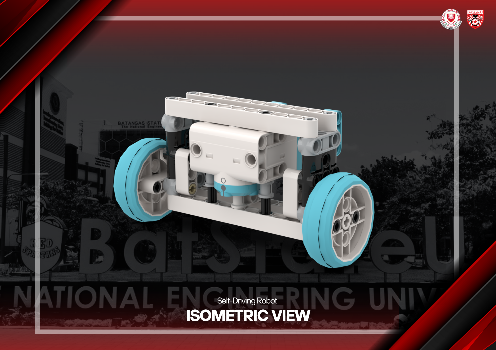 | 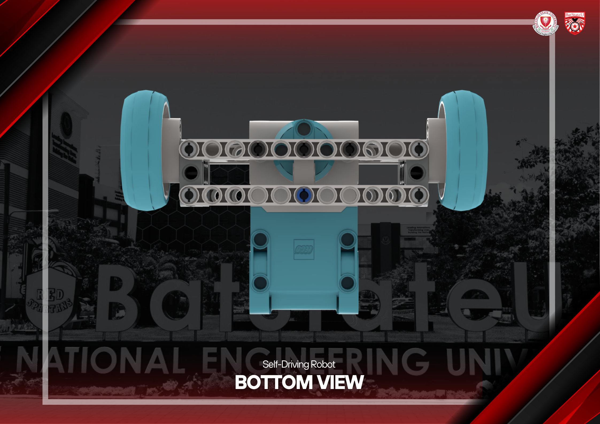 |
|:---------------------:|:---------------------:|
| Figure 1. Robot's Steering Mechanism <br> Isometric View | Figure 2. Robot's Steering Mechanism <br> Bottom View |

| 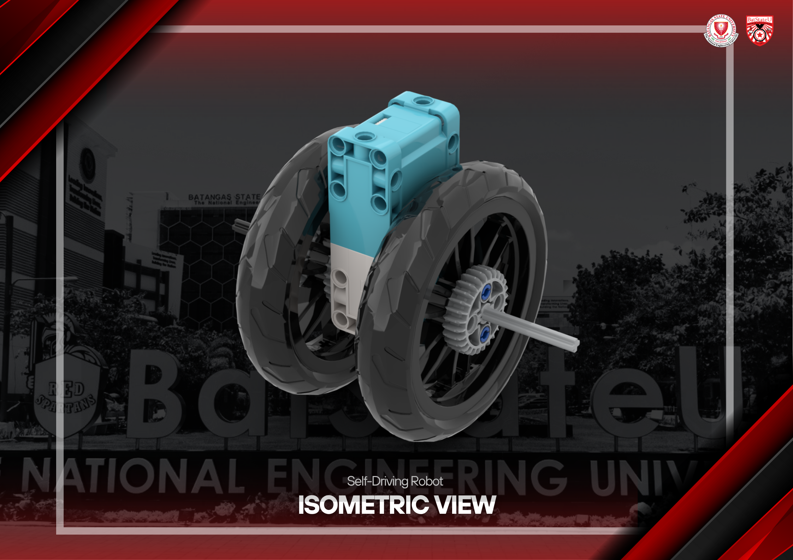 |  |
|:---------------------:|:---------------------:|
| Figure 3. Robot's Driving Mechanism <br> Isometric View | Figure 4. Robot's Driving Mechanism <br> Rear View |

</center>

&nbsp;&nbsp;&nbsp;&nbsp;&nbsp;&nbsp;&nbsp;&nbsp;&nbsp;&nbsp;For the robot’s steering mechanism, one Technic™ Large Angular Motor is integrated at the front of the self-driving robot to steer the front wheels, where they turn in the same direction at the same angle. This method is referred to as parallel steering and is similar to how steering works in real cars. The steering geometry selected was the <b>Parallel Steering</b>, rather than Differential Steering, where one wheel moves faster than the other in order to turn; Ackermann, in which the inner wheel turns at a greater angle than the outer wheel, as well as the counterpart of Ackermann, Anti-Ackermann [[8]](#ref8). It offers simplicity compared to other options that are more complex to build and control. Furthermore, both the Open and Obstacle Challenge requires maneuverability; thus, the smaller turning radius offered by parallel steering is advantageous especially for tight spaces like parking. This steering geometry also solves the problem with an uneven and irregular field as it improves the stability and handling of movement and turns of the self-driving robot. 

&nbsp;&nbsp;&nbsp;&nbsp;&nbsp;&nbsp;&nbsp;&nbsp;&nbsp;&nbsp;Consequently, <b>rear-wheel drive (RWD)</b> was selected because it provides better traction, especially when the robot needs to travel consistently [[9]](#ref9). The team also believes that RWD is better than front-wheel drive (FWD), which can make the robot harder to balance, especially when it needs to carry sensors and components at the front.  

&nbsp;&nbsp;&nbsp;&nbsp;&nbsp;&nbsp;&nbsp;&nbsp;&nbsp;&nbsp;In the drive system, differential gear was intially considered since it helps balance wheel speed during turns and provides smoother movement. However, the team decided not to include it because of the uneven surface problem of the practice field. Consequently, a differential requires flat, consistent traction to function properly.  And on an uneven ground, it could cause one wheel to lose contact and reduce stability. Instead, a direct drive setup was used where each wheel is powered by its own motor. This made the robot more stable and easier to control, especially when turning or driving over small bumps. It also simplified the design and reduced weight, making the robot more reliable during runs.  

&nbsp;&nbsp;&nbsp;&nbsp;&nbsp;&nbsp;&nbsp;&nbsp;&nbsp;&nbsp;By combining RWD and parallel steering, the team achieved a movement system that was both stable and precise. The rear wheels provided consistent driving force, while the front wheels helped for smooth turning without affecting the robot's balance. This setup made it easier for the robot to navigate around tight corners and spaces, maintain alignment, and avoid obstacles effectively. 

### 1.3. Mechanical Design

&nbsp;&nbsp;&nbsp;&nbsp;&nbsp;&nbsp;&nbsp;&nbsp;&nbsp;&nbsp;The structure of the self-driving robot is made mostly out of PLA Filament that were 3D-printed based on the teams own preference, with a combination of LEGO® Technic™ elements. The mechanical design, as shown resembles the well-known and traditional vehicle used by commuters in the Philippines on a daily basis, which is the Jeepney. Aside from being just a vehicle, it's also the country's identity, serving a huge part in preserving the essential traditions and culture of the Philippines. The reason behind using this as the team's inspiration lies in the team's triumph in the national stage, which lead to an opportunity to represent the Philippines in the global stage. Additionally, this vehicle also holds an immense value as it plays a big part in the team's journey; the vehicle that drove the members back and forth from home to training grounds.  

&nbsp;&nbsp;&nbsp;&nbsp;&nbsp;&nbsp;&nbsp;&nbsp;&nbsp;&nbsp;Building on previous year’s experience, where the robot was constructed solely from LEGO® Technic™ parts, it was recognized to give importance on integrating engineering principles with creativity and innovation. For the international stage of the competition, the design was enhanced by incorporating custom 3D-printed components that extend beyond the chassis, resulting in a more functional and distinctive build. For example, instead of using LEGO-based camera and sensor enclosures, custom cases were designed and printed, which allows secure yet removable mounting of these modules, and offers something new, but still efficient, functional, and reliable for the robot. 

&nbsp;&nbsp;&nbsp;&nbsp;&nbsp;&nbsp;&nbsp;&nbsp;&nbsp;&nbsp;These design choices highlight the team’s growing proficiency in applying mechanical design concepts and engineering problem-solving to create practical yet original solutions. Further discussions and technical details about the 3D-printed components and engineering factors are provided in Chapter 5. [Engineering Factor](#7--engineering-factor)

| 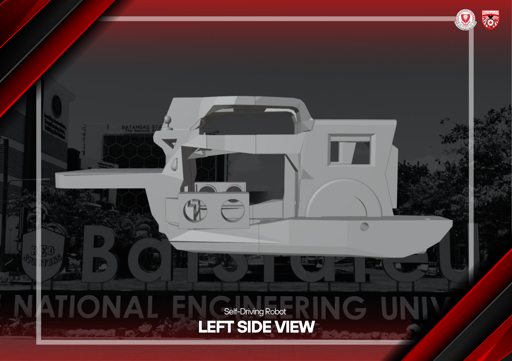 | 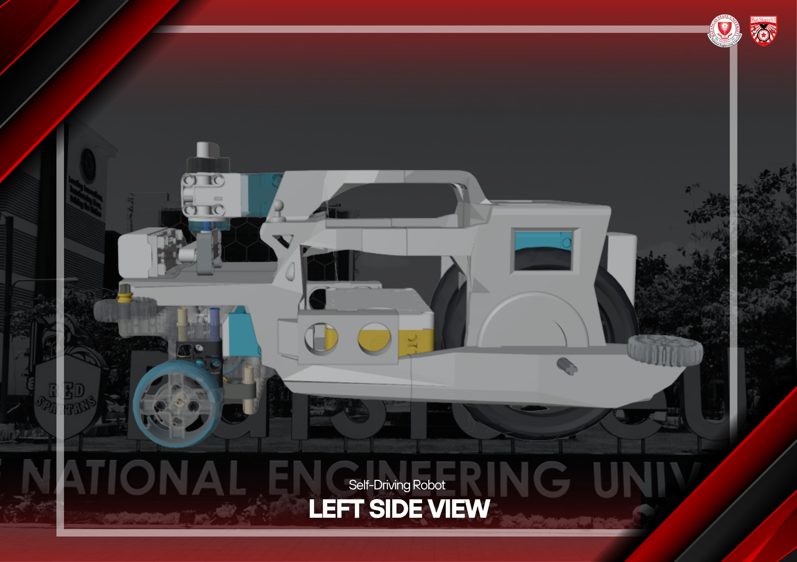 |
|:---------------------:|:---------------------:|
| Figure 5. <br> Robot Chassis <br> Left Side View | Figure 6. <br> Robot Chassis with LEGO® Components <br> Left Side View |

&nbsp;&nbsp;&nbsp;&nbsp;&nbsp;&nbsp;&nbsp;&nbsp;&nbsp;&nbsp;Additionally, the length of the robot is built to be longer, given that while the length of the robot increases, the larger the space will be intended for the parking area. Two different materials for the robot's wheels were utilized: the LEGO® Wheel 75 mm x 17 mm with Motorcycle Tire 94.2 mm x 20 mm and LEGO® Wheel 30.4 mm D. x 20 mm with Black Tire 43.2 mm x 22 mm, which handles the driving and steering mechanism, respectively. The large wheels were used for the rear-wheel drive system since a larger wheel has a larger circumference, and thus, have the ability to travel longer distances per rotation. It also increases the maximum speed limit a robot can travel per unit of time. Consequently, smaller wheels were utilized for the steering mechanism since they have a smaller turning radius, which makes it easier for the robot to handle tight turns in navigating obstacles, corners, and small spaces. Moreover, larger wheels cannot be used at the front part of the robot as these can block the view of the distance sensor, disabling the sensor to detect objects properly and accurately. The LEGO® Wheel with Black Tire also offer larger surface contact with more precision and finer control, preventing slips that makes the robot’s movement smooth and quick.  

<center>

|  |
|:---------------------:|
| Figure 7. <br> Robot's Wheels <br> Front View and Rear View

</center>

&nbsp;&nbsp;&nbsp;&nbsp;&nbsp;&nbsp;&nbsp;&nbsp;&nbsp;&nbsp;In designing the robot, close attention was paid to weight distribution, since it directly affects stability, traction, and turning accuracy. During the early testing, noable problems were recognized, such as uneven weight, especially when heavier components were placed toward the back. This made the robot tilt slightly during acceleration. To address this, we carefully rearranged the internal components to achieve a more balanced setup.

&nbsp;&nbsp;&nbsp;&nbsp;&nbsp;&nbsp;&nbsp;&nbsp;&nbsp;&nbsp;The UPS-18650 power module and Technic™ Large Hub were positioned near the center of the chassis to lower the robot’s center of gravity, improving balance and reducing unstability when moving or turning. The Technic™ Distance Sensor and OpenMV Cam H7 Plus were mounted at the front, while the LMS-ESP32 and motors provided counterweight at the rear. This distribution helped maintain equal traction between the front and back wheels, making the robot more stable during sharp turns and obstacle navigation.

<center>

| 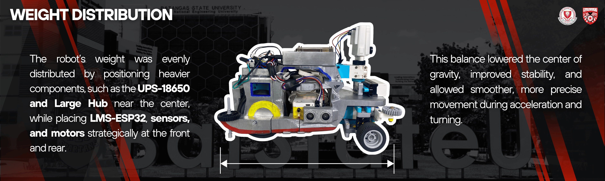 |
|:---------------------:|
| Figure 8. <br> Robot's Weight Distribution <br>

</center>

&nbsp;&nbsp;&nbsp;&nbsp;&nbsp;&nbsp;&nbsp;&nbsp;&nbsp;&nbsp;By ensuring that the weight was spread evenly, the robot achieved smoother motion, faster acceleration, and improved precision when aligning or parking. This optimization not only enhanced performance but also extended motor efficiency, since less torque was wasted compensating for imbalance. Overall, the refined weight distribution played a crucial role in achieving consistent and reliable movement across all challenges. 

---

## 2. 🔋 Power, Microcontroller, and Sense Management

&nbsp;&nbsp;&nbsp;&nbsp;&nbsp;&nbsp;&nbsp;&nbsp;&nbsp;&nbsp;The performance of the self-driving robot relies heavily on the integration of electrical components and the development of programs. Mainly developed with Python programming language, the robot was structured to carry out specific tasks for both the Open Challenge and Obstacle Challenge of the Future Engineers category. This section will discuss the elements that power, store data, and control the robot, including the power source, sensors, microcontrollers, and its vision system. Each component that constitutes the robot was carefully selected and evaluated based on the specifications that meets the demand for ensuring real-time responsiveness, accuracy, and reliability during autonomous navigation and handling of obstacles.  

### 2.1. Power Management

&nbsp;&nbsp;&nbsp;&nbsp;&nbsp;&nbsp;&nbsp;&nbsp;&nbsp;&nbsp;A reliable power source is essential for the consistent and uninterrupted performance of the robot. In managing and choosing the right power system, it was ensured that all electrical components, such as the sensors and motors, will receive stable and sufficient energy throughout countless testings. It is essentially what gives life to the robot. Consequently, this is the most important aspect to consider especially during competition runs to reduce risks of delays or power interruptions that could lead to performance issues. J.E.E.P.'s robot uses a rechargeable lithium-ion battery specifically designed for the SPIKE™ Prime Large Hub. This battery provides the necessary voltage and current to support motor movements and sensor readings.  

<center>

|  |
|:---------------------:|
| Figure 9. <br> Power Management |

</center>

### 2.1.1. Technic™ Large Hub Rechargeable Battery

&nbsp;&nbsp;&nbsp;&nbsp;&nbsp;&nbsp;&nbsp;&nbsp;&nbsp;&nbsp;The Technic™ Large Hub Rechargeable Battery is the partner and intended power source for the SPIKE™ Prime Hub. It is a lithium-ion polymer (Li-ion) battery with a capacity of 2100 mAh at 7.3 volts that provides enough energy to power the hub, motors, and connected sensors during the operation of the self-driving robot [[10]](#ref10). This battery is designed with the perfect dimension and structure to fit securely inside the Technic™ Large Hub. One of its main advantages is that it can be charged directly while it is inside the hub via a standard micro USB cable. This way, there is no need for the battery to be removed during charging. However, when needed, the battery can also be removed easily without using any mechanical tools, which makes maintenance quick and easy for everyone to do. 

<center>

**Table 4\. Technic™ Large Hub Rechargeable Battery**

| Specification | Description |
| ----- | ----- |
| Operating Voltage | 7.3 V DC (Rechargeable Li-ion Battery)| 
| Charging Interface | micro USB cable | 
| Lifetime | >500 cycles |
| Storage lifetime | one year after production, then it needs to be recharged | 

</center>

<center>

| 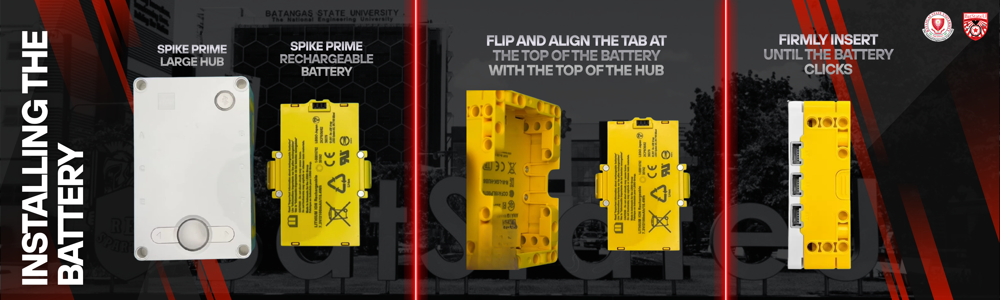 |
|:---------------------:|
| Figure 10. <br> Installing Technic™ Large Hub Rechargeable Battery

</center>

&nbsp;&nbsp;&nbsp;&nbsp;&nbsp;&nbsp;&nbsp;&nbsp;&nbsp;&nbsp;Shown above are the steps one must follow in order to install the battery to the hub. Consequently, the battery is built for durability, with a minimum lifespan of over 500 charge cycles. After 500 full charge/discharge cycles, it is expected to retain at least 30% of its original capacity, making it reliable for long-term use [[10]](#ref10). This rechargeable battery supports the robot’s need for consistent and portable power, which is essential for everal autonomous tasks that the robot is programmed to do during both the Open and Obstacle Challenge rounds. Its high energy capacity, ease of use, and compatibility with the SPIKE™ system make it a critical component of the robot's electronics and system. 

### 2.1.2. Raspberry pi UPS-18650 Battery

&nbsp;&nbsp;&nbsp;&nbsp;&nbsp;&nbsp;&nbsp;&nbsp;&nbsp;&nbsp;The Raspberry pi UPS-18650 Battery functions as a regulated power source for the robot’s auxiliary electronic systems, specifically supplying a stable 5 V DC output to the LMS-ESP32 microcontroller. The module is mounted inside a custom 3D-printed case, ensuring it is securely positioned while keeping the wiring organized and easy to access. The module holds two 18650 lithium-ion batteries, which provide a regulated 5 V output through its built-in boost converter [[2]](#ref2). This output is connected to the LMS-ESP32 using a USB cable, allowing the microcontroller to receive clean and consistent power even during high motor loads.  

<center>

**Table 5\. Raspberry pi UPS-18650 Battery**

| Specification | Description |
| ----- | ----- |
| Model | UPS 18650 Power Extension Board | 
| Input Voltage | 5 V DC | 
| Output Voltage | 5 V DC regulated | 
| Battery Type | Supports 1–2 × 18650 Li-ion cells (removable) |
| Charging Current | Max 1 A (5 V input) |
| Measurement Accuracy | Battery output percentage error ±1%; voltage measurement error ±3 mV | 

</center>

| 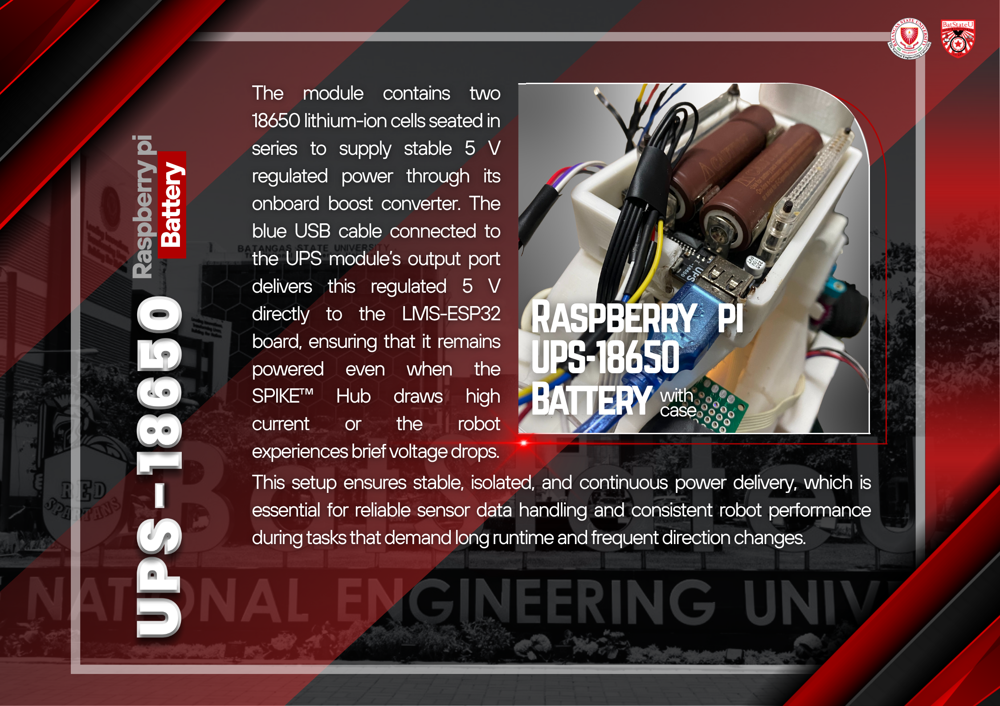 | 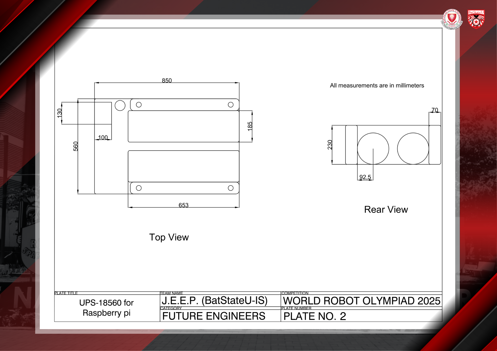 |
|:---------------------:|:---------------------:|
| Figure 11. <br> Raspberry pi UPS-18650 Battery | Figure 12. <br> Raspberry pi UPS-18650 Battery <br> Dimensions |

&nbsp;&nbsp;&nbsp;&nbsp;&nbsp;&nbsp;&nbsp;&nbsp;&nbsp;&nbsp;During early testing, it was noticed that power drops from the main hub caused the ESP32 to reset, disrupting communication. To solve this, the team decided to power the LMS-ESP32 independently using the UPS-18650. This setup worked effectively—the module automatically switches between external power and battery mode, so the ESP32 remains on at all times. Its built-in protection circuits against over-charge, over-discharge, and short circuits also ensured that the system is safe and reliable. 

&nbsp;&nbsp;&nbsp;&nbsp;&nbsp;&nbsp;&nbsp;&nbsp;&nbsp;&nbsp;Furthermore, in accordance with the Future Engineers Rulebook, which specifies that the robot must utilize only one main power button for activation, the system was designed so that the SPIKE™ Prime Hub’s power button simultaneously powers the UPS-18650 module and the LMS-ESP32. This combined power management approach ensures a synchronized startup and shutdown across all electronic subsystems, preventing inconsistent power status or data transmission errors. Discussed at Section 7. Engineering Factor is the wiring diagram, detailing how the UPS-18650, LMS-ESP32, and SPIKE™ Prime Hub are interconnected, showing the power delivery path and serial communication interface integrated into the robot’s electrical architecture. 

### 2.2. Microcontroller Management
&nbsp;&nbsp;&nbsp;&nbsp;&nbsp;&nbsp;&nbsp;&nbsp;&nbsp;&nbsp;The microcontroller management system ensures that there is seamless coordination between the robot’s controllers and connected electronic components to enable efficient prcoessing of data and real-time decision-making. Specifically, the SPIKE™ Prime Hub serves as the main controller that handles decision-making within the robot and commands for movements it should perform, while the LMS-ESP32 module functions as an interface for external sensors through serial communication. Powered by the UPS-18650 module and SPIKE™ Prime Hub Rechargeable Battery, this setup is tested to provide stable regulation of voltage and uninterrupted operation. Together, these critical controllers manage data flow and maintain synchronization, ensuring that the robot operates smoothly and responds accurately in coordination to the environment it sees.

<center>

|  |
|:---------------------:|
| Figure 13. <br> Microcontroller Management

</center> 

### 2.2.1. Technic™ Prime Large Hub

&nbsp;&nbsp;&nbsp;&nbsp;&nbsp;&nbsp;&nbsp;&nbsp;&nbsp;&nbsp;The SPIKE™ Prime Technic™ Large Hub is the main controller of our self-driving robot. It is a programmable control unit that connects to LEGO® motors and sensors through six input/output (I/O) ports, labeled A to F. These ports allow the hub to power motors, read sensor values, and control various functions of the robot [[1]](#ref1), [[11]](#ref11). 

<center>

| 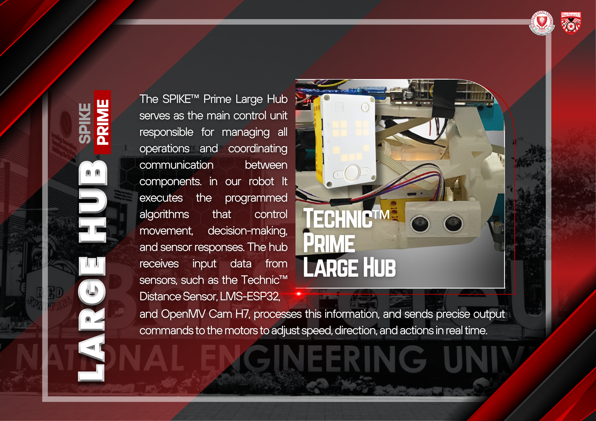 | 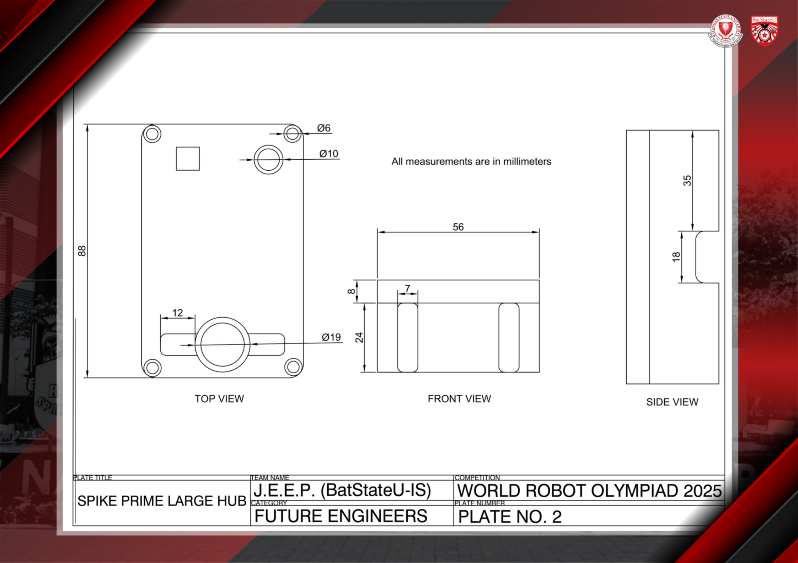 |
|:---------------------:|:---------------------:|
| Figure 14. <br> Technic™ Prime Large Hub | Figure 15. <br> Technic™ Prime Large Hub <br> Dimensions |

</center>

&nbsp;&nbsp;&nbsp;&nbsp;&nbsp;&nbsp;&nbsp;&nbsp;&nbsp;&nbsp;The hub runs on a MicroPython operating system, allowing to write and execute advanced programs using Python. It features a built-in 6-axis Gyro Sensor with three-axis accelerometer and three-axis gyroscope that helps the robot detect rotation, orientation, and motion [[11]](#ref11). This is especially useful for tracking turns and maintaining direction during navigation. 

<center>

**Table 6\. Technic™ Prime Large Hub**

| Specification | Description |
| ----- | ----- |
| Input/Output Ports | 6 LPF2 ports (A–F) for motors and sensors | 
| Built-in Sensors | 6-axis gyro and accelerometer |
| Memory | 32 MB |
| Processor | 100MHz M4 320 KB RAM 1M FLASH |
| Display | 5 × 5 LED matrix | 
| Buttons | Central button and directional navigation keys |
| Communication Interface | USB, Bluetooth Classic 4.2 (BTC), and Bluetooth Low Energy (BLE) |
| Operating Voltage | Battery output percentage error ±1%; voltage measurement error ±3 mV | 

</center>

&nbsp;&nbsp;&nbsp;&nbsp;&nbsp;&nbsp;&nbsp;&nbsp;&nbsp;&nbsp;Physically, the hub includes a 5x5 LED matrix display, a three-button interface consisting of center, left, and right, and a speaker for feedback sounds. It supports both USB and Bluetooth connectivity, with Bluetooth 4.2 used for wireless communication and firmware updates. A rechargeable lithium-ion battery powers the hub, and it can be charged directly via a micro USB cable [[11]](#ref11). 

&nbsp;&nbsp;&nbsp;&nbsp;&nbsp;&nbsp;&nbsp;&nbsp;&nbsp;&nbsp;With its compact size of 88.0 mm x 56.0 mm x 32.0 mm and compatibility with LEGO® Technic™ building elements, the SPIKE™ Large Hub is ideal for building smart and responsive robots like our self-driving robot. It provides 32 MB memory which is enough for programs and data, as well as a processing power of 100MHz M4 320 KB RAM 1M FLASH to support real-time decision-making and multitasking during both Open and Obstacle Challenge runs.  

### 2.2.2. LMS-ESP32 

&nbsp;&nbsp;&nbsp;&nbsp;&nbsp;&nbsp;&nbsp;&nbsp;&nbsp;&nbsp;The LMS-ESP32, also known as the Wi-Fi Python ESP32 Board for MINDSTORMS, is a MicroPython-based microcontroller specifically designed by Antons Mindstorms to extend the capabilities of LEGO® robotics systems such as SPIKE™ Prime, Robot Inventor, and EV3 [[12]](#ref12). Built on the Espressif ESP32 architecture, it combines a dual-core 32-bit LX6 processor with onboard Wi-Fi and Bluetooth (BLE) connectivity, allowing the robot to communicate wirelessly with other devices or cloud-based systems for data transfer and remote control. 

<center>

| 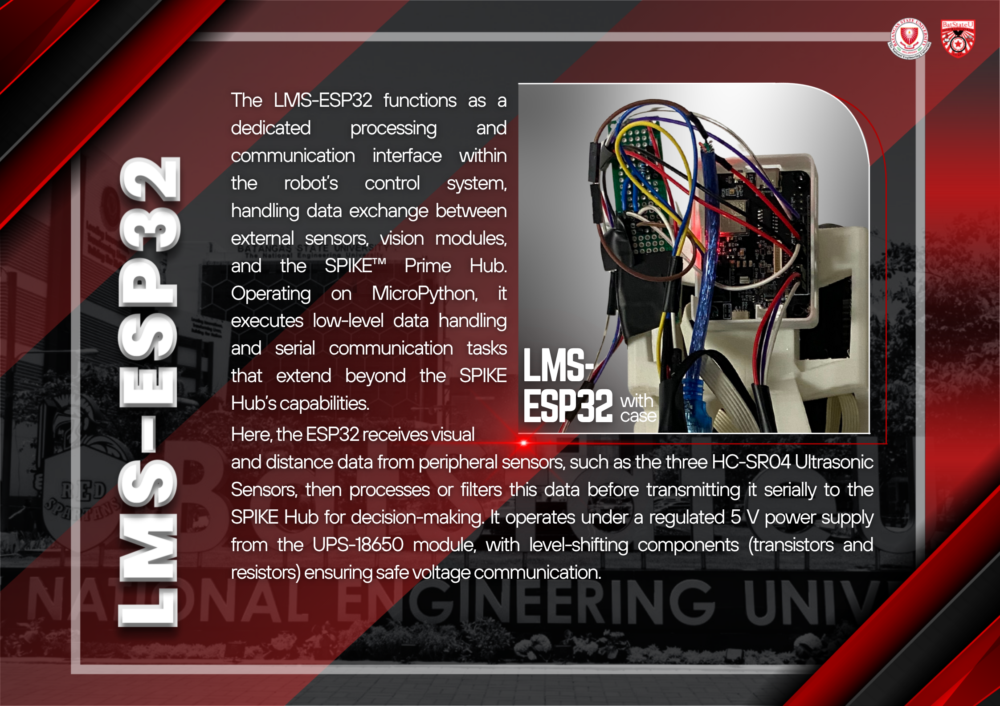 |  | 
|:---------------------:|:---------------------:|
| Figure 16. <br> LMS-ESP32  | Figure 17. <br> LMS-ESP32  <br> Dimensions |

</center>

<center>

**Table 7\. LMS-ESP32**

| Specification | Description |
| ----- | ----- |
| Processor | Dual-core Xtensa® 32-bit LX6 (ESP32 architecture) | 
| Clock Speed | up to 240 MHz |
| Operating Voltage | 3.3 V to 5 V DC |
| Communication Interface | UART Serial (for SPIKE™ / EV3 connection) |
| Programming Language | MicroPhyton |
| Memory | 520 KB SRAM + 4 MB Flash | 
| Compatibility | LEGO® SPIKE™ Prime, Robot Inventor, and EV3 systems |

</center>

&nbsp;&nbsp;&nbsp;&nbsp;&nbsp;&nbsp;&nbsp;&nbsp;&nbsp;&nbsp;The board supports MicroPython firmware, which enables flexible programming and faster data handling through lightweight scripts. It features a UART serial interface for communication with the SPIKE™ Prime Hub, allowing bidirectional data transfer for sensor readings and camera inputs. This communication setup allows the ESP32 to act as a co-processor, offloading data processing tasks, such as filtering and processing the values read by the ultrasonic sensor, before sending processed information back to the hub. 

&nbsp;&nbsp;&nbsp;&nbsp;&nbsp;&nbsp;&nbsp;&nbsp;&nbsp;&nbsp;Hardware-wise, the LMS-ESP32 includes dedicated LEGO®-compatible connectors for easy integration, a USB-C port for programming and power input, and a regulated 5 V – 3.3 V power converter that ensures compatibility with both standard LEGO voltage levels and external components [[12]](#ref12). The board also provides multiple GPIO pins, I²C, and SPI interfaces, allowing connection to third-party sensors or peripherals. 

&nbsp;&nbsp;&nbsp;&nbsp;&nbsp;&nbsp;&nbsp;&nbsp;&nbsp;&nbsp;In the robot’s system, the LMS-ESP32 is powered by the UPS-18650 module through a USB connection, ensuring a stable 5 V supply. The data scanned from connected sensors are processed by the ESP32 and then transmitted to the SPIKE™ Hub via the serial interface and communication, which was configured with transistors and resistors for proper voltage level shifting and protection. This setup also lessened the strain for the SPIKE™ Hub by minimizing the data it needs to load and control. 

&nbsp;&nbsp;&nbsp;&nbsp;&nbsp;&nbsp;&nbsp;&nbsp;&nbsp;&nbsp;On the software side, the LMS-ESP 32 continuously gathers distance data from the three (3) HC-SR04 ultrasonic sensors and transmits that data to the SPIKE™ Prime Hub using the same process used in [Traffic Sign Detection.](#41-traffic-sign-detection) This setup enables the ESP32 to function as a dedicated processing unit for the ultrasonic sensors. Since the SPIKE™ Prime Hub cannot directly interface with standard ultrasonic modules like the HC-SR04, the ESP32 handles the timing, signal processing, and distance calculation. It then transmits the processed data to the hub in a readable format, effectively bridging the sensors and the main controller.

```py
from machine import Pin, time_pulse_us
from pupremote import PUPRemoteSensor
import time

pr = PUPRemoteSensor(power=False)
pr.add_channel('line', 'hhh')
pr.process()

# --- Setup Ultrasonic Sensors ---
trig1 = Pin(21, Pin.OUT)
echo1 = Pin(22, Pin.IN)

trig2 = Pin(32, Pin.OUT)
echo2 = Pin(33, Pin.IN)

trig3 = Pin(26, Pin.OUT)
echo3 = Pin(27, Pin.IN)

# --- Distance Measurement Function (returns mm) ---
def getDistance(trig, echo):
    trig.value(0)
    time.sleep_us(2)
    trig.value(1)
    time.sleep_us(10)
    trig.value(0)

    try:
        duration = time_pulse_us(echo, 1, 800000)
        
        distanceMm = (duration / 2) / 2.91
        return int(distanceMm)
    except OSError:
        return -1

while True:
    distance1 = getDistance(trig1, echo1)
    distance2 = getDistance(trig2, echo2)
    distance3 = getDistance(trig3, echo3)

    print("Sensor1:", distance1, "mm | Sensor2:", distance2, "mm", "| Sensor3:", distance2, "mm")

    # Send data to SPIKE hub
    pr.update_channel('line', distance1, distance2, distance3)
    pr.process()

    time.sleep(0.05)
```

In this implementation, the program first initializes a PUPRemoteSensor instance, which serves as the communication interface between the LMS-ESP32 and the SPIKE™ Prime Hub. The line 
```py
pr.add_channel('line', 'hhh')
``` 
defines a communication channel named line that transmits three 16-bit integer values corresponding to the three ultrasonic distance readings.

Each sensor pair, consisting of a trigger (`trig`) and echo (`echo`) pin, is configured using the ```machine.Pin``` class. The trigger pin sends a short 10-microsecond pulse, while the echo pin measures the time taken for the reflected ultrasonic signal to return. This duration, obtained through the ```time_pulse_us()``` function, is then converted to distance in millimeters using the formula ```(duration / 2) / 2.91```, where **2.91** represents the approximate microseconds per millimeter for sound in air.

The main loop continuously measures the distances from all three sensors, prints the values for debugging purposes, and updates the communication channel using ```pr.update_channel()```. The ```pr.process()``` call ensures that the new data is transmitted immediately to the SPIKE™ Prime Hub. A short delay of **0.05 seconds** maintains a consistent update rate while preventing excessive CPU usage.

&nbsp;&nbsp;&nbsp;&nbsp;&nbsp;&nbsp;&nbsp;&nbsp;&nbsp;&nbsp;On the SPIKE™ Prime Hub side, the robot’s main control program is managed through the custom `FE` class, which handles all drive, steering, sensing, and communication logic. Within the class, the hub communicates with the LMS-ESP32 module through a wired serial connection using the `PUPRemoteHub` interface. This allows the hub to receive the ultrasonic distance data that the LMS-ESP32 gathers and processes.

In the constructor, the line:
```python
self.distSensorBack = PUPRemoteHub(distSensorB)
self.distSensorBack.add_command('line', 'hhh')
```

initializes a device interface connected to the port where the LMS-ESP32 module is wired. The command 'line' and format string 'hhh' define a structured data packet containing three 16-bit integer values—each corresponding to a distance reading from one of the three ultrasonic sensors connected to the LMS-ESP32. This design allows the hub to access all three distance measurements through a single communication call.

When the robot needs to retrieve the latest distance readings, it does so through the `getDistance()` method.

```python
def getDistance(self, selection):
    try:
        if selection == FRONT:
            return self.distSensor.distance()
        elif selection == LEFT:
            return self.distSensorBack.call("line")[0]
        elif selection == RIGHT:
            return self.distSensorBack.call("line")[1]
        else:
            return self.distSensorBack.call("line")[2]
    except:
        return 0
```

The `getDistance()` method retrieves distance readings from both the SPIKE™ Prime ultrasonic sensor and the external HC-SR04 ultrasonic modules.
It uses the selection argument to determine which sensor’s distance should be returned.

```python
elif selection == LEFT:
    return self.distSensorBack.call("line")[0]
```

Here, the call to `self.distSensorBack.call("line")` triggers a serial request to the ESP32, which responds with the most recent ultrasonic measurements. The hub then interprets the data and assigns each value to its corresponding directional reading.

### 2.3. Sense Management

&nbsp;&nbsp;&nbsp;&nbsp;&nbsp;&nbsp;&nbsp;&nbsp;&nbsp;&nbsp;The self-driving robot wouldn’t be in its form and purpose without its sensors and vision system. These components serve as the robot’s eyes, allowing it to perceive and respond to its surroundings with accuracy and intelligence. Through sensors such as the distance sensor and built-in gyro, the robot can detect objects, measure distances, identify the distance from both sides to decide its path or direction, and maintain orientation. Additionally, the integration of the OpenMV Cam H7 enables the robot to recognize traffic signs and make real-time decisions during navigation. The proper selection and programming of these sensing devices are critical to ensure that the robot’s performance will be reliable.  

<center>

|  |
|:---------------------:|
| Figure 18. <br> Robot’s Sensors and Vision System


</center>

### 2.3.1. Technic™ Distance Sensor

&nbsp;&nbsp;&nbsp;&nbsp;&nbsp;&nbsp;&nbsp;&nbsp;&nbsp;&nbsp;The Technic™ Distance Sensor serves as one of the core components of the robot, enabling precise navigation and obstacle detection. Utilizing Time-of-Flight (ToF) technology, the sensor measures the distance between itself and nearby objects with high accuracy. It is capable of detecting distances ranging from 50 to 2000 mm with an accuracy of ±20 mm, while faster sensing operations allow measurements from 50 to 300 mm with an improved accuracy of ±15 mm [[13]](#ref13). For a clearer understanding of its technical and mechanical specifications, visual aids are provided below to offer additional information about the distance sensor.  

<center>

| 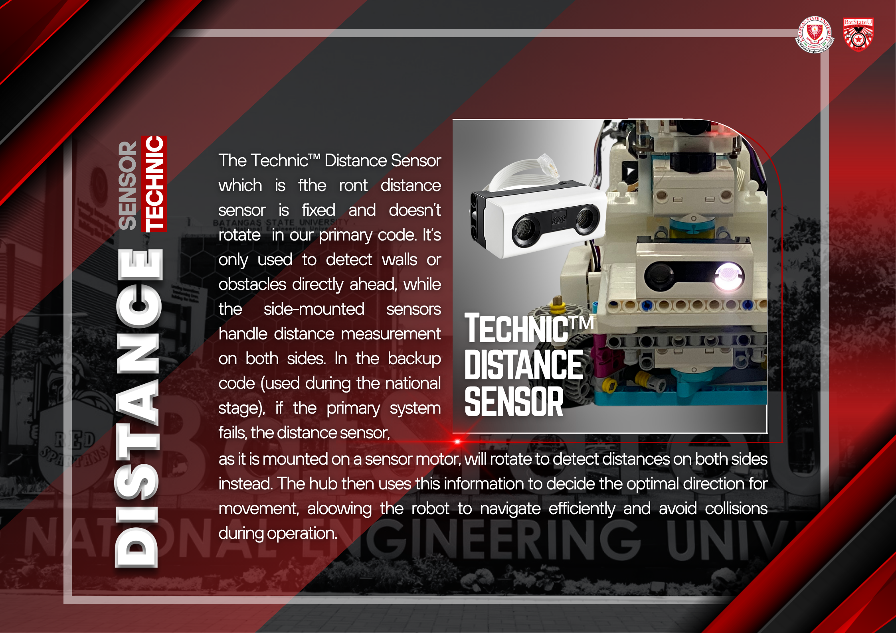 |  |
|:---------------------:|:---------------------:|
| Figure 19. <br> Robot’s Technic™ Distance Sensor | Figure 20. <br> Robot’s Technic™ Distance Sensor <br> Dimensions |

</center>

<center>

**Table 8\. Technic™ Distance Sensor**

| Specification | Description |
| ----- | ----- |
| Operating Voltage | 3.3 V | 
| Interface | LPF2 | 
| Detection Range | 4 cm – 200 cm |
| Measurement Accuracy | ±1 cm | 
| Field of View | ±15° | 
| Dimensions | 48 mm × 40 mm × 24 mm |

</center>

&nbsp;&nbsp;&nbsp;&nbsp;&nbsp;&nbsp;&nbsp;&nbsp;&nbsp;&nbsp;It emits high-frequency sound waves (ultrasound), which are inaudible to humans, and then measures the time it takes for the echo to bounce back after hitting an object. By calculating this time delay, the sensor determines how far the object is from the sensor. In the robot, the Technic™ Distance Sensor is mounted at the front, attached to the sensor motor, to measure the distance from the walls which will help determine the correct driving direction and prevent collisions in the Open Challenge and Obstacle Challenge round. It operates at up to 100 Hz, providing real-time distance data to the SPIKE™ Prime Hub for quick and accurate navigation decisions [[13]](#ref13). Its compact, LEGO® Technic™-compatible design allows seamless integration into the robot’s structure. 

### 2.3.2. HC-SR04 Ultrasonic Sensor

&nbsp;&nbsp;&nbsp;&nbsp;&nbsp;&nbsp;&nbsp;&nbsp;&nbsp;&nbsp;Three HC-SR04 Ultrasonic Sensors are attached around the robot, particularly with one at the rear part, one at the left and right side of the robot, which will ensure that the obstacles the the robot will be needing to navigate can properly be sensed by the self-driving robot. With regards to the technicalities of the sensor, the HC-SR04 Ultrasonic Sensor, in terms of its hardware, contains two ultrasonic tansducer that works together, with one acting as a transmitter, changing electrical signals into 40 kHz ultrasonic sound pulses, and with the other functioning as a receiver, which receives and listens for this pulses after they bounce back from an object [[14]](#ref14).  

<center>

| 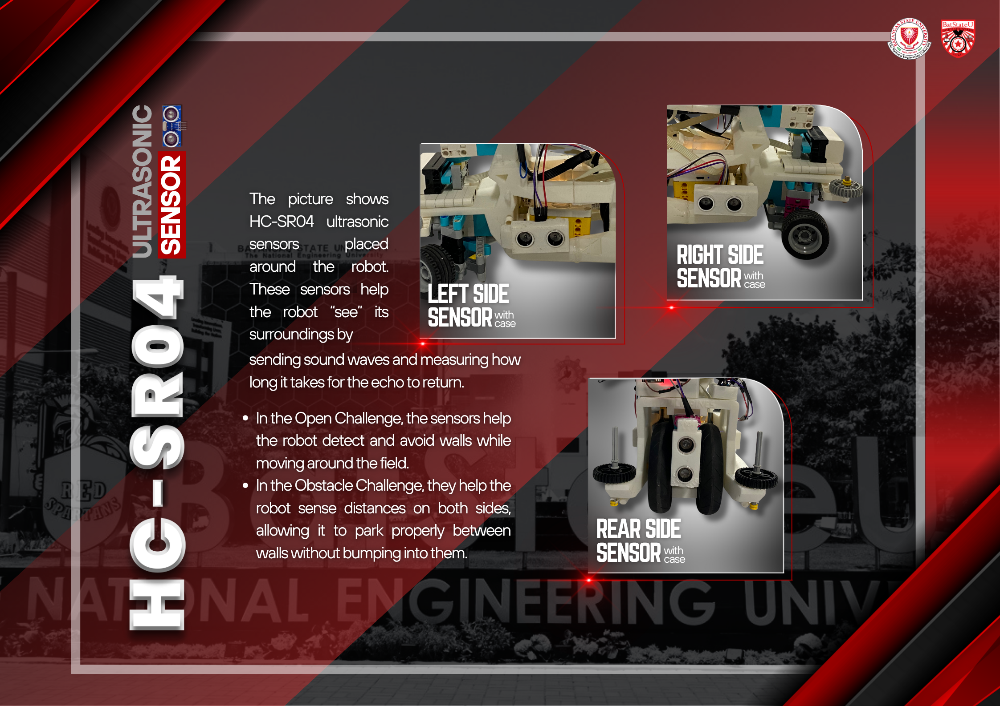 | 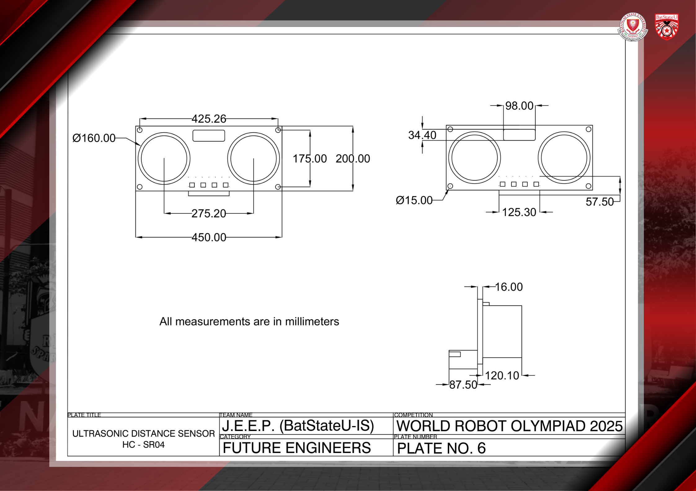 |
|:---------------------:|:---------------------:|
| Figure 21. <br> HC-SR04 Ultrasonic Sensor | Figure 22. <br> HC-SR04 Ultrasonic Sensor <br> Dimensions |

</center>

&nbsp;&nbsp;&nbsp;&nbsp;&nbsp;&nbsp;&nbsp;&nbsp;&nbsp;&nbsp;After the returning sound waves are detected from an object, it creates an output signal, and the distance of this signal to the sensor detects and measures the length of of how far the object is. Through measuring this signal length, the Arduino can calculate the exact distance to the object. And its capacity measures objects between 2 cm and 400 cm away with an accuracy of about 3 millimeters [[14]](#ref14).  

<center>
  
**Table 9\. HC-SR04 Technical Specifications**

| Specifications | Description |
| ----- | ----- |
| Operating Voltage | DC 5V | 
| Operating Current | 15 mA | 
| Operating Frequency | 40KHz |
| Maximum Range | 400 cm | 
| Minimum Range | 2 cm | 
| Ranging Accuracy | 3 mm |
| Measuring Angle | 15 degrees |
| Trigger Input Signal | 10µS TTL pulse |
| Dimension | 45 x 20 x 15 mm |

</center>

### 2.3.3. Gyro Sensor 

&nbsp;&nbsp;&nbsp;&nbsp;&nbsp;&nbsp;&nbsp;&nbsp;&nbsp;&nbsp;In addition to external sensors, the SPIKE™ Prime Hub includes built-in motion sensors: a three-axis gyroscope and a three-axis accelerometer. These internal sensors play a crucial role in helping our self-driving robot detect its orientation, motion, and rotation during its operation. The accelerometer measures the direction of gravity along three axes — X, Y, and Z — allowing the hub to determine which side is facing up or down [[15]](#ref15). This helps the robot identify its current orientation, such as whether it is upright, tilted, or falling. It also enables the detection of gestures such as taps, free fall, and shaking. 

<center>

| 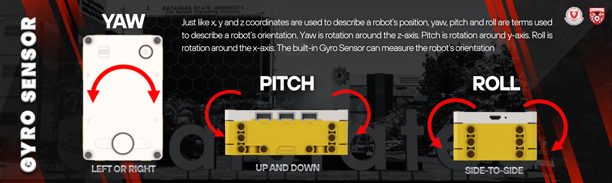 |
|:---------------------:|
| Figure 23. <br> Robot’s Gyro Sensor

</center>

&nbsp;&nbsp;&nbsp;&nbsp;&nbsp;&nbsp;&nbsp;&nbsp;&nbsp;&nbsp;The gyro sensor measures the robot’s angular rotation across the three axes. It tracks changes in pitch (forward or backward tilt), roll (side-to-side tilt), and yaw (rotational direction) [[15]](#ref15). Furthermore, it can also provide both the rate of rotation in degrees per second and the total angle turned in degrees. This makes it possible for the robot to perform accurate turns, such as 90° or 180° rotations, and maintain straight paths when necessary. Together, the built-in gyroscope and accelerometer improve the robot’s ability to move precisely and respond to different conditions, especially in tasks that require accuracy in reading directions like wall avoidance, alignment, and parking.  

### 2.3.4. OpenMV Cam H7 Plus 

&nbsp;&nbsp;&nbsp;&nbsp;&nbsp;&nbsp;&nbsp;&nbsp;&nbsp;&nbsp;The OpenMV Cam H7 Plus functions as the vision system of the self-driving robot, allowing it to detect and interpret visual cues such as traffic signs during the Obstacle Challenge. This compact and low-power microcontroller-based camera is programmable using high-level Python scripts, enabling the efficient implementation of real-world machine vision applications. 

<center>

| 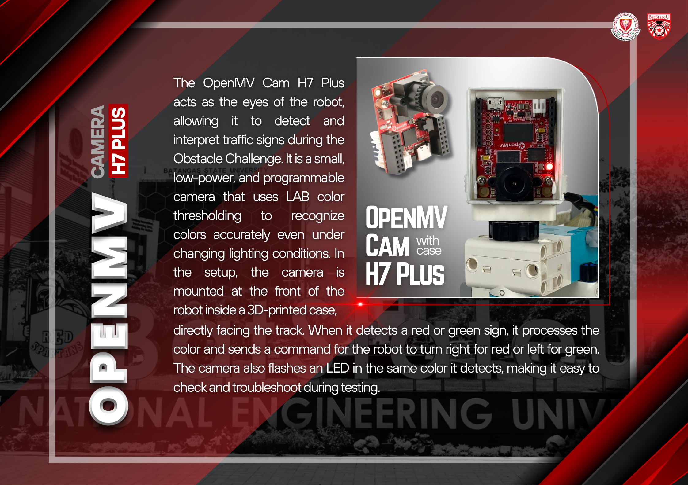 | 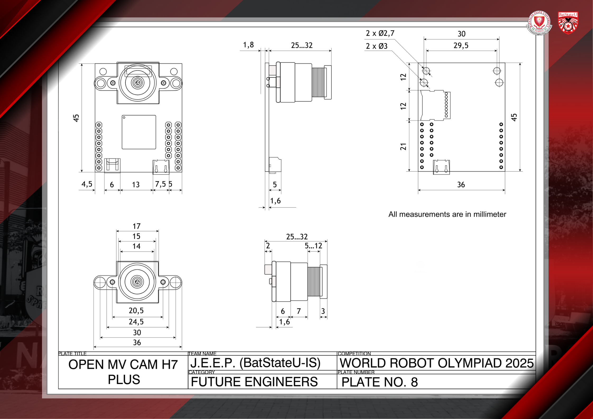 |
|:---------------------:|:---------------------:|
| Figure 24. <br> Robot’s OpenMV Cam H7 Plus | Figure 25. <br> Robot’s OpenMV Cam H7 Plus <br> Dimensions |

</center>

<center>

**Table 10\. OpenMV Cam H7 Plus Technical Specifications**

| Specification | Description |
| ----- | ----- |
| Processor | 480 MHz ARM Cortex-M7 | 
| RAM | 1 MB SRAM | 
| Flash Storage | 2 MB internal + microSD card support |
| Image Sensor | OmniVision OV7725 | 
| Frame Rate | Up to 60 FPS (QVGA), 30 FPS (VGA) | 
| Lens | M12 mount, 115° field of view |
| Interfaces | USB, UART, SPI, I²C |
| Operating Voltage | 3.6 V – 5 V DC |
| Dimensions | 45 mm × 36 mm × 30 mm |

</center>

&nbsp;&nbsp;&nbsp;&nbsp;&nbsp;&nbsp;&nbsp;&nbsp;&nbsp;&nbsp;The camera is powered by an STM32H7 Arm® Cortex® M7 processor operating at 480 MHz, equipped with 512 KB of RAM and 2 MB of flash memory [[16]](#ref16). It features an image sensor capable of capturing high-resolution images at 2592 × 1944 (5 MP). The team selected LAB thresholding for image processing, as it performs effectively under varying lighting conditions by separating color values based on human perception rather than raw RGB data. To identify objects, the camera analyzes pixel density, allowing it to detect color intensity with greater precision. A higher pixel density indicates the presence and color of a nearby object, enabling the robot to interpret this data, transmit it to the central hub, and execute the appropriate action to avoid obstacles. 

&nbsp;&nbsp;&nbsp;&nbsp;&nbsp;&nbsp;&nbsp;&nbsp;&nbsp;&nbsp;In the robot’s configuration, the OpenMV Cam H7 is mounted at the front and enclosed within a custom-designed 3D-printed case. It is carefully positioned and aligned to face traffic signs directly during navigation. When the camera detects a red or green traffic sign, it processes the image and determines the appropriate turning direction—left for green and right for red. Additionally, the camera has been programmed to indicate its detection output by flashing a corresponding LED color (red or green), providing a clear visual cue that facilitates quick and efficient troubleshooting. 

---

## 3. 🚀 Open Challenge Strategy 

&nbsp;&nbsp;&nbsp;&nbsp;&nbsp;&nbsp;&nbsp;&nbsp;&nbsp;&nbsp;The Open Challenge Round of the Future Engineers category requires the self-driving robot to autonomously complete three full laps around the game field, with the inner track walls placed randomly. Throughout the run, the robot must ensure that it makes no contact with the outer boundary wall. The team’s primary objectives for this round are to enable the robot to accurately determine its initial driving direction, maintain stable motion and control throughout the laps, consistently avoid collisions with both inner and outer walls, and complete all three laps with precise turns, movements, and countering. To achieve these goals, various techniques and movement strategies for driving direction determination, wall detection and avoidance, and lap counting were carefully developed and implemented.  

<center>

<!--Need to update-->

| 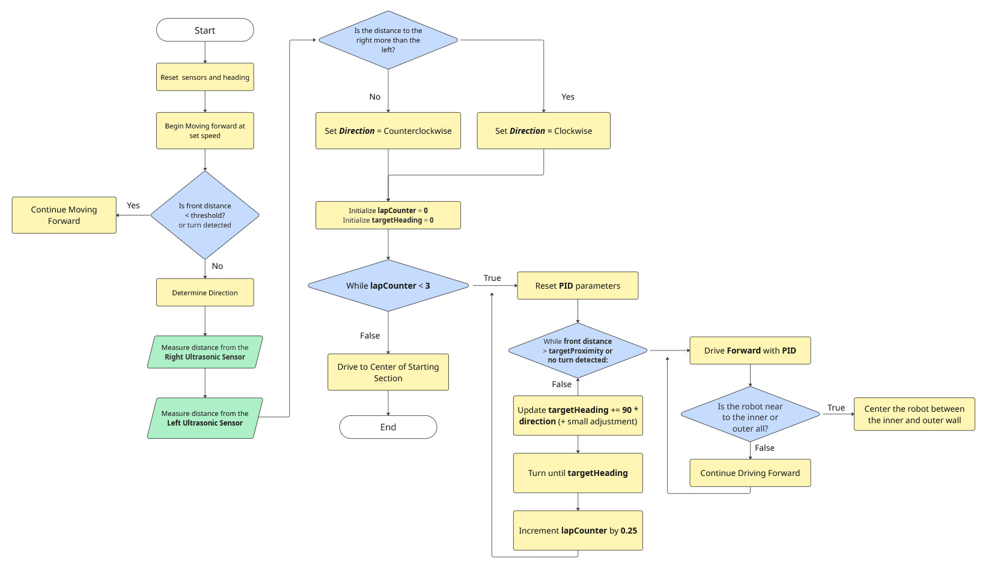 |
|:---------------------:|
| Figure 26. <br> Open Challenge Flowchart

</center>

&nbsp;&nbsp;&nbsp;&nbsp;&nbsp;&nbsp;&nbsp;&nbsp;&nbsp;&nbsp;In the Open Challenge strategy, the robot drives forward until a turn is detected or it gets too close to a wall. It then determines its driving direction using the two side ultrasonic sensors and records the distance of each straight section during the first lap. These recorded distances are reused in the following laps to ensure consistent movement and prevent undershooting along each straight section. 

<!-- &nbsp;&nbsp;&nbsp;&nbsp;&nbsp;&nbsp;&nbsp;&nbsp;&nbsp;&nbsp;In line with the flowchart above, the starting condition we implemented for the Open Challenge round involves the self-driving robot resetting its sensors and heading, then beginning its movement by driving forward. It continues this motion until one of three conditions is met:
<br>(1) the distance on the left side becomes significantly greater than the right (indicating open space or a corner),
<br>(2) the distance on the right side becomes significantly greater than the left (indicating a similar opening on the opposite side), or
<br>(3) the front distance sensor detects a wall closer than the defined front threshold.  -->

<!-- OLD - It continues this motion until its front-facing distance sensor detects a wall closer than a preset threshold. This initial forward movement ensures that the robot consistently reaches a defined checkpoint before making any directional decisions. -->
<!-- 
&nbsp;&nbsp;&nbsp;&nbsp;&nbsp;&nbsp;&nbsp;&nbsp;&nbsp;&nbsp;Once this threshold is met, the robot stops and proceeds to determine its driving direction: either clockwise or counterclockwise. To do this, the sensor mounted on a rotating motor scans both directions — first rotating to the left, measuring the distance, and then to the right. The robot then compares the measured values. If the right side has a greater distance, it sets the direction clockwise; otherwise, it sets it counterclockwise. This step is essential for adjusting the robot's path depending on the randomized starting location and ensuring that the robot follows the correct path and direction around the field. 

&nbsp;&nbsp;&nbsp;&nbsp;&nbsp;&nbsp;&nbsp;&nbsp;&nbsp;&nbsp;However, before turning, the rotating sensor must rotate along with the chosen direction to signal the upcoming turn. This can also assist with determining mistakes and debugging since it can communicate its movement with us. After performing the 90-degree turn, the sensor motor will then return to its original position — facing forward — to indicate that the turn has been completed and is prepared for the next turn or section. Moreover, while driving forward after each section and checking the distance from the preceding wall, the Technic™ Distance Sensor’s LEDs are programmed to light up on the side based on its direction. This action functions as a visual cue for the team, assisting in debugging and monitoring direction. 

&nbsp;&nbsp;&nbsp;&nbsp;&nbsp;&nbsp;&nbsp;&nbsp;&nbsp;&nbsp;The robot then enters the lap execution loop, where it repeats a drive-turn sequence until it completes three full laps. As it moves forward, the robot uses PID control (as outlined in the flowchart) to maintain smooth and accurate motion, adjusting based on real-time distance measurements. When the front distance falls below the target proximity, the robot resets its PID settings, updates its target heading by 90 degrees (multiplied by its set direction), executes the turn, and increments the lap counter by 0.25, representing one segment of a full lap. This loop continues until the lap counter reaches 3.0, signaling that the three laps are complete. 

&nbsp;&nbsp;&nbsp;&nbsp;&nbsp;&nbsp;&nbsp;&nbsp;&nbsp;&nbsp;To finish, the robot executes a final command to drive straight to the center of the starting section using its distance sensor and then stops, completing the Open Challenge run. This process ensures both consistency and accuracy in lap tracking and navigation, allowing the robot to adapt to changing conditions while maintaining reliable performance.  -->

### 3.1. Determining Drive Direction 

&nbsp;&nbsp;&nbsp;&nbsp;&nbsp;&nbsp;&nbsp;&nbsp;&nbsp;&nbsp;At the start of the Open Challenge, the self-driving robot must decide which direction it should take around the field, which is either clockwise or counterclockwise. This decision that the robot will make depends on its position and surroundings at the beginning of the run. This step is one of the most crucial tasks, as it sets the course of the robot. Therefore, our team made sure to select the most appropriate strategy and components to ensure that the detection of direction will be accurate and consistent. This involved integrating the necessary sensors and programming logic that would allow the robot to make the correct decision.  

```python
direction = sannisLivisa.driveDeterminDir(500, 600, 700, decelerate=True, sideThreshold=600, frontThreshold=350)
```

&nbsp;&nbsp;&nbsp;&nbsp;&nbsp;&nbsp;&nbsp;&nbsp;&nbsp;&nbsp;In line with the flowchart above, the starting condition we implemented for the Open Challenge round involves the robot first begins by driving forward. It continues this movement until one of three conditions is met:
<br>(1) the distance on the left side becomes significantly greater than the right (indicating open space or a corner),
<br>(2) the distance on the right side becomes significantly greater than the left (indicating a similar opening on the opposite side), or
<br>(3) the front distance sensor detects a wall closer than the defined front threshold. 

```python
def determineDir(self, exclude=2000, measureTime=100):
    """
    Determines whether the robot should turn clockwise (1) or counterclockwise (-1)
    based on which side (left or right) has more open space as measured by the
    rear-facing distance sensor (LMS-ESP32).

    Args:
        exclude (int): Distance reading to ignore (e.g., invalid or out-of-range value).
        measureTime (int): Duration in milliseconds to sample distance data.

    Returns:
        int: 1 for clockwise, -1 for counterclockwise.
    """

    # Code in try catch block so that if the LMS-ESP32 refuses to connect or has an error
    # the program will not crash
    try:
         # Initialize and start a timer to limit measurement duration
        checkTimer = StopWatch()
        checkTimer.pause()
        checkTimer.reset()
    
        checkTimer.resume()
        largestRight = 0
        largestLeft = 0

        # Measure for a short abount of time
        while checkTimer.time() < measureTime:
            # Poll distance data from the LMS-ESP32 (returns [left, right])
            dists = self.distSensorBack.call("line")

            # Update the largest right-side distance if it's valid and greater
            dist = dists[1]
            if dist > largestRight and dist != exclude:
                largestRight = dist

            # Update the largest left-side distance if it's valid and greater
            dist = dists[0]
            if dist > largestLeft and dist != exclude:
                largestLeft = dist

        checkTimer.pause()
        checkTimer.reset()

        # Debug output for diagnostic purposes
        log("Dist Right:", largestRight, level="DETERMINE DIR")
        log("Dist Left:", largestLeft, level="DETERMINE DIR")
        log("Backup (Front):", largestLeft, level="DETERMINE DIR")

        # Compare the two sides and determine turning direction
        # (-1 = Counterclockwise, 1 = Clockwise)
        if largestLeft > largestRight:
            direction = -1
        else:
            direction = 1

        log(direction, level="DETERMINE DIR")
        return direction
    except:

        # Fallback: If LMS-ESP32 fails to respond, use the legacy method instead
        log("LMS-ESP 32 Refused to connect!", level="ERROR")
        return self.determineDirOld()
```

&nbsp;&nbsp;&nbsp;&nbsp;&nbsp;&nbsp;&nbsp;&nbsp;&nbsp;&nbsp;Once positioned at an appropriate distance from the wall, the robot determines its driving direction by comparing the readings from the two side ultrasonic sensors managed by the LMS-ESP32 module. During this process, the robot continuously samples both the left and right distance values for a short duration, ignoring any invalid or excluded readings. It records the largest valid distance detected on each side within this period. After the sampling phase, the robot compares these two maximum values — if the left side has the greater distance, it sets its driving direction to counterclockwise; otherwise, it drives clockwise. This method provides a more reliable and noise-resistant approach by evaluating multiple sensor samples over time rather than relying on a single reading, ensuring a consistent and accurate decision on the robot’s initial driving direction. 

If the above code fails or the LM-ESP32 responds with an error, the code will fallback to our previous code which we had previously used during the nationals</p2>

```python
def determineDirOld(self, exclude=2000):
     """
    Legacy method for determining the turning direction (clockwise or counterclockwise)
    using a single rotating distance sensor. The sensor sweeps right and left to find
    which side has more open space.

    Args:
        exclude (int): Distance value to ignore (e.g., invalid readings or out-of-range data).

    Returns:
        int: 1 for clockwise, -1 for counterclockwise.
    """
    # Initialize timer for measurement intervals
    checkTimer = StopWatch()
    checkTimer.pause()
    checkTimer.reset()

     # --- Measure Right Side ---
    # Rotate the distance sensor to the right (~90°)
    self.lookDir(90, speed=1000)
    while self.senseMotor.angle() < 88:
        pass # Wait until the sensor is in position
    
    # Move slightly backward to improve right-side visibility
    start = self.mileage()
    target = start - 80
    self.driveMotor.run_target(180, target, wait=False)

    # Measure right-side distance for a short duration
    checkTimer.resume()
    largestRight = 0
    while checkTimer.time() < 800:
        dist = self.distSensor.distance()
        if dist > largestRight and dist != exclude:
            largestRight = dist

    # Stop and reset timer
    checkTimer.pause()
    checkTimer.reset()
    log("Dist Right:", largestRight, level="DETERMINE DIR")

    # --- Measure Left Side ---
    # Rotate the sensor to the left (~90°)
    self.lookDir(-90, speed=1000)
    while self.senseMotor.angle() > -88:
        pass # Wait until the sensor is in position
    
    self.driveMotor.run_target(180, start, wait=False)

    checkTimer.resume()

    # Measure left-side distance for a short duration
    largestLeft = 0
    while checkTimer.time() < 800:
        dist = self.distSensor.distance()
        if dist > largestLeft and dist != exclude:
            largestLeft = dist

    checkTimer.pause()
    checkTimer.reset()

    log("Dist Left:", largestLeft, level="DETERMINE DIR")

     # Compare the largest distances from both sides
    # (-1 = Counterclockwise / Left side more open, 1 = Clockwise / Right side more open)
    if largestLeft > largestRight:
        direction = -1
    else:
        direction = 1

    log(direction, level="DETERMINE DIR")
    self.center()
    return direction
```

### Explanation

&nbsp;&nbsp;&nbsp;&nbsp;&nbsp;&nbsp;&nbsp;&nbsp;&nbsp;&nbsp;The <code>determineDirOld()</code> function is an earlier implementation of the robot’s direction-selection logic. It serves as a fallback method when the <code>LMS-ESP32</code> sensor fails to connect or respond. 

&nbsp;&nbsp;&nbsp;&nbsp;&nbsp;&nbsp;&nbsp;&nbsp;&nbsp;&nbsp;During the <b>Philippine Robotics Olympiad (PRO)</b>, the robot used only a single rotating distance sensor for this task, since the side-mounted ultrasonic sensors were not yet attached or utilized at that stage. As a result, this version relies entirely on one sensor mounted on a motor that rotates to scan both sides of the robot. 

&nbsp;&nbsp;&nbsp;&nbsp;&nbsp;&nbsp;&nbsp;&nbsp;&nbsp;&nbsp;The procedure operates as follows: 

1. **Measure the Right Side**  
   &nbsp;&nbsp;&nbsp;&nbsp;The robot rotates the distance sensor approximately <b>90° to the right</b> and moves slightly backward to avoid detecting its own body. It samples distance readings for about 800 milliseconds, recording the largest valid distance (representing the most open area on that side). 

2. **Measure the Left Side**  
   &nbsp;&nbsp;&nbsp;&nbsp;The sensor is then turned <b>90° to the left</b>, and the robot returns to its starting position before repeating the same measurement process for another 800 milliseconds to determine the largest distance on the left side. 

3. **Compare and Decide**  
   &nbsp;&nbsp;&nbsp;&nbsp;If the left distance is greater, the robot sets the direction to <code>-1</code> (counterclockwise). Otherwise, it sets it to <code>1</code> (clockwise). 

4. **Recentering**  
   &nbsp;&nbsp;&nbsp;&nbsp;After determining the turning direction, the sensor is recentered using <code>self.center()</code> to prepare for the next navigation phase. 

&nbsp;&nbsp;&nbsp;&nbsp;&nbsp;&nbsp;&nbsp;&nbsp;&nbsp;&nbsp;While slower than the dual-sensor method implemented later in <code>determineDir()</code>, this legacy approach provided a robust and reliable solution during the PRO, effectively compensating for the absence of other sensors. 


### 3.2. Wall Detection and Avoidance

&nbsp;&nbsp;&nbsp;&nbsp;&nbsp;&nbsp;&nbsp;&nbsp;&nbsp;&nbsp;To ensure that the robot can properly avoid collisions with both the randomly placed inner wall and the outer boundary walls of the game field, a dynamic wall detection strategy was implemented using the Technic™ Distance Sensor and two (2) HC-SR04 Ultrasonic Sensors mounted on either side of the robot. 

```python
# Main Lap Control Loop
while currentLap < 3:
    correction = 0

    # This takes place right after detecting direction
    # No need to drive forwards, directly turn after determining direction
    if currentLap == 0:
        # Update the target heading based on the detected direction
        targetHeading += 90 * direction
        if direction < 0:
            targetHeading -= 0.9  # Small correction for counterclockwise turns

        # Reset internal parameters and execute the turn
        sannisLivisa.resetParams()
        turnFunc(sannisLivisa, targetHeading, turnErrorKp, KI, turnErrorKd, MAXSPEED, turnTolerance)

        # Mark progress and proceed
        currentLap += 0.25
        continue

    # ------------------------------- #
    # Lap 1: Wall Following & Mapping #
    # ------------------------------- #
    elif currentLap <= 1:
        lastRot = sannisLivisa.driveMotor.angle()
        distTraveled = 0

        # Continue driving while maintaining safe distance from walls
        while sannisLivisa.getDistance(FRONT) < safetyDistance or distTraveled < otherSafetyDistance:
            leftAdjust = 0
            rightAdjust = 0

            # Check proximity to walls on either side and compute lateral adjustment
            if sannisLivisa.getDistance(LEFT) < leftThreshold or sannisLivisa.getDistance(RIGHT) < rightThreshold:
                leftAdjust = sannisLivisa.getDistance(LEFT)
                rightAdjust = sannisLivisa.getDistance(RIGHT)

            # Compute heading correction using PID
            error = rightAdjust + targetHeading - HUB.imu.heading() - leftAdjust
            KP = baseKP
            KD = linearMap(sannisLivisa.driveMotor.speed(), 0, 1000, 0, KDdrive)

            sannisLivisa.errorSum, sannisLivisa.prevError, correction = pid(
                KP, KI, KD, error, sannisLivisa.errorSum, sannisLivisa.prevError,
                maxSum=355, minSum=-355
            )

            # Clamp correction values for stability
            correction = min(max(correction, MINCORRECTION_DRIVE), MAXCORRECTION_DRIVE)

            # Apply movement correction
            sannisLivisa.move(MAXSPEED, correction)
            distTraveled = sannisLivisa.driveMotor.angle() - lastRot

        # Record the distance traveled before turning
        distTraveled = sannisLivisa.driveMotor.angle() - lastRot
        roundedDist = distTraveled
        sannisLivisa.record(str(currentLap)[1::], roundedDist + 30)
```

)

&nbsp;&nbsp;&nbsp;&nbsp;&nbsp;&nbsp;&nbsp;&nbsp;&nbsp;&nbsp;During the <b>first lap</b>, the robot operates in an exploratory mode. It follows the detected wall, turning 90° at each corner while recording the distances traveled between turns. This process uses the <code>record()</code> function, which stores the measured distance before each turn. These recorded values guide the robot in subsequent laps, allowing it to remember and repeat the most efficient route even if the inner walls are rearranged. 

```python
# PID Wall-Following Logic
while sannisLivisa.getDistance(distSensor) < targetProximity and sannisLivisa.getDistance("front") > targetProximityFront:
    leftAdjust = 0
    rightAdjust = 0

    # Detect proximity to left or right walls
    if sannisLivisa.getDistance(LEFT) < leftThreshold or sannisLivisa.getDistance(RIGHT) < rightThreshold:
        leftAdjust = sannisLivisa.getDistance(LEFT)
        rightAdjust = sannisLivisa.getDistance(RIGHT)

    # Calculate heading error with lateral offset correction
    error = rightAdjust + targetHeading - HUB.imu.heading() - leftAdjust
    KP = baseKP
    KD = linearMap(sannisLivisa.driveMotor.speed(), 0, 1000, 0, KDdrive)

    # Update PID and apply correction
    sannisLivisa.errorSum, sannisLivisa.prevError, correction = pid(
        KP, KI, KD, error, sannisLivisa.errorSum, sannisLivisa.prevError,
        maxSum=355, minSum=-355
    )

    correction = min(max(correction, MINCORRECTION_DRIVE), MAXCORRECTION_DRIVE)
    sannisLivisa.move(MAXSPEED, correction)
```

&nbsp;&nbsp;&nbsp;&nbsp;&nbsp;&nbsp;&nbsp;&nbsp;&nbsp;&nbsp;Wall following is maintained through a continuous PID feedback loop. The robot measures its heading using the IMU and its distance from the side walls using the sensors. If it drifts too close to either side, it calculates a combined correction based on both lateral distances to re-center itself. The derivative term <code>KD</code> scales dynamically with the driving speed to maintain stable and responsive control at varying velocities. 

```python

while currentLap < 3:
    correction = 0

    # First Lap
    if currentLap == 0:
        ...
    elif currentLap <= 1:
        ... 

    # 2nd & 3rd Laps
    else:
        # --- Laps 2 and 3: Playback Using Recorded Data ---
        # Retrieve recorded distance from memory
        lastRot = sannisLivisa.driveMotor.angle()
        distTraveled = 0
        distToTravel = sannisLivisa.remember(str(currentLap)[1::])

        # Drive based on remembered distances while applying real-time correction
        while distTraveled < distToTravel and \
              sannisLivisa.getDistance("front") > minimumDistance and \
              sannisLivisa.getDistance(distSensor) < targetProximity:
            
            leftAdjust = 0
            rightAdjust = 0
            distTraveled = sannisLivisa.driveMotor.angle() - lastRot

            if sannisLivisa.getDistance(LEFT) < leftThreshold or sannisLivisa.getDistance(RIGHT) < rightThreshold:
                leftAdjust = sannisLivisa.getDistance(LEFT)
                rightAdjust = sannisLivisa.getDistance(RIGHT)

            error = rightAdjust + targetHeading - HUB.imu.heading() - leftAdjust
            KP = baseKP
            KD = linearMap(sannisLivisa.driveMotor.speed(), 0, 1000, 0, KDdrive)

            sannisLivisa.errorSum, sannisLivisa.prevError, correction = pid(
                KP, KI, KD, error, sannisLivisa.errorSum, sannisLivisa.prevError,
                maxSum=355, minSum=-355
            )

            correction = MAXCORRECTION_DRIVE if correction > MAXCORRECTION_DRIVE else correction
            correction = MINCORRECTION_DRIVE if correction < MINCORRECTION_DRIVE else correction

            sannisLivisa.move(MAXSPEED, correction)
```
&nbsp;&nbsp;&nbsp;&nbsp;&nbsp;&nbsp;&nbsp;&nbsp;&nbsp;&nbsp;After completing the first lap, the robot transitions to playback mode. In this phase, it recalls the previously recorded distances using the <code>remember()</code> method and repeats those driving segments while still maintaining real-time heading correction. This approach combines memory-based navigation with live feedback, enabling the robot to move efficiently while adapting to small positional errors or sensor noise. 

```python
# Heading Adjustment After Each Turn
targetHeading += 90 * direction
if direction < 0:
    targetHeading -= 0.12  # Counterclockwise correction
else:
    targetHeading += 0.25  # Clockwise correction

# Execute precise 90° turn
turnFunc(sannisLivisa, targetHeading, turnErrorKp, KI, turnErrorKd, MAXSPEED, turnTolerance)
```

&nbsp;&nbsp;&nbsp;&nbsp;&nbsp;&nbsp;&nbsp;&nbsp;&nbsp;&nbsp;After each straight section, the robot performs a 90° turn based on IMU feedback. A small offset (−0.12° for counterclockwise and +0.25° for clockwise) compensates for observed drift and minor rounding errors, ensuring that the robot maintains consistent orientation across all laps. 

```python
# Final Alignment and Finish
while sannisLivisa.getDistance("front") > endTarget:
    error = targetHeading - HUB.imu.heading()
    sannisLivisa.errorSum, sannisLivisa.prevError, correction = pid(KP, KI, KD, error, ...)
    sannisLivisa.move(MAXSPEED, correction)

# Controlled stop after finish line detection
sannisLivisa.eBrake(1000)
```

&nbsp;&nbsp;&nbsp;&nbsp;&nbsp;&nbsp;&nbsp;&nbsp;&nbsp;&nbsp;Finally, after completing all three laps, the robot aligns itself toward the center of the track and drives forward until the front distance sensor detects the finishing wall. The PID controller continuously corrects the heading during this approach to ensure a smooth, stable final run before executing a controlled stop using <code>eBrake()</code>. 

<!-- 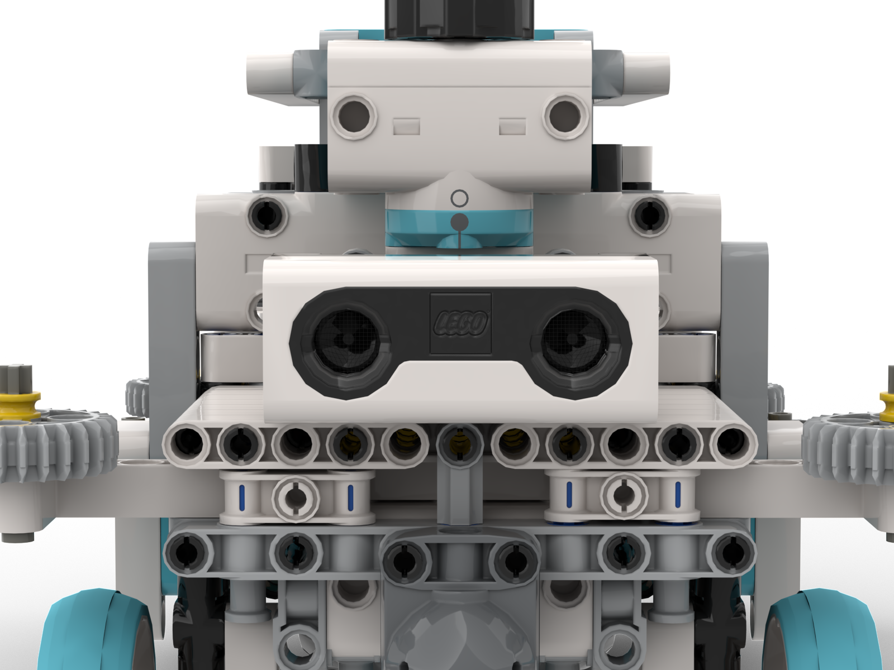 -->

## 4. 🚧 Obstacle Challenge Strategy

&nbsp;&nbsp;&nbsp;&nbsp;&nbsp;&nbsp;&nbsp;&nbsp;&nbsp;&nbsp;After completing the Open Challenge, the team focused on the Obstacle Challenge, a key task in the Future Engineers category. In this round, the robot must autonomously complete three laps around the game field while avoiding randomly placed obstacles, with their positions determined prior to the start of the challenge. The obstacles include red and green traffic signs that the robot must detect and respond to correctly—passing on the left for green signs and on the right for red signs. In addition to obstacle avoidance, the robot is required to begin the lap by exiting the parking space and perform parallel parking at the end of the third lap. The parking space is precisely sized to the robot’s length, requiring careful maneuvering to avoid contacting the boundary walls. This round evaluates the robot’s ability to recognize colors, make real-time decisions based on detections, and maintain accurate movement under dynamic conditions. The essential techniques and movement strategies considered for this challenge are described in the following sections.  

&nbsp;&nbsp;&nbsp;&nbsp;&nbsp;&nbsp;&nbsp;&nbsp;&nbsp;&nbsp;Based on the strategy implemented for the Obstacle Challenge, as outlined in the flowchart below, the robot begins by initializing its sensors. It then rotates its distance sensor to the left to measure the distance, storing the value in a variable labeled left. The same process is repeated to the right, with the value stored in right. The robot then compares the two distances: if the left side offers more space, it sets the driving direction to clockwise; if the right side has more space, it sets the direction to counterclockwise. This approach closely mirrors the method used to determine the driving direction at the start of the Open Challenge.  

| 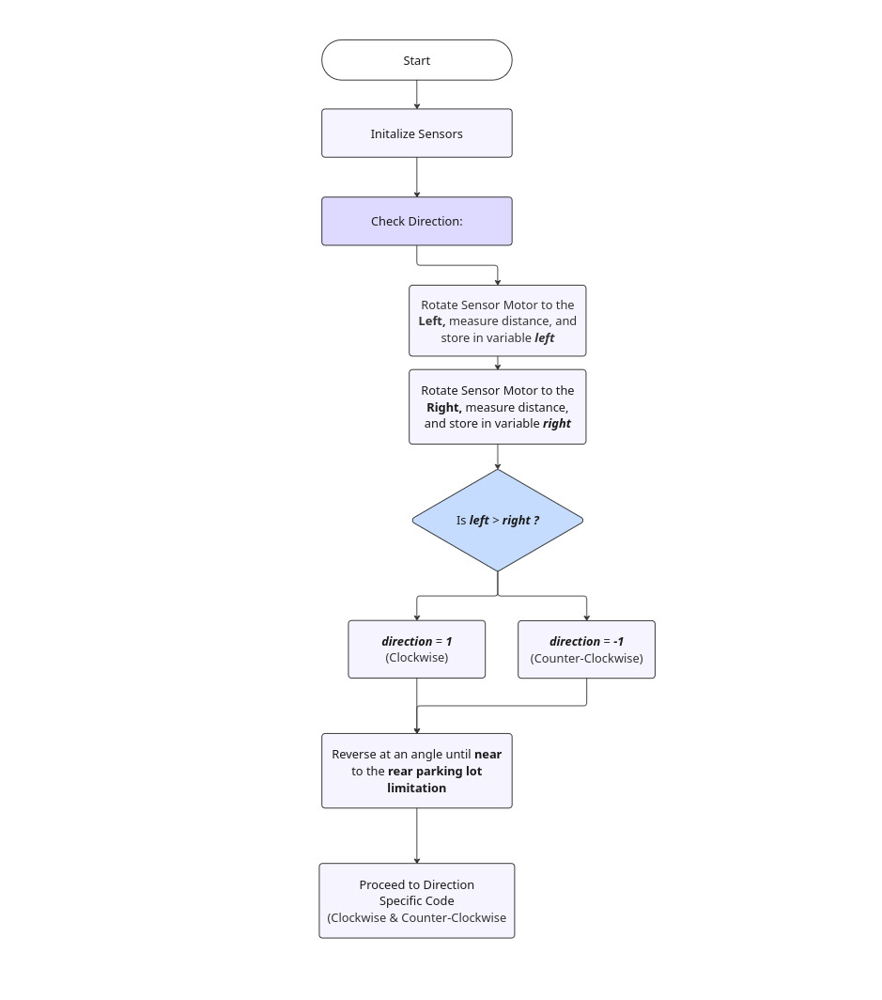 |
|:---------------------:|
| Figure 27. <br> Obstacle Challenge Flowchart <br> Start |

| 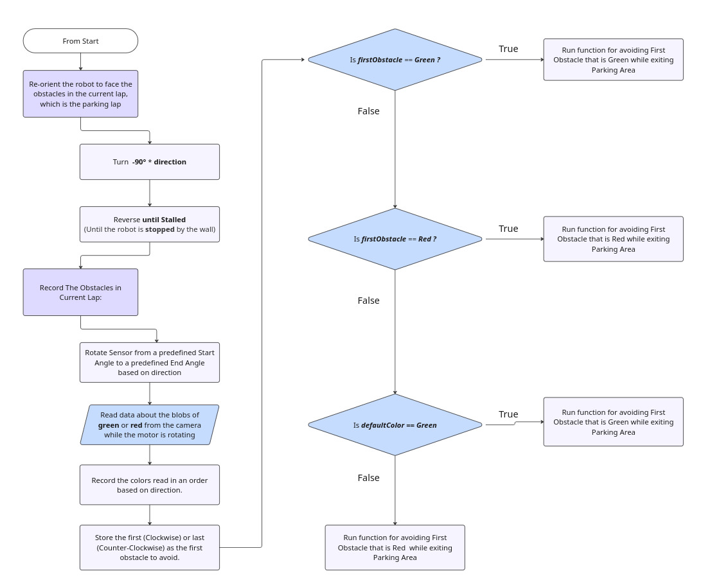 |
|:---------------------:|
| Figure 28. <br> Obstacle Challenge Flowchart <br> From Start |

&nbsp;&nbsp;&nbsp;&nbsp;&nbsp;&nbsp;&nbsp;&nbsp;&nbsp;&nbsp;After deciding the direction, the robot proceeds to exit the parking area by turning 90 degrees based on the chosen direction and reverses until it stalls against the wall. Once in position, the robot begins scanning the lap to detect obstacles and stores them based on the direction of movement. Then, it identifies the first obstacle it needs to avoid and uses this to decide the proper avoidance function or decision as it leaves the parking area. Depending on whether the obstacle is red or green, it runs a specific function to safely pass it. 

| 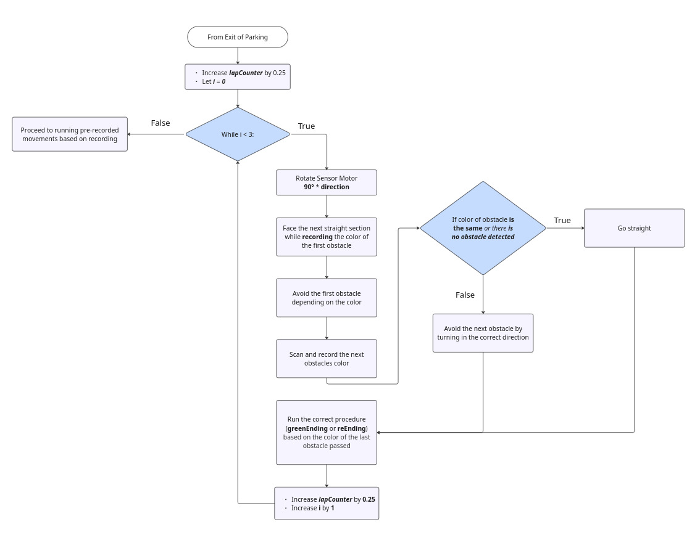 |
|:---------------------:|
| Figure 29. <br> Obstacle Challenge Flowchart <br> From Exit Parking |

&nbsp;&nbsp;&nbsp;&nbsp;&nbsp;&nbsp;&nbsp;&nbsp;&nbsp;&nbsp;Once it’s out of the parking lap, the robot enters the recording phase, where it scans and avoids obstacles section by section. It rotates the sensor motor to face the straight section, records the color of the first obstacle, avoids it accordingly, then continues to detect and respond to the next one. After passing each obstacle, it updates the recorded information and continues this loop up to three times. Finally, when the recording phase ends, the robot uses the stored movement patterns to replay its actions. It now proceeds to perform the laps based on pre-recorded data instead of re-scanning. 

| 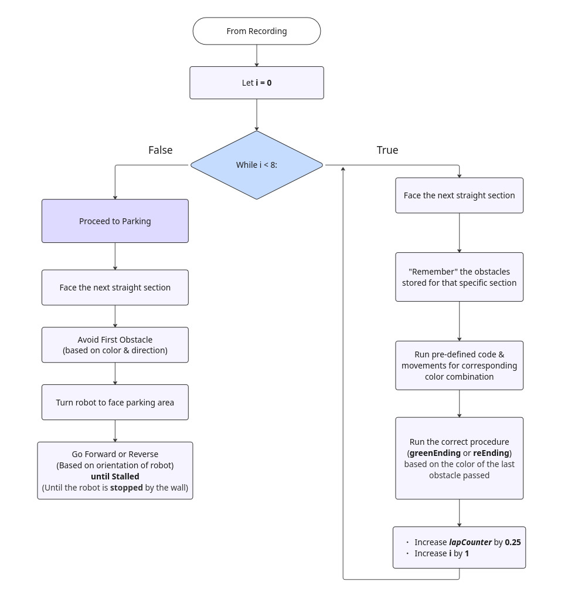 |
|:---------------------:|
| Figure 30. <br> Obstacle Challenge Flowchart <br> From Recording |

&nbsp;&nbsp;&nbsp;&nbsp;&nbsp;&nbsp;&nbsp;&nbsp;&nbsp;&nbsp;Finally, when the recording phase ends, the robot uses the stored movement patterns to replay its actions. It now proceeds to perform the laps based on pre-recorded data instead of re-scanning.  

### 4.1. Traffic Sign Detection	
&nbsp;&nbsp;&nbsp;&nbsp;&nbsp;&nbsp;&nbsp;&nbsp;&nbsp;&nbsp;The OpenMV Cam H7 Plus serves as the self-driving robot’s vision to be able to detect and classify traffic signs, represented by Green and Red colored obstacles that are randomly placed around the field. We implemented in our strategy that the obstacle detection process occurs primarily during the first lap, which is treated as a <b><i>learning and recording phase</i></b>. During this lap, the robot pauses at key positions or checkpoints and rotates the camera to identify obstacles that are placed along its path. If a green pillar is detected, the robot is programmed to avoid it by turning left; if a red pillar is detected, it turns right. If no color or obstacle is detected, due to occlusion or lighting issues, a default response (typically treating the obstacle as red) is triggered to ensure the robot still avoids a potential collision. 

### Blob Detection

&nbsp;&nbsp;&nbsp;&nbsp;&nbsp;&nbsp;&nbsp;&nbsp;&nbsp;&nbsp;&nbsp;&nbsp;&nbsp;&nbsp;To detect traffic signs accurately, the OpenMV Cam H7 Plus is programmed to use the [LAB color space](https://en.wikipedia.org/wiki/CIELAB_color_space) instead of the [standard RGB](https://en.wikipedia.org/wiki/RGB_color_spaces). LAB is more effective for color-based object detection under varying lighting conditions because it separates the lightness (L) from the color channels (A and B). This allows for more stable detection of red and green objects even if the lighting changes during the run.

 

&nbsp;&nbsp;&nbsp;&nbsp;&nbsp;&nbsp;&nbsp;&nbsp;&nbsp;&nbsp;The camera scans the environment by capturing real-time image frames and applying color blob detection using predefined LAB thresholds for green and red pillars. These thresholds were determined through trial and error, utilizing the OpenMV IDE’s built-in color thresholding tool. By adjusting the values while observing the live feed, the team was able to fine-tune detection to ensure that the desired colors were consistently recognized without producing false positives. An example of the LAB threshold values used by the team is shown below: 

```py
# === Color Thresholds (LAB) ===
greenThreshold = (0, 60, -128, -15, -128, 127)
redThreshold = const((0, 35, 0, 127, 1, 127))

# Format: (L Min, L Max, A Min, A Max, B Min, B Max)
```
&nbsp;&nbsp;&nbsp;&nbsp;&nbsp;&nbsp;&nbsp;&nbsp;&nbsp;&nbsp;When the camera detects a blob (a region in the image that matches the threshold), it returns the blob’s position and size. The robot then uses this information to classify the obstacle as green or red, and respond accordingly (e.g., turn left for green, right for red). 

&nbsp;&nbsp;&nbsp;&nbsp;&nbsp;&nbsp;&nbsp;&nbsp;&nbsp;&nbsp;Within the main loop, the camera continuously captures frames and applies LAB-based color blob detection. Detected blobs are filtered to select the most significant candidate. LED indicators provide real-time feedback about which color is dominant. The robot then sends the blob's position and size to the Hub using the `PUPRemoteSensor` class, allowing the main control program to make navigation decisions such as turning left for green or right for red. This system combines reliable color detection with structured data communication to enable dynamic obstacle avoidance while maintaining a consistent response under variable lighting conditions. 

```python
while True:
    # Capture current camera frame
    img = sensor.snapshot()

    # Detect green blobs
    greenBlobs = img.find_blobs([greenThreshold], pixels_threshold=250)
    greenBlob = findDominantBlob(greenBlobs, roiHeight)
    greenCx, greenCy, greenPixels = 0, 0, 0
    if greenBlob:
        greenCx = greenBlob.cx()
        greenCy = greenBlob.cy()
        greenPixels = greenBlob.pixels()
        img.draw_rectangle(greenBlob.rect(), color=(218, 66, 44), thickness=1)

    # Detect red blobs
    redBlobs = img.find_blobs([redThreshold], pixels_threshold=250)
    redBlob = findDominantBlob(redBlobs, roiHeight)
    redCx, redCy, redPixels = 0, 0, 0
    if redBlob:
        redCx = redBlob.cx()
        redCy = redBlob.cy()
        redPixels = redBlob.pixels()
        img.draw_rectangle(redBlob.rect(), color=(68, 214, 44), thickness=1)

    # LED indicator for dominant color
    indicateBlob(greenPixels, redPixels)

    # Select target X coordinate based on dominant blob
    targetX = greenCx if greenPixels > redPixels else redCx

    # Debug output for monitoring blob positions and sizes
    print(greenCx, greenCy, greenPixels, redCx, redCy, redPixels)

    # Send processed blob data to Hub
    camera.update_channel('blob', greenCx, greenCy, greenPixels, redCx, redCy, redPixels)
    camera.process()
```
The first step in every iteration of the main loop is **capturing a frame** from the camera sensor. `The sensor.snapshot()` function returns an [`Image`](https://docs.openmv.io/library/omv.image.html#class-image-image-object) object representing the **current camera frame**. This image is then used for color detection and blob analysis.

Afterwards, it then proceeds to get the blobs (connected region of pixels) in the image that falls into the specific LAB threshold.

```python
greenBlobs = img.find_blobs([greenThreshold], pixels_threshold=250)
greenBlob = findDominantBlob(greenBlobs, roiHeight)
```

The first set of blobs it tries to get are all of the green blobs. This is doen throught the line `greenBlobs = img.find_blobs([greenThreshold], pixels_threshold=250)`, where `greenThreshold` is a tuple of LAB min/max value which was defined above, and `pixels_threshold=250` which ignores any small areas below 250 pixels, reducing false positives.

Then it calls the helper function `findDotouchingminantBlob`. 
```python
def findDominantBlob(blobs, roiHeight):
    bestBlob = None
    maxPixels = 0
    for b in blobs:
        if (b.h() > b.w() or (b.y() + b.h()) == roiHeight) and b.pixels() > maxPixels:
            bestBlob = b
            maxPixels = b.pixels()
    return bestBlob
```
This helper function selects the most significant green blob. It filters for vertically elongated blobs or blobs touching the bottom of the ROI and selects the one with the largest number of pixels.

```python
greenCx, greenCy, greenPixels = 0, 0, 0
if greenBlob:
    greenCx = greenBlob.cx()
    greenCy = greenBlob.cy()
    greenPixels = greenBlob.pixels()

    # Draw a rectangle acound the most significant green blob
    img.draw_rectangle(greenBlob.rect(), color=(218, 66, 44), thickness=1)
```

If a dominant green blob exists, extract its center coordinates and pixel count.
`draw_rectangle()` visually outlines the blob on the image feed for debugging and verification.

The red blob detection works identically:
```python
redBlobs = img.find_blobs([redThreshold], pixels_threshold=250)
redBlob = findDominantBlob(redBlobs, roiHeight)
redCx, redCy, redPixels = 0, 0, 0
if redBlob:
    redCx = redBlob.cx()
    redCy = redBlob.cy()
    redPixels = redBlob.pixels()
    img.draw_rectangle(redBlob.rect(), color=(68, 214, 44), thickness=1)
```
It uses redThreshold to detect regions corresponding to red pillars.
Finds the dominant red blob, extracts center and pixel size, and draws a bounding rectangle.

<!-- Camera's View -->

|<center> 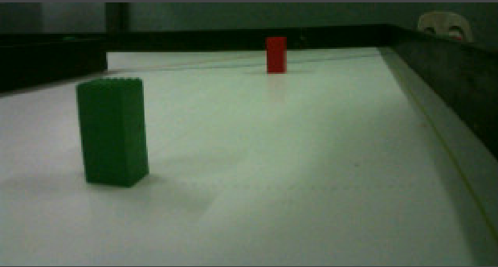 </center> |
|:---------------------:|
| Raw Image |

|<center> 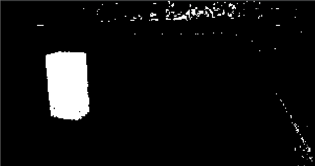 </center> | <center>  </center> |
|:---------------------:|:---------------------:|
| Green Threshold | Red Threshold |

After processing the image and finding the group of pixels or blobs of the image that meets the **certain thresholds** for ***Green*** or ***Red***, the data (the position and size) of these blobs is then transferred onto the Hub.

First the `PUPRemoteSensor` class is created and the channel in which the data will be transfered onto the hub:

```py
from pupremote import PUPRemoteSensor

camera = PUPRemoteSensor(power=True)
camera.add_channel('blob', to_hub_fmt='hhhhhh')  # channel name and format
```

The first arguement of the `add_channel` method is the name of the channel, and the second the format of the data. In this case we are sending 6 short integers which is represented by `h`. To learn more, see [Format Characters](https://docs.python.org/3/library/struct.html#format-characters)

Then, in every loop cycle, the camera detects color blobs and sends the processed data to the hub:

```py
camera.update_channel('blob', greenCx, greenCy, greenPixels, redCx, redCy, redPixels)
camera.process()
```

The data sent can then be read from the Hub using this code:
```py
data = camSensor.call("blob")
```
Which reads from the channel that we created earlier.

### 4.2. Traffic Sign Avoidance Strategy

&nbsp;&nbsp;&nbsp;&nbsp;&nbsp;&nbsp;&nbsp;&nbsp;&nbsp;&nbsp;The entire program for the robot is designed around single-instance detection of obstacles, rather than the commonly used continuous detection method for this category. This means that the robot captures data from the camera only at specific intervals, instead of constantly monitoring its surroundings. The team chose this approach because it simplifies debugging during the official competition. 

&nbsp;&nbsp;&nbsp;&nbsp;&nbsp;&nbsp;&nbsp;&nbsp;&nbsp;&nbsp;The main strategy behind the robot's programming is determined by navigating based on the color of traffic signs—whether both signs are the same color or different. However, it also includes the driving direction required in the challenge round, exiting the parking area at the start of the round, and detecting and responding to the presence of a parking lot. 

&nbsp;&nbsp;&nbsp;&nbsp;&nbsp;&nbsp;&nbsp;&nbsp;&nbsp;&nbsp;Take, for example, a clockwise direction as shown in the illustration below. If both detected traffic signs are green, the robot will follow a straight path along the left side, passing the traffic signs on its left. If both traffic signs are red, the robot will move straight along the right side, passing the traffic signs on its right. 

&nbsp;&nbsp;&nbsp;&nbsp;&nbsp;&nbsp;&nbsp;&nbsp;&nbsp;&nbsp;In another case, if both detected signs are green and a parking lot is also detected, the robot will drive between the parking lot and the traffic signs, effectively avoiding both. The same strategy applies if both signs are red and a parking lot is detected. 

_You may refer to the accompanying illustration for better visualization; the arrows indicate the route the robot takes in each possible scenario._

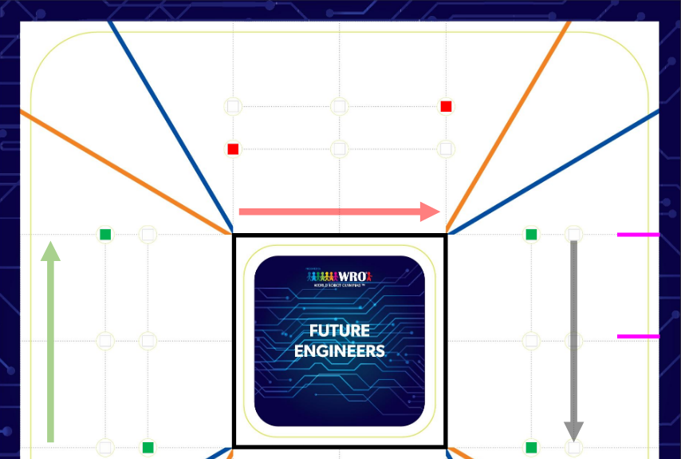

&nbsp;&nbsp;&nbsp;&nbsp;&nbsp;&nbsp;&nbsp;&nbsp;&nbsp;&nbsp;Another route, also in a clockwise direction, is shown in the illustration below. In this path, the robot begins by scanning the nearby traffic sign to detect their colors. If it detects a green traffic sign, it turns left to go around it; if it detects red, it turns right. If no color is detected, the robot defaults to a pre-set color, usually red. After maneuvering around the first obstacle, the robot stops and scans for a second one. Based on the color of the traffic sign it detects, it proceeds in the corresponding direction. However, if the section contains a parking lot, it uses a different route. The robot follows an alternate route, moving between the parking area and the traffic sign, depending on the color it previously recorded. 

_You may refer to the accompanying illustration for a clearer understanding; the arrows indicate the robot’s route in each scenario._

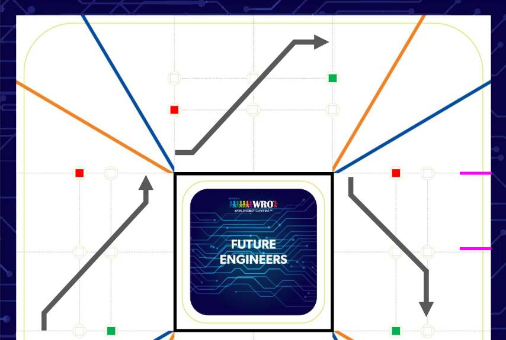

_Here is another path the robot takes in a clockwise direction when the first detected color is green and a parking lot is present.
Refer to the illustration below._

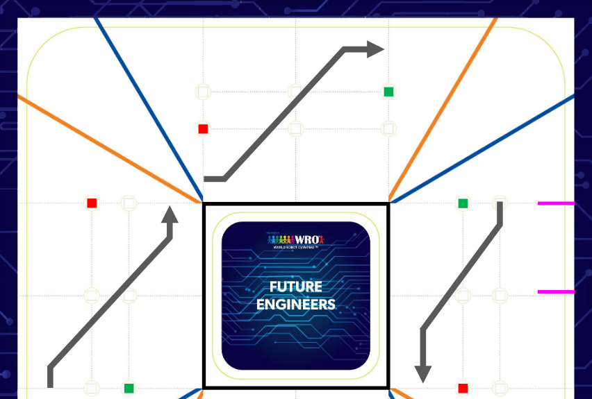

### 4.3. Perpendicular Parking Strategy

&nbsp;&nbsp;&nbsp;&nbsp;&nbsp;&nbsp;&nbsp;&nbsp;&nbsp;&nbsp;For the Perpendicular Parking scenario, the illustration will be based again on the clockwise direction. If the first detected obstacle is red, the robot will move to the right of the traffic sign, make a 90-degree turn going to the left, and continue moving forward until it reaches the outer wall, where it will come to a stop. 

_You may refer to the accompanying illustration for a clearer understanding; the arrows indicate the robot’s route for red first and green second perpendicular parking scenarios._

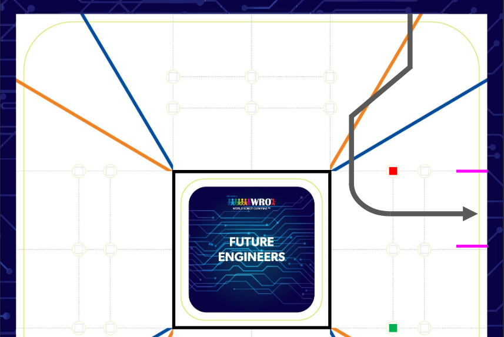

&nbsp;&nbsp;&nbsp;&nbsp;&nbsp;&nbsp;&nbsp;&nbsp;&nbsp;&nbsp;However, if the first detected obstacle is green, the robot will pass to the left of the traffic sign, then make a 90-degree right turn and move forward until it reaches the inner wall. Once it detects this, the robot will reverse until it reaches the outer wall, where it will come to a complete stop. 

_You may refer to the accompanying illustration for a clearer understanding; the arrows indicate the robot’s route for the green-first and red-second perpendicular parking scenarios._

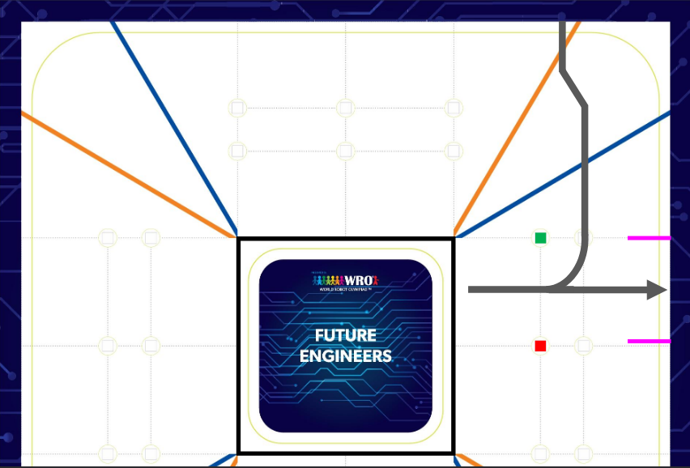

### 4.4. Semi-Machine Learning Strategy

&nbsp;&nbsp;&nbsp;&nbsp;&nbsp;&nbsp;&nbsp;&nbsp;&nbsp;&nbsp;The robot’s semi-machine learning approach follows a record-and-replay strategy, similar to basic imitation learning. It "learns" from the first lap by recording inputs such as the colors of the pillars and associating them with predefined actions or routes. This information is then reused in subsequent laps to navigate the course without needing to scan again. 

&nbsp;&nbsp;&nbsp;&nbsp;&nbsp;&nbsp;&nbsp;&nbsp;&nbsp;&nbsp;In the first lap, the robot focuses on data collection. It scans the environment using a camera, detects the colors of the traffic sign, and stores them in memory along with the corresponding lap segment, for example, lap `0.25`: `["Red", "Green"]`. During this phase, the robot essentially gathers input-output pairs: the detected traffic sign colors (inputs) determine the chosen path or movement (outputs). These mappings such as `"red = right"` or `"green = left"` are stored in memory for future reference. 

```py
# Record the robot's action for a quarter lap based on detected pillar color
def recordQuarterLap(sannisLivisa: FE, initalDetection: tuple, currentLap=0.25):
    # Detect initial pillar color using wall-following and recording logic
    pillarColor = wallingTurnAndRecord(sannisLivisa, initalDetection)
    
    currentLapRecord = []  # Store the sequence of pillar colors encountered this quarter lap
    prevTurn = ""          # Keep track of the previous turn direction for decision logic

    log("1.", pillarColor)
    
    # Execute the first turn based on the detected color
    if pillarColor == "Green":
        greenFirst(sannisLivisa, brake=True)
        prevTurn = "LEFT"
    elif pillarColor == "Red":
        redFirst(sannisLivisa, brake=True)
        prevTurn = "RIGHT"
    else:
        # Fallback in case no color is detected: use DEFAULT strategy
        if DEFAULT == "Red":
            redFirst(sannisLivisa, brake=True)
            prevTurn = "RIGHT"
            pillarColor = "Red"
        else:
            greenFirst(sannisLivisa, brake=True)
            prevTurn = "LEFT"
            pillarColor = "Green"

    # Record the first detected pillar color
    currentLapRecord.append((pillarColor))

    # Scan again to detect the next pillar or color change in the quarter lap
    if pillarColor == "Green":
        pillarColor = scanOnce(sannisLivisa,  70, -15, minThreshold=400)
    else:
        pillarColor = scanOnce(sannisLivisa, -15, -70, minThreshold=400)

    log("2.", pillarColor)

    # Record the second color only if it differs from the first
    try:
        if currentLapRecord[0] != pillarColor:
            currentLapRecord.append((pillarColor))
    except:
        # Fallback: ensure at least one color is recorded
        currentLapRecord.append((pillarColor))

    # Re-center robot before proceeding to the final turn
    sannisLivisa.center()

    # Perform the last maneuver for the quarter lap based on current color and previous turn
    if pillarColor == "Green" and prevTurn != "LEFT":
        greenLast(sannisLivisa, recording=True)
    elif pillarColor == "Red" and prevTurn != "RIGHT":
        redLast(sannisLivisa, recording=True)
    else:
        # If color matches previous turn, the robot just continues to move straight
        beep()
        sannisLivisa.lookDir(90, asyncBool=False)
        sannisLivisa.drive(1150, 500, 900, heading=0, decelerate=True)

        # Execute final ending maneuver based on the first pillar color
        if currentLapRecord[0] == "Green":
            greenEnding(sannisLivisa)
        else:
            redEnding(sannisLivisa)

    # Clean up any invalid entries (None) in the record
    currentLapRecord = [e for e in currentLapRecord if e != 'None']
    log(currentLapRecord)

    # Store the quarter lap record in the robot's memory for later playback
    # Format lap number as string index (e.g., "0.25" -> ".25") for memory retrieval later
    sannisLivisa.record(str(currentLap)[1::], currentLapRecord)
```

&nbsp;&nbsp;&nbsp;&nbsp;&nbsp;&nbsp;&nbsp;&nbsp;&nbsp;&nbsp;In the second and third laps, the robot no longer performs scans. Instead, it relies on the stored data and executes the corresponding pre-programmed movement routines. It calls a function named runRecord(), which loads the recorded memory of the previously detected pillar colors and directs the robot to follow the appropriate path. The logic is straightforward: if the stored data is "Red", the robot uses the right-side obstacle path; if it's "Green", it uses the left-side obstacle path; and if both "Red" and "Green" are stored for the same lap, it follows a more advanced route designed to navigate around both obstacles. 

```py
def runRecord(sannisLivisa: FE, currentLap):
    # Perform walling to face the next straight section
    wallingTurn(sannisLivisa)
    beep()

    # Format lap number as string index (e.g., "0.25" -> ".25") for memory retrieval
    # Retrieve previously recorded obstacle sequence for this lap
    formattedCurrent = str(currentLap)[1::]
    currentObstacles = sannisLivisa.remember(formattedCurrent)

    # Check if this lap corresponds to the parking maneuver
    parking = formattedCurrent == PARKINGLAP

    log(f"Lap {currentLap} Obstacles:", currentObstacles)

    # Execute appropriate driving routine depending on detected obstacle combination
    if list(set(currentObstacles)) == GREEN:
        greenOnly(sannisLivisa, parking)  # Only green pillars detected

    elif list(set(currentObstacles)) == RED:
        redOnly(sannisLivisa)  # Only red pillars detected

    elif currentObstacles == GREEN + RED:
        greenRed(sannisLivisa, False, parking)  # Green pillars first, then red pillars

    elif currentObstacles == RED + GREEN:
        redGreen(sannisLivisa, False, parking)  # Red pillars first, then green pillars

    # Final straight drive until the robot detects stall (end of lap or obstacle)
    sannisLivisa.driveUntilStalled(150, 600, 300, heading=0)
```

---

## 5. 🐞 Problems Encountered

&nbsp;&nbsp;&nbsp;&nbsp;&nbsp;&nbsp;&nbsp;&nbsp;&nbsp;&nbsp;The process of developing and improving the robot involved encountering several challenges that tested both its mechanical and technical capabilities. These difficulties provided valuable learning experiences, prompting the team to refine and enhance their strategies. This section outlines the most significant issues faced and the measures taken to address them, ultimately improving the robot’s performance and reliability during both the Open and Obstacle Challenges. 

### 5.1. Improper Printing
&nbsp;&nbsp;&nbsp;&nbsp;&nbsp;&nbsp;&nbsp;&nbsp;&nbsp;&nbsp;Throughout the fabrication process, the team encountered several challenges while 3D printing custom parts for the robot. A common issue was inaccurate measurements, which led to misaligned or poorly fitting components. Certain parts, such as sensor mounts and connector holes, were off by a few millimeters, creating difficulties during assembly. These errors typically arose from minor scaling mistakes or the printer’s tolerance variations, which became apparent only after testing the actual fit. 

&nbsp;&nbsp;&nbsp;&nbsp;&nbsp;&nbsp;&nbsp;&nbsp;&nbsp;&nbsp;The team also encountered failed and halted prints, particularly during longer print jobs. In some instances, prints detached from the build plate or the filament jammed mid-process, resulting in wasted materials—which were costly—and lost time. These interruptions necessitated rechecking the printer’s settings and, in some cases, restarting the print from the beginning. 

&nbsp;&nbsp;&nbsp;&nbsp;&nbsp;&nbsp;&nbsp;&nbsp;&nbsp;&nbsp;Another recurring problem was the wrong alignment of holes and connectors. A few designs had holes that did not perfectly match the sizes of LEGO Technic connectors, which forced us to manually adjust the parts using a file or reprint them after correcting the CAD model. In other instances, improper dimensions led to overly tight or loose fits—some mounts couldn’t hold sensors securely, while others had excessive gaps that affected the stability of the integration. 

&nbsp;&nbsp;&nbsp;&nbsp;&nbsp;&nbsp;&nbsp;&nbsp;&nbsp;&nbsp;Despite these setbacks, the challenges highlighted the importance of careful calibration and iterative design. Each failed print provided an opportunity to refine the process and improve the accuracy of the models before attempting another print. These experiences enhanced the team’s problem-solving skills and patience, making successful prints all the more rewarding. 

### 5.2. Faulty Power Source
&nbsp;&nbsp;&nbsp;&nbsp;&nbsp;&nbsp;&nbsp;&nbsp;&nbsp;&nbsp;During testing, the team also faced recurring issues with the power source, particularly with the UPS-18650 module and its connected battery. On several occasions, the module failed to provide stable power, causing the ESP32 and sensors to shut down unexpectedly. In some cases, the 18650 battery became partially drained or “dead” even after charging, resulting in inconsistent startup behavior and intermittent communication loss between the ESP32 and the SPIKE™ Prime Hub. 
    
### 5.3. Spray Painting
&nbsp;&nbsp;&nbsp;&nbsp;&nbsp;&nbsp;&nbsp;&nbsp;&nbsp;&nbsp;While working on the colored version of the robot, the team faced several challenges during the spray painting process. One major difficulty was the long drying time, particularly because multiple layers were applied to achieve an even and vibrant finish. As a result, fingerprints or smudges occasionally appeared on the surface when parts were handled too soon. The uneven drying also caused small areas to become sticky or textured, requiring light sanding and repainting to restore a smooth finish. 

&nbsp;&nbsp;&nbsp;&nbsp;&nbsp;&nbsp;&nbsp;&nbsp;&nbsp;&nbsp;The team also observed that some paint did not adhere well to the 3D-printed PLA surfaces. To address this, the team implemented light sanding before painting and applied thinner coats to prevent drips and pooling. Despite these minor setbacks, the experience emphasized the importance of patience and timing when applying finishing touches. Ultimately, the paint enhanced the robot’s appearance, giving it a clean, professional, and well-engineered look.

### 5.4. Uneven and Unclean Field

&nbsp;&nbsp;&nbsp;&nbsp;&nbsp;&nbsp;&nbsp;&nbsp;&nbsp;&nbsp;As previously noted, the Obstacle and Open Challenges demanded precise movement, accurate obstacle detection, and reliable turning. During testing, the team encountered issues with the game field’s uneven, unclean, and unstable surface. Certain areas, particularly near the corners, featured noticeable bumps, accumulated dust, gaps, or slight inclines that affected the robot’s movement. These surface irregularities caused unexpected tilting, loss of balance, and occasional slipping, especially during tight turns or straight-line motion. 

&nbsp;&nbsp;&nbsp;&nbsp;&nbsp;&nbsp;&nbsp;&nbsp;&nbsp;&nbsp;This issue made it difficult for the robot to maintain a consistent path and occasionally affected the camera’s sensing and reading accuracy. To address the problem, the team performed troubleshooting and adjusted program values, as well as implemented structural modifications to improve the robot’s stability and ground contact. These included selecting optimal wheels for both the steering and driving mechanisms. These changes minimized the impact of the uneven field, enabling the robot to achieve smoother and more stable movement during its runs. 

### 5.5. Constant Necessity of Cleaning the Wheels

&nbsp;&nbsp;&nbsp;&nbsp;&nbsp;&nbsp;&nbsp;&nbsp;&nbsp;&nbsp;Throughout the development process, the team observed that the robot’s performance was highly sensitive to the condition of its wheels. When the wheels accumulated dirt, the robot was more prone to drifting, particularly during sharp or narrow turns. Conversely, overly clean wheels caused slipping due to reduced friction, resulting in less reliable movement and diminished traction. This posed a significant challenge, as maintaining the optimal wheel condition for consistent performance was difficult. Furthermore, continuous runs caused the wheels to naturally collect dust and debris from the field, gradually affecting ground contact and stability. To mitigate this issue, the team frequently inspected and cleaned the wheels, ensuring the robot could maintain accurate and reliable movement during testing. 

### 5.6. Postponed Training Due to Sudden Calamities

&nbsp;&nbsp;&nbsp;&nbsp;&nbsp;&nbsp;&nbsp;&nbsp;&nbsp;&nbsp;Another problem encountered by the team is the consequent occurrence of storms and other calamities in the Philippines, particularly in the northern and southern portions of Luzon, which significantly affected the province where the members reside. Unfortunately, while others in different areas may have experienced even worse conditions, the team still faced multiple and continuous suspensions of classes and activities. These interruptions hindered the members from maximizing their time and productivity in preparation for their scheduled tasks and training. Moreover, the planned timeline had to be adjusted several times, causing delays in processes that were initially set to be completed within specific periods.

&nbsp;&nbsp;&nbsp;&nbsp;&nbsp;&nbsp;&nbsp;&nbsp;&nbsp;&nbsp;Despite these setbacks, the team remained understanding and empathetic toward the broader situation. The team's hearts go out to those who have lost family members, friends, pets, homes, and sources of livelihood due to these calamities. The experience also reminded the team of the importance of resilience and patience during difficult times. Although the delays posed challenges in maintaining momentum, the group used the time to reassess priorities, reorganize schedules, and strengthen coordination to ensure that the set goals would continue once circumstances improved. 


---

## 6. 🖨️ 3D Printing Management

&nbsp;&nbsp;&nbsp;&nbsp;&nbsp;&nbsp;&nbsp;&nbsp;&nbsp;&nbsp;Dedicated not only to improving the aesthetics of the self-driving robot but also to enhancing its innovative functionality, the team integrated multiple 3D-printed components designed in-house. Each part was carefully engineered to meet specific requirements aimed at improving the robot’s performance. This section outlines the process undertaken for designing and developing these 3D-printed components, highlighting how each contributes to the robot’s overall engineering factor.  

### 6.1. 3D Modeling

&nbsp;&nbsp;&nbsp;&nbsp;&nbsp;&nbsp;&nbsp;&nbsp;&nbsp;&nbsp;To design the 3D-printed parts, <b>Blender</b>—an open-source 3D modeling software—was utilized for its versatility in creating animations, visual effects, and precise 3D models suitable for printing [[17]](#ref17). The choice of Blender enabled the creation of detailed and customized components that could not be achieved using standard LEGO® parts alone. Specifically, Blender was used to model the <b>electronic component cases</b>, including the camera mount, sensor housings, and the initial version of the robot’s chassis. Each part was dimensioned carefully to ensure a secure fit with existing LEGO Technic™ elements while maintaining proper alignment and structural stability.  

<center>

| 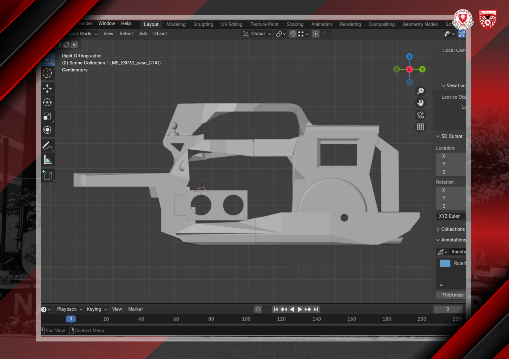 | 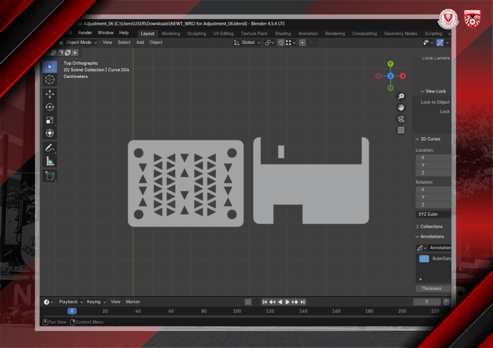 |
|:---------------------:| :---------------------:|
| <center> Figure 31. <br> 3D Modeling </center> | <center> Figure 32. <br> 3D Modeling </center>|  

</center>

&nbsp;&nbsp;&nbsp;&nbsp;&nbsp;&nbsp;&nbsp;&nbsp;&nbsp;&nbsp;The workflow began with sketching each design according to the robot’s requirements and physical constraints. Using Blender’s modeling tools, precise 3D geometries were created with careful attention to scale and alignment, particularly for components requiring tight fits. Blender’s measurement tools and modifier system were utilized to refine each model before exporting the designs as STL files for slicing and printing. 

&nbsp;&nbsp;&nbsp;&nbsp;&nbsp;&nbsp;&nbsp;&nbsp;&nbsp;&nbsp;Overall, the combination of Blender’s flexibility and advanced modeling capabilities enabled faster design iterations and improved outcomes. The software played a crucial role in enhancing the functionality, aesthetics, and overall engineering quality of the robot. 

### 6.2. Material Selection 

&nbsp;&nbsp;&nbsp;&nbsp;&nbsp;&nbsp;&nbsp;&nbsp;&nbsp;&nbsp;FlashForge PLA filament with a 1.75 mm diameter was selected as the primary material for all 3D-printed components due to its ease of printing and reliable dimensional accuracy. PLA is among the most widely used filaments in 3D printing and offers several advantages that make it well-suited for the robot’s design. It provides excellent precision—essential for components that must fit accurately with LEGO elements and electronic parts such as the OpenMV Cam H7—and exhibits minimal warping, enabling consistent print quality even on standard, non-heated build surfaces. 

&nbsp;&nbsp;&nbsp;&nbsp;&nbsp;&nbsp;&nbsp;&nbsp;&nbsp;&nbsp;Another advantage of PLA is its rigidity. This helps maintain the alignment and stability of mounted structural parts. While it is not as flexible or impact-resistant as materials like PETG or ABS, its stiffness is an important element for components that require shape retention under load. PLA is also biodegradable and more environmentally friendly than many other plastics, which aligns with responsible engineering practices. Given its ease of use, good surface finish, and suitability for fine details, PLA was the most practical and efficient choice for producing custom parts quickly and reliably throughout the development process. 

### 6.3. 3D Printing Settings

&nbsp;&nbsp;&nbsp;&nbsp;&nbsp;&nbsp;&nbsp;&nbsp;&nbsp;&nbsp;After completing the custom component designs in Blender, the models were prepared for printing using slicing software such as FlashPrint 5 and Bambu Studio, both configured with optimized settings for PLA filament. The objective during the printing process was to achieve an optimal balance between strength, dimensional accuracy, weight, and print time while ensuring that each part fulfilled the functional requirements of the robot. 

<center>

|  |  |
|:---------------------:| :---------------------:|
| <center> Figure 33. <br> FlashForge Print Settings </center> | <center> Figure 34. <br> Bambu Lab Print Settings </center>|  

</center>

&nbsp;&nbsp;&nbsp;&nbsp;&nbsp;&nbsp;&nbsp;&nbsp;&nbsp;&nbsp;In the print settings, FlashForge PLA filament (1.75 mm) was used with a 0.4 mm nozzle for all prints. A layer height of 0.2 mm was selected as it provided an effective balance between surface quality and print speed while maintaining tight tolerances—essential for components such as the slide-lock camera case, sensor mounts, and electronic housings, which required precise fits with LEGO Technic™ parts. The infill density was set to 15% using a hexagon pattern, offering sufficient strength for most structural and functional components, including brackets, supports, and the robot chassis, while keeping the prints lightweight and efficient to produce. 

&nbsp;&nbsp;&nbsp;&nbsp;&nbsp;&nbsp;&nbsp;&nbsp;&nbsp;&nbsp;Print orientation was carefully chosen to improve strength. For example, parts that would experience vertical stress were printed lying flat so that the layer lines ran perpendicular to the direction of the force, reducing the risk of cracking. When prints involved overhangs or bridging, such as on the holes of the camera case, custom support structures enabled directly in the slicer were used, ensuring they were easy to remove without damaging critical surfaces. With these printing settings and careful preparation, the team were able to produce durable, accurate, and functional parts that integrated seamlessly into the robot's structure and performance. 

### 6.4. Printing

&nbsp;&nbsp;&nbsp;&nbsp;&nbsp;&nbsp;&nbsp;&nbsp;&nbsp;&nbsp;The FlashForge Adventurer 4 was utilized for printing the sensor housings and the initial version of the chassis, while the Bambu Lab printer was employed for the final chassis and other refined components. These printers were selected for their reliability, ease of operation, and compatibility with PLA filament. Both systems feature fully enclosed printing chambers that maintain consistent temperatures during printing, minimizing warping and ensuring dimensional accuracy. This setup provided flexibility for rapid prototyping while also delivering high-quality results for the final model. 

<center>

|  |  |
|:---------------------:| :---------------------:|
| <center> Figure 35. <br> Flashforge Printer </center> | <center> Figure 36. <br> Bambu Lab Printer </center>| 

</center>

&nbsp;&nbsp;&nbsp;&nbsp;&nbsp;&nbsp;&nbsp;&nbsp;&nbsp;&nbsp;The FlashForge Adventurer 4 has a build volume of 220 × 200 × 250 mm, a layer resolution range of 0.1–0.4 mm, and a nozzle temperature capacity of up to 265 °C [[18]](#ref18). Its removable flexible build plate allows for easy part removal, while the built-in camera and touchscreen interface enable efficient monitoring and control of the printing process. With a print speed of up to 100 mm/s, the printer served as the primary prototyping machine for evaluating fits, tolerances, and mechanical functionality. 

&nbsp;&nbsp;&nbsp;&nbsp;&nbsp;&nbsp;&nbsp;&nbsp;&nbsp;&nbsp;For the final chassis, the Bambu Lab X1 Carbon Combo printer was utilized. This printer offers a build volume of 256 × 256 × 256 mm and supports a maximum print speed of up to 500 mm/s with an acceleration of up to 20,000 mm/s² [[19]](#ref19). It operates within a 0.1–0.4 mm layer height range and reaches nozzle temperatures of up to 300 °C, making it suitable for various materials, including PLA, PETG, ABS, ASA, and carbon fiber-reinforced filaments [[19]](#ref19). Advanced features such as automatic bed leveling, dual auto bed calibration, active vibration compensation, and a carbon HEPA filtration system ensure clean, precise, and reliable prints. The Automatic Material System (AMS) further enables efficient multi-filament management  [[19]](#ref19). With its high-speed performance and consistent accuracy, the X1 Carbon Combo produced a strong, dimensionally accurate, and professional-quality final chassis that matched the robot’s design and structural requirements. 

&nbsp;&nbsp;&nbsp;&nbsp;&nbsp;&nbsp;&nbsp;&nbsp;&nbsp;&nbsp;Together, the two printers complemented each other within the workflow: the FlashForge Adventurer 4 provided reliable prototyping capabilities, while the Bambu Lab X1 Carbon Combo delivered high-quality fabrication for the final components. 

<center>

|  |  |
|:---------------------:| :---------------------:|
| <center> Figure 37. <br> 3D Printing in FlashForge </center> | <center> Figure 38. <br> 3D Printing n Bambu Lab </center>|  

</center>

---

## 7. 📐 Engineering Factor

&nbsp;&nbsp;&nbsp;&nbsp;&nbsp;&nbsp;&nbsp;&nbsp;&nbsp;&nbsp;Behind every successful robot lies a process of challenges, decisions, creative problem-solving, and innovative engineering. The design process focused not only on building a functional robot but on developing one that operates intelligently and efficiently. Each engineering aspect described in this section represents a purposeful solution aimed at enhancing the robot’s efficiency, consistency, reliability, and adaptability—embodying the principles of effective engineering. 

### 7.1. One-Button Power Mechanism

&nbsp;&nbsp;&nbsp;&nbsp;&nbsp;&nbsp;&nbsp;&nbsp;&nbsp;&nbsp;One of the most innovative and team-engineered features of the robot is the one-button power mechanism—a design that stands out as both a creative and functional breakthrough. Inspired by the Future Engineers competition rule, which requires the robot to be powered on using only one button and one motion, the team set out to create a unified power system that could activate all components simultaneously. 

&nbsp;&nbsp;&nbsp;&nbsp;&nbsp;&nbsp;&nbsp;&nbsp;&nbsp;&nbsp;At first, the concept seemed unlikely to work, as integrating separate power sources—namely the SPIKE™ Prime Large Hub, the LMS-ESP32, and the UPS-18650 power module—into a single activation circuit posed significant challenges. However, through careful planning, circuit testing, and iterative design, the team successfully engineered a reliable one-button system that synchronized power delivery across all devices.This solution was not just a simple innovation but a product of genuine engineering creativity. The team designed custom wiring layouts and verified voltage compatibility to ensure safe and efficient startup. What began as an uncertain idea evolved into a fully functional feature that exemplified technical understanding and original problem-solving approach, proving that bold ideas, when engineered with precision, can truly work. 

&nbsp;&nbsp;&nbsp;&nbsp;&nbsp;&nbsp;&nbsp;&nbsp;&nbsp;&nbsp;This was accomplisged by the team through connecting the UPS-18650 to the LMS-ESP32 via USB, and then linking the ESP32 to the SPIKE™ Prime Hub through a serial connection that uses transistors and resistors for voltage regulation and logic control. The SPIKE™ Hub’s power button acts as the main trigger—when it is pressed, it powers not only itself but also activates the ESP32 and the UPS module. 
  
<center>

| 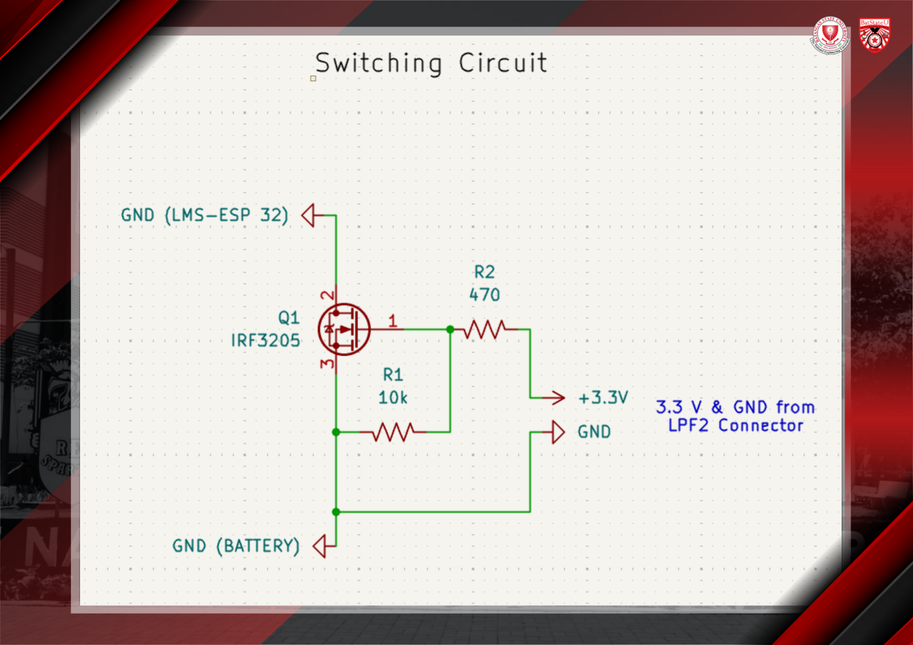 | 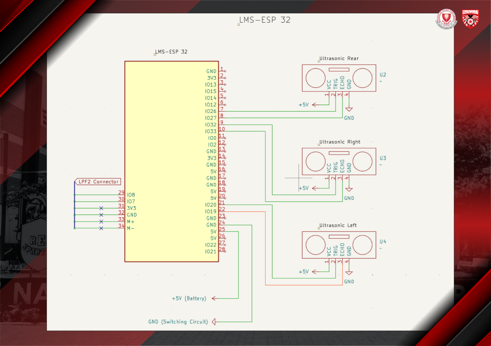 |
|:---------------------:| :---------------------:|
| <center> Figure 51. <br> Switching Circuit </center> | <center> Figure 52. <br> Schematic Diagram </center> |

</center>

&nbsp;&nbsp;&nbsp;&nbsp;&nbsp;&nbsp;&nbsp;&nbsp;&nbsp;&nbsp;These schematic diagrams illustrate the team’s custom-designed electrical system that integrates the LMS-ESP32, the LEGO® SPIKE™ Prime Hub, and multiple ultrasonic sensors into a unified, one-button-powered platform. This system represents a key innovation in the robot’s electrical design, engineered entirely by the team to meet the competition’s one-motion power rule while maintaining stable multi-sensor functionality. The diagrams show both the main control circuit and the custom MOSFET-based switching circuit that make this power logic possible. 

<b> 1. LMS-ESP32 Control Circuit </b>
- This is the core microcontroller handling sensor input and communication with the SPIKE™ Prime Hub. 
  - It connects to three ultrasonic sensors (labeled U2, U3, and U4) placed at the rear, right, and left of the robot.
  - Each sensor receives +5V power from the UPS-18650 power module, ensuring consistent operation independent of the SPIKE™ Hub’s internal battery.
  - The Echo and Trigger pins are mapped to dedicated ESP32 GPIOs, allowing precise distance readings from all three directions.
  - A dedicated +5V (Battery) input supplies power to the ESP32, while the ground connection is intelligently routed through the switching circuit—allowing it to turn on or off in sync with the SPIKE Hub.\
  - This layout allowed the team to extend the SPIKE™ Prime system’s functionality beyond its default port limit without external boards or manual power control.
     
<b> 2. Custom Switching Circuit </b>
- The switching circuit, built around an IRF3205 N-channel MOSFET (Q1), is the core of the team’s one-button power mechanism.
  - It manages the shared ground connection between the ESP32 system and the UPS battery using a signal from the SPIKE™ Prime Hub.
  - The MOSFET gate receives a 3.3V control signal from the Hub’s LPF2 connector, which acts as the digital “switch.”
  - Two resistors: R1 (10 kΩ) and R2 (470 Ω) stabilize the gate voltage through a voltage divider and pull-down configuration, ensuring clean switching without signal noise.
  - When the SPIKE™ Hub’s main power button is pressed, the 3.3V signal activates the MOSFET, completing the ground path and instantly powering the entire ESP32 subsystem.
  - This means both controllers, which are the SPIKE™ Hub and LMS-ESP32 boot simultaneously with one button press, a feature originally thought to be unfeasible until the team validated it through experimentation and circuit prototyping.

<b> 3. LPF2 Connector Reference Table </b>
- This small reference table defines the pinout of the LPF2 communication connector used by the SPIKE™ Hub, specifying the lines for GND, 3.3V, and serial communication pins (ID1–ID2). This helps align the correct wiring for signal and power integration between the LEGO hub and the ESP32.

### 7.2. 3D-Printed OpenMV Cam H7 Plus Case 

&nbsp;&nbsp;&nbsp;&nbsp;&nbsp;&nbsp;&nbsp;&nbsp;&nbsp;&nbsp;One of the key engineering features developed was a custom 3D-printed case for the OpenMV Cam H7, serving as one of the robot’s primary vision systems. The concept for this component originated entirely from the team’s own ideas, combining creativity and practical engineering to address both functionality and convenience. The case was designed to hold the camera securely while allowing easy access and removal when needed. Rather than relying on a traditional fixed mount—which would require time-consuming disassembly—the team engineered a unique slide-lock mechanism. This original design allows the camera to be attached or detached quickly, greatly improving efficiency during testing, troubleshooting, and rewiring. The slide-lock also stabilizes the camera during operation, preventing unwanted movement or vibration and ensuring consistent performance throughout each challenge. 

&nbsp;&nbsp;&nbsp;&nbsp;&nbsp;&nbsp;&nbsp;&nbsp;&nbsp;&nbsp;The development process went through several design iterations to ensure that the camera case was both secure and user-friendly. The initial concept began with a simple case design intended to hold the camera using a screw-fastened cover. However, finding a screw size that fit the camera case precisely proved challenging. To overcome this issue, the design was reimagined to incorporate a slide-lock mechanism, eliminating the need for mechanical fasteners or tools. This redesign allowed for easier camera installation and removal while maintaining a firm hold. The second attempy featuring the slide-lock system was then printed, but minor dimensional inaccuracies emerged when compared to the actual size of the OpenMV Cam H7, prompting further refinement of the model.  

&nbsp;&nbsp;&nbsp;&nbsp;&nbsp;&nbsp;&nbsp;&nbsp;&nbsp;&nbsp;In the third iteration, precise measurements of the OpenMV Cam H7 were taken to refine the slide-lock design and achieve a more accurate fit. This version marked a major improvement as it securely held the camera in place, provided quick and effortless access, and kept the wiring neatly organized and protected. What made this design truly original was the team’s creative approach to solving a practical problem through a fully custom mechanism. The slide-lock concept was entirely self-engineered—born from experimentation, hands-on testing, and the team’s commitment to creating a unique, efficient, and tool-free solution tailored specifically to the robot’s needs.  

<center>

|  |  |
|:---------------------:| :---------------------:|
| <center> Figure 39. <br> 3D-Printed OpenMV Cam H7 Plus Case  </center> | <center> Figure 40. <br> 3D-Printed OpenMV Cam H7 Plus Case  <br> Dimesions </center> |

</center>

### 7.3. 3D-Printed LMS-ESP32 Case

&nbsp;&nbsp;&nbsp;&nbsp;&nbsp;&nbsp;&nbsp;&nbsp;&nbsp;&nbsp;The 3D-printed LMS-ESP32 case was developed as a key engineering innovation aimed at improving the functionality and reliability of the robot’s electronic system. During initial testing, it was observed that the ESP32 board was vulnerable to movement and potential disconnections when mounted openly on the chassis. To resolve this issue, a fully custom enclosure was conceptualized and modeled in Blender based on the team’s original design approach. Fabricated using PLA filament, the case provided a secure and organized housing that protected the ESP32 from physical disturbances while maintaining accessibility for wiring and maintenance. This original solution not only strengthened the robot’s structural integrity but also reflected the team’s hands-on problem-solving and design creativity. 

&nbsp;&nbsp;&nbsp;&nbsp;&nbsp;&nbsp;&nbsp;&nbsp;&nbsp;&nbsp;The case was precisely dimensioned to accommodate the LMS-ESP32 board and its USB connection to the UPS-18650 power module, while providing sufficient clearance for signal and power cables. The design incorporated strategically placed ventilation slots to promote passive heat dissipation, keeping the board within safe operating temperatures during extended operation. Rather than mounting directly onto LEGO® Technic™ elements, the enclosure featured a custom structural design created entirely by the team to fit seamlessly within the robot’s framework. This original configuration demonstrated a creative engineering approach—balancing protection, accessibility, and functionality through a self-designed structure tailored specifically to the robot’s layout and performance needs. 

<center>

| 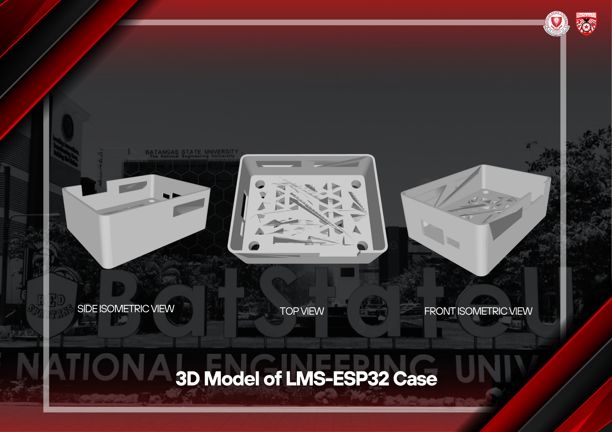 |  | 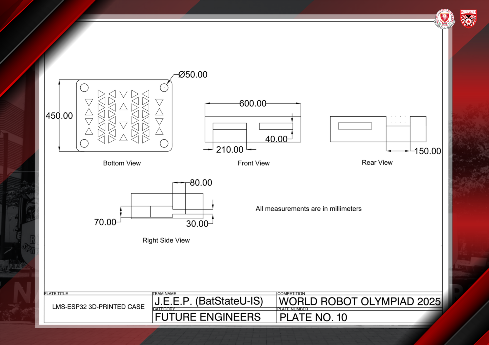 |
|:---------------------:| :---------------------:| :---------------------:|
| <center> Figure 42. <br> 3D Model of LMS-ESP 32 Case </center> | <center> Figure 43. <br> 3D-Printed LMS-ESP 32 Case </center> | <center> Figure 44. <br> 3D-Printed LMS-ESP 32 Case <br> Dimesions </center> |

</center>

&nbsp;&nbsp;&nbsp;&nbsp;&nbsp;&nbsp;&nbsp;&nbsp;&nbsp;&nbsp;Several iterations were printed to achieve proper alignment of holes and connectors, as initial prototypes showed minor mismatches between the ESP32’s pin layout and the robot’s structural frame. Adjustments to thickness and hole diameter were made after each test print, improving both the mechanical strength and ease of access for maintenance. The final version of the case achieved a balance between rigidity and light weight. 

### 7.4. 3D-Printed UPS-18650 Case

&nbsp;&nbsp;&nbsp;&nbsp;&nbsp;&nbsp;&nbsp;&nbsp;&nbsp;&nbsp;Similarly, the 3D-printed case for the UPS-18650 module represented another key engineering enhancement in the robot’s design. Building upon the experience gained from modeling and printing earlier components such as the camera and sensor enclosures, the development of this case became a more streamlined and efficient process. With a clear understanding of dimensional requirements and alignment considerations for securely fitting electronic components, the team was able to design a custom, form-fitting enclosure for the UPS module. This thoughtful design ensured stable mounting, effective protection, and easy accessibility, reflecting the team’s growing expertise and creative problem-solving in 3D-printed component fabrication.  

&nbsp;&nbsp;&nbsp;&nbsp;&nbsp;&nbsp;&nbsp;&nbsp;&nbsp;&nbsp;Using Blender for 3D modeling, the case was designed to provide precise spacing for the module’s ports, indicators, and wiring while maintaining a compact structure that fit neatly within the robot’s overall framework. Once fabricated, the enclosure proved easy to assemble and install, offering reliable protection and stability for the UPS-18650 module. The thoughtful design also enhanced cable management by minimizing clutter and improving accessibility, which made maintenance and adjustments more efficient. 

<center>

| 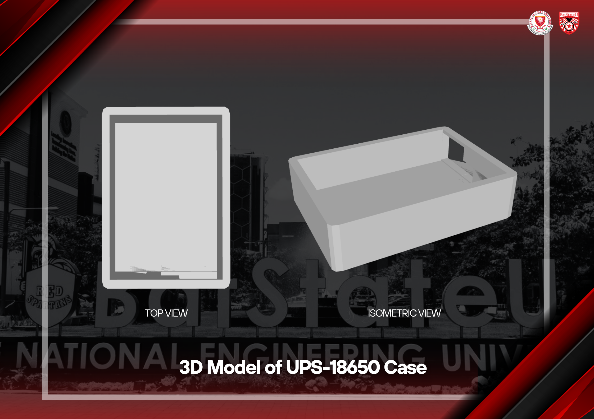 |  | 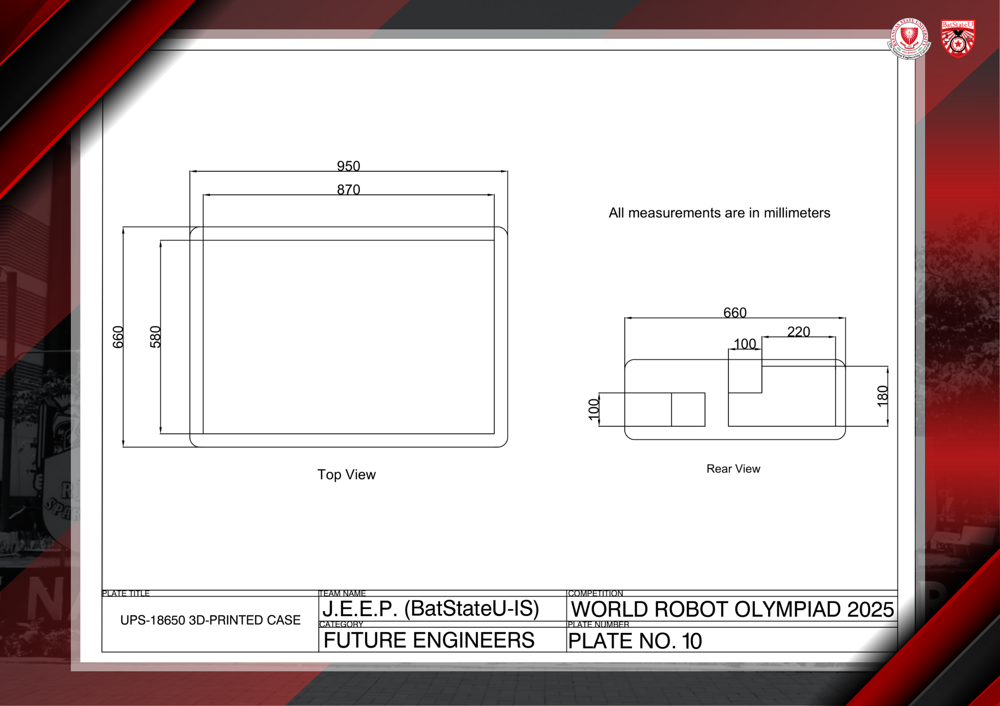 |
|:---------------------:| :---------------------:| :---------------------:|
| <center> Figure 45. <br> 3D Model of UPS-18650 Case </center> | <center> Figure 46. <br> 3D-Printed UPS-18650 Case </center> | <center> Figure 47. <br> 3D-Printed UPS-18650 Case <br> Dimesions </center> |

</center>

&nbsp;&nbsp;&nbsp;&nbsp;&nbsp;&nbsp;&nbsp;&nbsp;&nbsp;&nbsp;This part reflected how the team’s progressive learning in 3D modeling and fabrication directly contributed to faster, more precise design iterations. 

### 7.5. 3D-Printed HC-SR04 Ultrasonic Sensor Case

&nbsp;&nbsp;&nbsp;&nbsp;&nbsp;&nbsp;&nbsp;&nbsp;&nbsp;&nbsp;The 3D-printed case for the HC-SR04 Ultrasonic Sensor served as another key engineering innovation that enhanced both functionality and integration within the robot. Designed entirely from the team’s original concept, the enclosure featured a custom slide-lock mechanism that allowed it to lock directly into the robot’s chassis. This design provided a secure and stable mount for the sensor, ensuring precise alignment and consistent distance measurement during operation while showcasing the team’s creativity and engineering ingenuity. 

&nbsp;&nbsp;&nbsp;&nbsp;&nbsp;&nbsp;&nbsp;&nbsp;&nbsp;&nbsp;Precise measurements of the sensor’s transducers, PCB layout, and mounting dimensions were taken to achieve a snug and accurate fit while keeping the pins and wiring fully accessible. The final 3D-printed design enhanced the sensor’s protection and durability, ensuring secure placement within the chassis and maintaining proper alignment for consistent and reliable distance readings. 

<center>

| 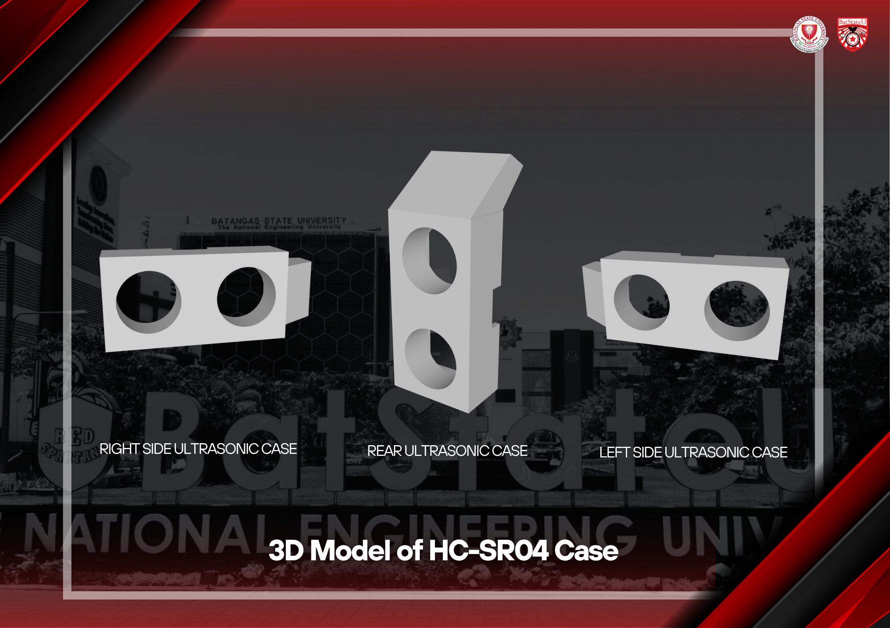 |  |  |
|:---------------------:| :---------------------:| :---------------------:|
| <center> Figure 48. <br> 3D Model of HC-SR04 Ultrasonic Sensor Case </center> | <center> Figure 49. <br> 3D-Printed HC-SR04 Ultrasonic Sensor Case </center> | <center> Figure 50. <br> 3D-Printed HC-SR04 Ultrasonic Sensor Case <br> Dimesions </center> |

</center>

### 7.6. 3D-Printed Robot Chassis

&nbsp;&nbsp;&nbsp;&nbsp;&nbsp;&nbsp;&nbsp;&nbsp;&nbsp;&nbsp;The 3D-printed chassis was one of the most original and defining engineering achievements in the robot’s development, entirely conceptualized and created by the team. Drawing inspiration from the iconic jeepney, the design was carefully modeled from scratch to capture its recognizable form while adapting it to function as the robot’s main structural framework. Every contour, panel, and mounting point was crafted with the use of the team’s own creativity and technical skill, balancing cultural expression with engineering practicality. This hands-on approach showcased how the team transformed an idea into a fully functional, 3D-printed structure that united aesthetic originality with mechanical strength and precision. 

&nbsp;&nbsp;&nbsp;&nbsp;&nbsp;&nbsp;&nbsp;&nbsp;&nbsp;&nbsp;As the central frame supporting every major subsystem, achieving accuracy and strength was crucial. During the early stages, several trial-and-error iterations were produced using the FlashForge Adventurer 4 printer. These initial attempts faced challenges such as incomplete prints, misalignments, and dimensional inaccuracies, which are issues often caused by minor modeling errors or printer calibration inconsistencies. Despite these obstacles, each iteration provided valuable learning experiences that guided refinements in modeling, structural reinforcement, and overall print quality, ultimately leading to a stronger and more precise final chassis. 

&nbsp;&nbsp;&nbsp;&nbsp;&nbsp;&nbsp;&nbsp;&nbsp;&nbsp;&nbsp;After several iterations, a functional prototype was successfully produced that met the initial design goals. For the final version, the Bambu Lab 3D printer was used, which provided higher resolution, better print stability, and smoother surface finish. In the end, the result was a strong, lightweight, and accurately fitted chassis that perfectly supported the robot’s electronic and mechanical components. 

<center>
 
|  |  |  |
|:---------------------:| :---------------------:| :---------------------:|
| <center> Figure 51. <br> 3D Model of Robot Chassis </center> | <center> Figure 49. <br> 3D-Printed Robot Chassis </center> | <center> Figure 50. <br> 3D-Printed Robot Chassis <br> Dimesions </center> |

</center>

### 7.7. Rotating Camera and Distance Sensor

&nbsp;&nbsp;&nbsp;&nbsp;&nbsp;&nbsp;&nbsp;&nbsp;&nbsp;&nbsp;The creation of the rotating sensor system stands as one of the team’s most inventive and technically clever engineering solutions. It originated from the idea of maximizing the robot’s sensing capability without adding extra hardware or ports. Through brainstorming and experimentation, the team designed a custom rotating platform that combined both the OpenMV Cam H7 and the Technic™ Distance Sensor into a single, coordinated system. 

&nbsp;&nbsp;&nbsp;&nbsp;&nbsp;&nbsp;&nbsp;&nbsp;&nbsp;&nbsp;To maximize the functionality of both the camera and the distance sensor, the robot is equipped with a Technic™ Large Angular Motor that enables these sensors to rotate approximately 90° in both directions from a central starting position. This rotational mechanism significantly expands the sensors' field of view, allowing the robot to better observe its surroundings, detect walls and obstacles from multiple angles, and respond more accurately to changes in the environment. This feature was developed in response to the limited number of available ports on the Technic™ Large Hub, which restricted the number of sensors that could be connected at once. By mounting both the OpenMV Cam H7 and the Technic™ Distance Sensor on a rotating platform powered by a single motor, the team were able to simulate the presence of multiple sensors while conserving ports. The rotating sensor system plays a key role in obstacle detection, wall tracking, and situational awareness across both the Open and Obstacle Challenge rounds. 

<center>

| 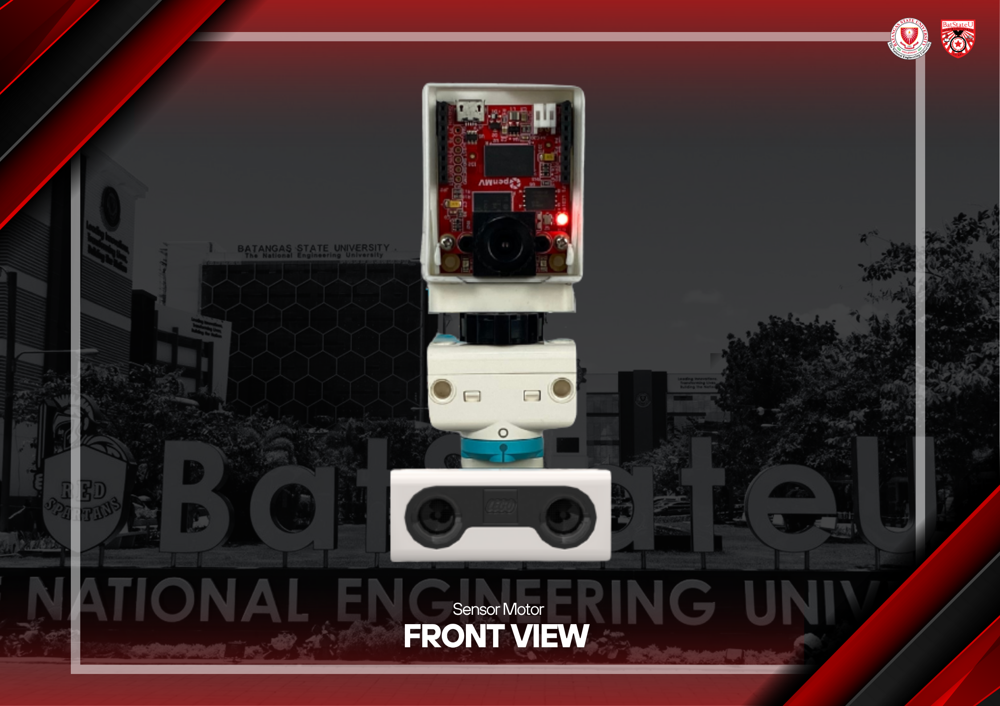 | 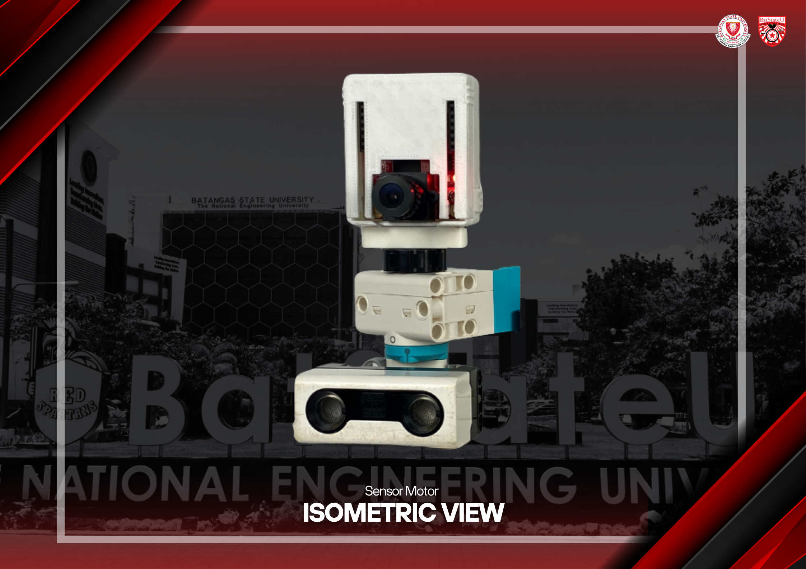 |
|:---------------------:| :---------------------:|
| <center> Figure 49. <br> Robot's Rotating Mechanism <br> Front View </center> | <center> Figure 50. <br> Robot's Rotating Mechanism <br> Side View </center> |

</center>

---

## 8. 🔧 Mechanical Improvements

&nbsp;&nbsp;&nbsp;&nbsp;&nbsp;&nbsp;&nbsp;&nbsp;&nbsp;&nbsp;Throughout the development of the self-driving robot, the team carefully evaluated a wide range of mechanical and technical aspects to enhance its overall functionality, precision, and adaptability. Every component, configuration, and mechanism was systematically tested, modified, or replaced to achieve smoother movement, more accurate navigation, and improved task performance. These iterative refinements contributed significantly to the robot’s consistency and responsiveness during critical operations such as turning, wall detection, obstacle avoidance, and parking. As a result of this continuous improvement process, the team successfully optimized the robot’s reliability and efficiency across both the Open Challenge and Obstacle Challenge rounds. The following sections highlight the major mechanical modifications implemented to maximize the robot’s full potential.  

### 8.1. Weight Reduction through 3D Printing

&nbsp;&nbsp;&nbsp;&nbsp;&nbsp;&nbsp;&nbsp;&nbsp;&nbsp;&nbsp;One of the major mechanical improvements implemented in the robot was the reduction of its overall weight through the replacement of several LEGO® structural components with custom 3D-printed parts. In the early prototypes, the team observed that the robot’s chassis and sensor mounts contributed significant weight, which negatively impacted its speed, balance, and turning accuracy. To overcome this issue, key structural sections were redesigned in Blender, focusing on optimizing geometry to achieve the ideal balance between strength and lightweight efficiency.  

&nbsp;&nbsp;&nbsp;&nbsp;&nbsp;&nbsp;&nbsp;&nbsp;&nbsp;&nbsp;By 3D printing these parts using PLA filament, the team gained precise control over wall thickness, infill density, and internal support structures, allowing the creation of components that were both lightweight and mechanically stable. This optimization significantly reduced unnecessary mass without compromising structural integrity.  

&nbsp;&nbsp;&nbsp;&nbsp;&nbsp;&nbsp;&nbsp;&nbsp;&nbsp;&nbsp;The team also took advantage of 3D printing’s flexibility to create compact and multi-functional parts, combining what used to be several LEGO assemblies into single integrated pieces. This further cut down on weight and simplified the overall structure. Through these modifications, the robot became faster, more responsive, and more energy-efficient, showing how mechanical optimization through 3D printing directly contributed to its improved performance in navigation. 

---

## 9. 🛠️ Construction Guide

&nbsp;&nbsp;&nbsp;&nbsp;&nbsp;&nbsp;&nbsp;&nbsp;&nbsp;&nbsp;This section outlines a detailed instruction and guide on how J.E.E.P. constructed and programmed the self-driving robot. This includes a specific set of steps to follow and a video presentation of how the robot can be assembled. Above all, the team wishes that this will serve as an inspiration for everyone because the essence of engineering is not only about innovating and creating solutions, but rather sharing insights and ideas that will drive the future forward. Thus, [Section 10: Recommendations and Future Work](#10-recommendations-and-future-work) may help others to think outside the box and create an advancement from what J.E.E.P. (BatStateU-IS) have developed.  

### 9.1. Guide for Constructing the Robot

### **_Step 1. Prepare the necessary kits and components._**
The checklist below may serve as your guide for preparing the materials. *To check the price of each, you may refer to the Bills of Materials detailed at [Section 11: Appendices.](#11-appendices)*


**Table 4. Checklist of Materials**

| CHECKLIST OF MATERIALS |  |
| ----- | :---- |
|  **Material** | <center> **Quantity** </center> | 
| LEGO® Education SPIKE™ Prime Set | <center> 1 pc |
| LEGO® Education SPIKE™ Prime Expansion Set | <center>  1 pc |
| LEGO® Education SPIKE™ Essential Set | <center>   1 pc |
| LEGO® MINDSTORMS® Education EV3 Core Set  | <center>  1 pc |
| LEGO® MINDSTORMS® Education EV3 Expansion Set  | <center>  1 pc |
| LEGO® Wheel 75 x 17mm with Motorcycle Tire 94.2 x 20  | <center>  2 pcs |
| OpenMV Cam H7 Plus  | <center>  1 pc |
| LMS-ESP32  | <center>  1 pc |
| UPS-18650 for Raspberyy pi  | <center>  1 pc |
| HC-SR04 Ultrasonic Sensor  | <center>  3 pcs |
| PLA Filament  | <center>  1 pc |
| 3D Printer  | <center>  1 pc |

### **_Step 2. Start Building the Robot._** 
A specific and detailed list of parts and step-by-step instructions of constructing it can be found by scanning the ***QR code*** below or by clicking this [link](https://drive.google.com/file/d/1no6-Ziz5b2zDsR3MFzkWGNEyoSrwSkGQ/view).

<center>

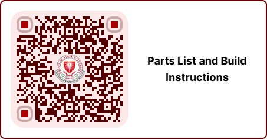

</center>

### **_Step 3. Ensure that electrical connections are properly wired and connected._** 
You may use these pictorial diagrams as reference for connecting the ***OpenMV Cam H7 Plus*** and the ***Spike™ Prime Sensors*** to the ***Technic™ Large Hub.***

</center>

| 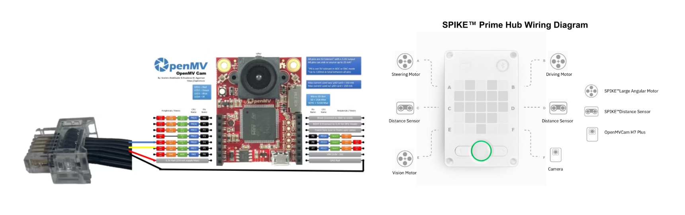 |
|:---------------------:|
| Figure 53. <br> Connection Pictorial Diagram

---

## 9.2. Guide for Programming the Robot

## 💻 Software and Tools Used

| Tool / Program                              | Purpose                                          |
|---------------------------------------------|--------------------------------------------------|
| [Pybricks](https://pybricks.com/)           | Custom MicroPython firmware for SPIKE™ Prime     |
| [Pybricks App](https://code.pybricks.com/)           | Used to program and upload code to the Hub wirelessly via browser  |
| [OpenMV IDE](https://openmv.io/pages/download) | Programming and debugging OpenMV Cam             |
| [Blender](https://www.blender.org/)         | 3D modeling of mechanical components             |
| [FlashPrint](https://www.flashforge.com/download-center) | Slicing and exporting 3D print models           |
| [Git](https://git-scm.com/) / [GitHub](https://github.com/) | Version control and collaboration              |
| [Markdown](https://www.markdownguide.org/)  | Formatting this documentation |


### 9.2.1. Programming the [OpenMV Cam H7 Plus](https://openmv.io/products/openmv-cam-h7-plus)

### **_Step 1. Install OpenMV IDE._** 
Begin by installing the [OpenMV IDE](https://openmv.io/pages/download), the official development environment for the OpenMV Cam H7 Plus. This will be used for writing, uploading, and testing vision-based programs directly on the camera.


### **_Step 2. Prepare the Required Libraries._**
Ensure that any external libraries needed for the communication of the hub and camera are added to your environment. The libraries include:

* [antonvh/PUPRemote](https://github.com/antonvh/PUPRemote)

Copy `lpf2.py` and `pupremote.py` from the `src` folder into the camera

### **_Step 3. Connect the Camera to the Computer._** 
Use a *USB A to USB Micro* cable to connect the OpenMV camera. The LED indicators on the camera will blink green and flash white when successfully connected. In the IDE, click the “Connect” button (or press `Ctrl+E`) to connect.

> [!NOTE]
> The *USB A to USB Micro* cable ***must*** have **data transfer** capabilities or it will not work.

### **_Step 4. Load and Edit the Program._** 
Before starting, it is recommended to read how we worked on the OpenMV Cam in [Section 4: Obstacle Challenge Strategy](#4-obstacle-challenge-strategy) to understand how its features and code work. The OpenMV IDE comes with a default sample program that you can edit. The team also provided a program `main.py` found in `src/camera` , which shows how the camera detects obstacles during the challenge. Test the program live using the `Run` button or `Ctrl+R`.

### **_Step 5. Upload the Program to the Camera._** 
Once the program performs as expected, go to `Tools > Save` open script to OpenMV Cam as `main.py`. This ensures the script runs automatically each time the camera is powered on during competition.

---

### 9.2.2. Programming the SPIKE™ Prime Large Hub

### **_Step 1. Install Pybricks Firmware on  SPIKE™ Prime Large Hub._**
Before programming the hub, install the Pybricks firmware using the instructions provided on the official Pybricks website. You may open the link below to access the complete instruction. This firmware allows for MicroPython programming directly on the SPIKE™ Large Hub. You may open this link for the complete instruction. https://pybricks.com/learn/getting-started/install-pybricks/

> [!IMPORTANT]  
> When installing the Pybricks firmware onto your SPIKE™ Prime Hub, It is important to keep in mind that after this process is done, you will not be able to use the original SPIKE™ App to be able to run code on that hub while Pybricks is installed!
>
> If you wish to revert your SPIKE™ Large Hub back to the original firmware, Just navigate to the online [Pybricks IDE](https://code.pybricks.com) and click the gear icon, next press the option labeled `Restore official LEGO® Firmware` then just follow the instructions from there.

### **_Step 2. Prepare the Programming Environment._** 
Open the [Pybricks Code Editor](https://code.pybricks.com), which is used to write and compile programs for the Pybricks firmware the we have installed on the SPIKE™ Prime Hub.

### **_Step 3. Learn the Basics._**
To get started, it is recommended to read the [Pybricks Documentation](https://docs.pybricks.com/en/stable/). You can also follow the guide Creating and running Pybricks programs from the Pybricks website to understand how to control motors and sensors using MicroPython.*

### **_Step 4. Use our Team’s Code for Reference._**
The team has provided sample programs under the folder `src/hub`, which can serve as a reference for obstacle handling, walling, and parking logic. 

We also used the library [PUPRemote](https://github.com/antonvh/PUPRemote) by antonvh for the hub to be able to recieve the data from the camera.

To use it with our code, create new files named `lpf2.py` and `pupremote.py` and copy the contents of the same files from the `src` folder, or alternatively, download said files and just import them in the IDE.

### **_Step 5. Connect the Hub via Bluetooth._**
Turn on your SPIKE™ Hub and open the Pybricks Editor. Click the Bluetooth icon at the top-right, select the correct hub from the list, and then click Pair to connect.*

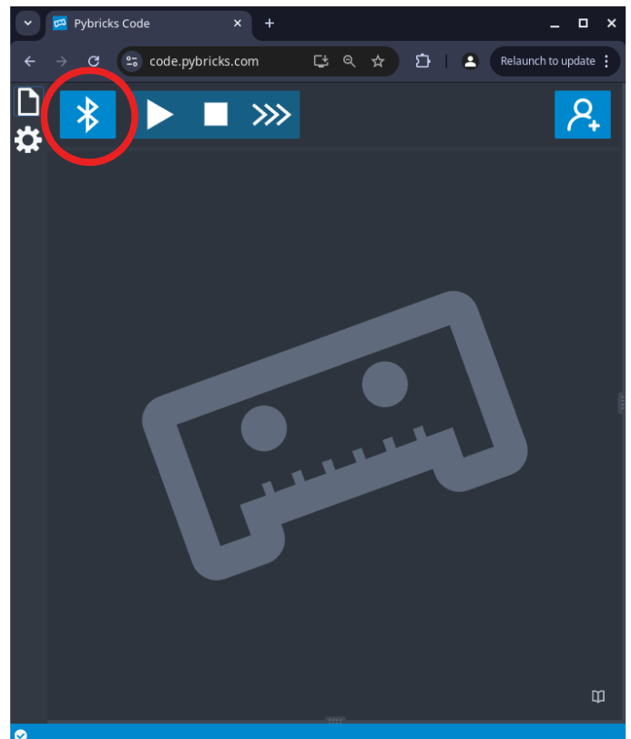
|:---------------------:|
| Figure 54. <br> Bluetooth Connection

### **_Step 6. Run and Upload the Program._** 
To run your script on the hub, click the “Run this program” button or press `F5`. To stop the program, click “Stop everything” or press `F6`. Pybricks automatically saves the program to the hub once it is run, so there's no need for a separate upload step.

> [!Note]
> We recommend to ***regularly backup*** your code in the event that your code dissappears or if you wish to revert your code to a previous version

---

### 9.3. Final Reminders and Optimization Tips

&nbsp;&nbsp;&nbsp;&nbsp;&nbsp;&nbsp;&nbsp;&nbsp;&nbsp;&nbsp;Before finalizing your robot for testing or competition, it is important to carry out a few final checks and apply optimization strategies to ensure a reliable performance. These reminders are based on our experience and are intended to help you improve consistency and reduce avoidable errors:

- **Double-Check All Connections**  
  - Ensure that all motors and sensors are connected to the correct ports as defined in the program. Loose or incorrect wiring may result in failure during operation.

- **Secure Structural Components**  
  - Inspect the robot for any unstable or misaligned LEGO® parts and 3D printed parts. Reinforce weak joints, especially around the steering and drive systems, to maintain structural integrity throughout the run.

- **Clean the Wheels Regularly**  
  - Dirt and debris on the wheels can affect traction and movement accuracy. Clean the tires whenever necessary to maintain reliable surface contact.

- **Review Sensor Alignment**  
  - Confirm that distance and color sensors, as well as the camera, are positioned and angled correctly. A small misalignment can result in incorrect readings and responses.

- **Test Before Final Run**  
  - Perform a short test run on the actual field or a close replica. This helps identify last-minute issues in movement, detection, or turning behavior.

- **Fine-Tune Code Parameters**  
  - Adjust speed values, turning angles, and detection thresholds based on field conditions. Even small changes can significantly improve accuracy and performance.

- **Monitor Battery Levels**  
  - Ensure both the SPIKE™ Prime Hub and the camera are fully charged before every session. Low battery levels can reduce motor power and sensor performance.

- **Stay Adaptable**  
  - Be prepared to adjust strategies or mechanics when necessary. Field conditions may vary, and flexibility is key to maintaining performance under pressure.

---

## 10. 💡 Recommendations and Future Work

&nbsp;&nbsp;&nbsp;&nbsp;&nbsp;&nbsp;&nbsp;&nbsp;&nbsp;&nbsp;A robot may be able to perform and execute its tasks successfully; however, there is always room for improvement. To enhance a robot’s performance, functionality, and reliability, it is important to first identify the limitations that restrict its full potential. Some of the limitations involve constraints in mobility and sense management, few environmental challenges that were discussed in [Section 5: Problems Encountered](#5-problems-encountered), or time restrictions during development.

&nbsp;&nbsp;&nbsp;&nbsp;&nbsp;&nbsp;&nbsp;&nbsp;&nbsp;&nbsp;In our case, while the robot demonstrated excellent performance in both the Open and Obstacle Challenge rounds, we identified specific areas where performance could be further optimized. These include improving sensor accuracy, refining the strategies, enhancing component selection, and reducing response time under changing field conditions. This section will discuss the recommendations and future work that will not only benefit the current version but also set a stronger foundation for future self-driving robot development.

### 10.1. Recommendations for Mobility Management

&nbsp;&nbsp;&nbsp;&nbsp;&nbsp;&nbsp;&nbsp;&nbsp;&nbsp;&nbsp;&nbsp;&nbsp;&nbsp;&nbsp;&nbsp;&nbsp;&nbsp;&nbsp;&nbsp;&nbsp;Before presenting the recommendations, it is important to acknowledge that the robot’s current mobility system has several limitations. During testing, the team observed challenges such as reduced traction during turns and inconsistent wheel grip. Furthermore, the robot employs a closed-wheel configuration rather than a differential drive system. This restricts its maneuverability to discrete turning angles of approximately +45° and -49°, thereby reducing its flexibility in navigation and adversely affecting its precision during parking maneuvers.These issues occasionally affected turning accuracy, speed stability, and overall maneuver control—highlighting the need for further mechanical refinements and exploration of improved mobility configurations. 

- **Incorporating a Differential Gear**  
  - One key recommendation is to incorporate a differential gear in the driving mechanism, as explored in the initial design. This is significant because, for example, in a right turn, the left wheel must travel a greater distance along the circular path than the right wheel in the same amount of time, since it is farther from the turn's center. In short, it allows the left and right wheels to rotate at different speeds, which is especially beneficial when the robot is turning. Additionally, it performs well in maintaining traction, stability, and reducing wheel slips during sharp or tight turns. Although the differential gear was removed in later versions due to various concerns, a properly tuned, tested, and incorporated differential mechanism could enhance the robot’s turning precision when combined with effective programming and mobility control.

- **Exploring Different Steering Geometry**  
  - It is also significant to evaluate other steering geometries, specifically the Ackermann steering mechanism. Due to its complexity, as well as time constraints, Parallel steering was utilized in the robot since it was more manageable and controllable within the available preparation time. Consequently, the Ackermann steering mechanism, though not easy to implement, allows for better control when performing critical and sharp turns.

- **Exploring Different Driving Mechanism**  
  - Both all-wheel drive (AWD) and rear-wheel drive (RWD) configurations have their respective advantages and drawbacks, and the optimal choice depends on performance priorities and operating conditions. The robot currently utilizes an RWD system due to its simpler construction and easier control. However, incorporating an AWD transmission could potentially enhance speed, acceleration, and overall stability by distributing power across all four wheels, thereby reducing the likelihood of wheel slippage during rapid acceleration. It should be noted, however, that AWD systems generally add weight, which could slightly reduce maximum speed.

- **Improving the Selection of Wheels**  
  - One of the identified limitations in the robot’s design was the inconsistency of its wheels. Due to limited accessibility to different wheel types, the team had restricted options, which prevented further evaluation of alternatives that could deliver better performance. It is recommended to explore a wider range of wheels with suitable dimensions and tire materials to achieve improved traction and stability during movement and steering. Wheel grip plays a crucial role in how the robot accelerates, turns, and stops. Utilizing wheels with rubberized surfaces or custom 3D-printed tread patterns could enhance traction and minimize slipping, particularly on uneven or dusty surfaces.
    
### 10.2. Recommendations for Power and Sense Management

&nbsp;&nbsp;&nbsp;&nbsp;&nbsp;&nbsp;&nbsp;&nbsp;&nbsp;&nbsp;&nbsp;&nbsp;&nbsp;&nbsp;&nbsp;&nbsp;&nbsp;&nbsp;&nbsp;&nbsp;Before presenting the recommendations, it is important to note that several limitations were observed in the robot’s power and sense management system. The robot’s sensory system is limited to four fixed directions which is the front, rear, and lateral sides resulting in reduced situational awareness. Unlike a 360° LIDAR system that provides continuous environmental scanning, the robot must rely on directional sensing, increasing the risk of undetected obstacles and requiring more conservative movement algorithms. Consequently, during operation, inconsistent power distribution occasionally caused minor delays in sensor response and communication between modules, particularly when multiple sensors were active simultaneously. Additionally, wiring congestion and restricted connection ports limited the flexibility of component placement and expansion. These issues, while manageable, highlighted opportunities to enhance efficiency, stability, and scalability in future iterations.  

- **Power Regulation and Distribution**
  - Efficient power and sensor management can be achieved through a combination of regulation, distribution, and data handling strategies. Stable power supply can be ensured by using DC-DC voltage regulators along with a power distribution board equipped with fuses or resettable PTCs to protect components from overcurrent, while battery monitoring allows real-time tracking of voltage, current, and overall power consumption. Sensor integration can be expanded using I²C or analog multiplexers to connect multiple sensors beyond the microcontroller’s native ports, and a dedicated sensor hub microcontroller can aggregate and preprocess sensor data before sending it to the main controller, reducing processing load and improving stability. Additionally, signal conditioning through filtering or amplification enhances the accuracy and reliability of sensor readings. Combining these approaches results in a scalable, organized, and reliable system for complex robotics or automation projects.

- **Explore Cameras with Greater Capacity**
  - The OpenMV Cam H7 Plus was utilized due to its accessibility, ease of use, compactness, low power consumption, and cost-effectiveness. While the existing camera setup has proven adequate, upgrading to more advanced vision systems, such as the Raspberry Pi Camera or Pixii Camera, could provide higher-resolution images and faster image processing capabilities. These modules are better suited for real-time object detection and other tasks requiring a vision system, such as obstacle detection in the Open and Obstacle Challenge. 

- **Utilize More Advanced and Responsive Sensors**
  - To improve the robot’s sensing reliability, especially in tasks like parking or detecting walls, the team recommend switching to sensors with high-precision of detection, capable of delivering accurate readings with minimal delay. In our experience, the sensors we have tried and utilized, such as the Technic™ Color Sensor and Technic™ Distance Sensor, sometimes failed to provide consistent data, which affected the robot’s ability to detect the obstacles or signs that it needs to detect, hindering it from performing its tasks reliably. Using advanced ultrasonic or LiDAR-based sensors with faster refresh rates and better range accuracy would enhance the robot’s sensing capabilities without significantly increasing power consumption.

### 10.3. Recommendations for Strategies

&nbsp;&nbsp;&nbsp;&nbsp;&nbsp;&nbsp;&nbsp;&nbsp;&nbsp;&nbsp;In addition to mechanical and electrical improvements, the strategies used in programming and task execution significantly impact the robot’s overall performance. Testing has shown that the current programming approach, while functional, sometimes leads to suboptimal task execution, such as delays in decision-making, inefficient path planning, or inconsistent responses to sensor inputs. To address these limitations, it is recommended to adopt more optimized programming strategies. Based on these observations, the following approaches are recommended to further optimize the robot’s programming and task execution for improved performance. 

- **Implement Continuous Detection**
  - To improve performance efficiency and reduce unnecessary delays, it is recommended to implement continuous detection during the Obstacle Challenge round. This approach enables the robot to actively scan and interpret its surroundings in real time while moving, rather than stopping to scan or responding only at specific points. By continuously detecting traffic signs, the robot can make faster decisions, avoid interruptions, and respond immediately to changing field conditions. This minimizes unnecessary actions, such as stopping or colliding with walls, resulting in smoother navigation and more effective time management throughout the run.

- **Utilize Color Sensor in Open Challenge**
  - Instead of using Technic™ Distance Sensor for identifying the robot’s drive direction, it is also recommended to consider using a Technic™ Color Sensor, as the team have previously implemented in the earlier versions in the national stage. The color sensor has the ability to detect the colored lines in the field, allowing it to determine its driving direction: if the color sensor detects an orange line, then the driving direction is clockwise, otherwise, if it is a blue line, the robot will move in a counterclockwise direction. Additionally, it is best to position the color sensor at the front-bottom part of the robot for faster and more reliable detection, minimizing the delay in responding and determining the direction that it should take.

### 10.4. Recommendations for Mechanical Design

&nbsp;&nbsp;&nbsp;&nbsp;&nbsp;&nbsp;&nbsp;&nbsp;&nbsp;&nbsp;Mechanical constraints in the robot’s design revealed several limitations that impact its operational efficiency and maneuverability. The current chassis was designed with a total width of 300 mm to maintain a minimum clearance of 450 mm for effective parking and basic maneuvering. While functional, this relatively large footprint imposes spatial constraints, limiting the robot’s ability to navigate tighter areas and increasing the likelihood of collisions in confined spaces. The size of the chassis also restricts the placement and integration of additional components, such as sensors, cameras, or actuators, which could otherwise enhance functionality. These limitations, although manageable during operation, highlight opportunities to improve efficiency, maneuverability, and adaptability in future iterations through optimized mechanical design.

- **Chassis Optimization**
  - To improve maneuverability and reduce collision risk, it is recommended to further optimize the robot’s physical dimensions. By reducing the chassis width and overall footprint while maintaining structural integrity, the robot could navigate tighter spaces more efficiently, enhance parking performance, and improve responsiveness during field operations. Careful design adjustments, such as compact component placement and streamlined chassis profiles, would allow the robot to take full advantage of available clearances without compromising stability.
 
- **Component Placement Reorganization**
  - It is recommended to carefully reconfigure the robot’s internal layout to maximize the use of available space and improve overall weight distribution. By strategically positioning heavier components, such as motors, batteries, or controllers, closer to the geometric center of the chassis, the robot’s stability can be significantly enhanced, reducing tipping risks during sharp turns or rapid movements. Optimized component placement also allows for better balance between the front, rear, and lateral axes, improving maneuverability in tight spaces and ensuring smoother operation across different field conditions. Additionally, efficient use of internal space can create room for future upgrades or additional sensors without increasing the overall footprint. This reorganization should be complemented with secure mounting and cable management strategies to prevent interference with moving parts, minimize wiring congestion, and maintain ease of maintenance.

- **Use of Lightweight Materials**
  - It is recommended to utilize lighter materials for non-critical structural components, such as covers, brackets, or secondary supports, to reduce the overall weight of the robot. Reducing mass enhances maneuverability, allowing the robot to accelerate, decelerate, and turn more smoothly and precisely. Lighter structures also decrease the load on motors and power systems, improving energy efficiency and extending battery life during operation. By carefully selecting materials such as high-strength plastics, aluminum, or composite materials, the robot can maintain structural integrity while achieving weight savings. This approach also allows for easier integration of additional components or upgrades, as the robot can accommodate extra sensors or accessories without negatively impacting stability or performance.

---

## 11. 📎 Appendices

&nbsp;&nbsp;&nbsp;&nbsp;&nbsp;&nbsp;&nbsp;&nbsp;&nbsp;&nbsp;This section contains supplementary materials that support the content presented in this documentation. Included in the appendices are diagrams, tables, timeline, and additional visual documentation that provide deeper insight into the design and development of the self-driving robot. These materials serve as references for illustrating the progress made throughout the project. 

### 11.1. Robot Actual Photos

|  |  |
|:---------------------:| :---------------------:|
| <center> Front View </center> | <center> Rear View </center>|  

| 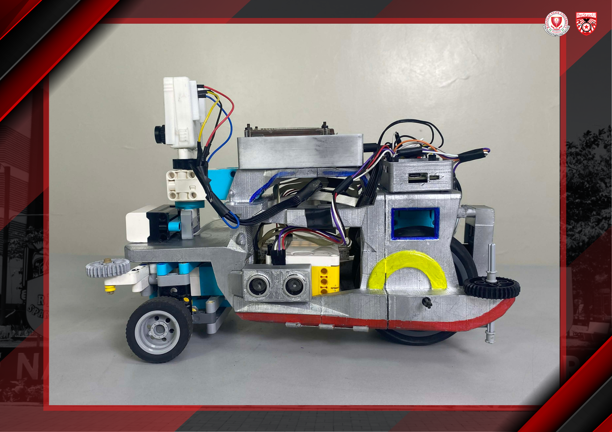 |  |
|:---------------------:| :---------------------:|
| <center> Left View </center> | <center> Right View </center>| 

|  |  |
|:---------------------:| :---------------------:|
| <center> Top View </center> | <center> Bottom View </center>| 

---

### 11.2. Robot 3D Model

| 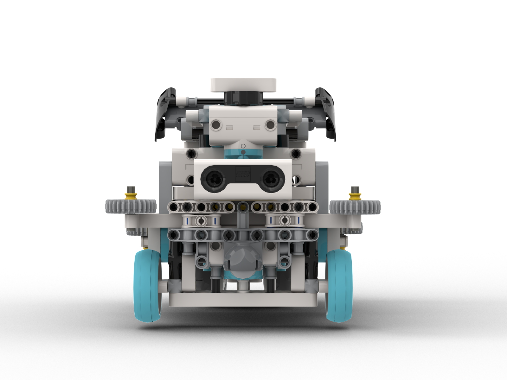 | 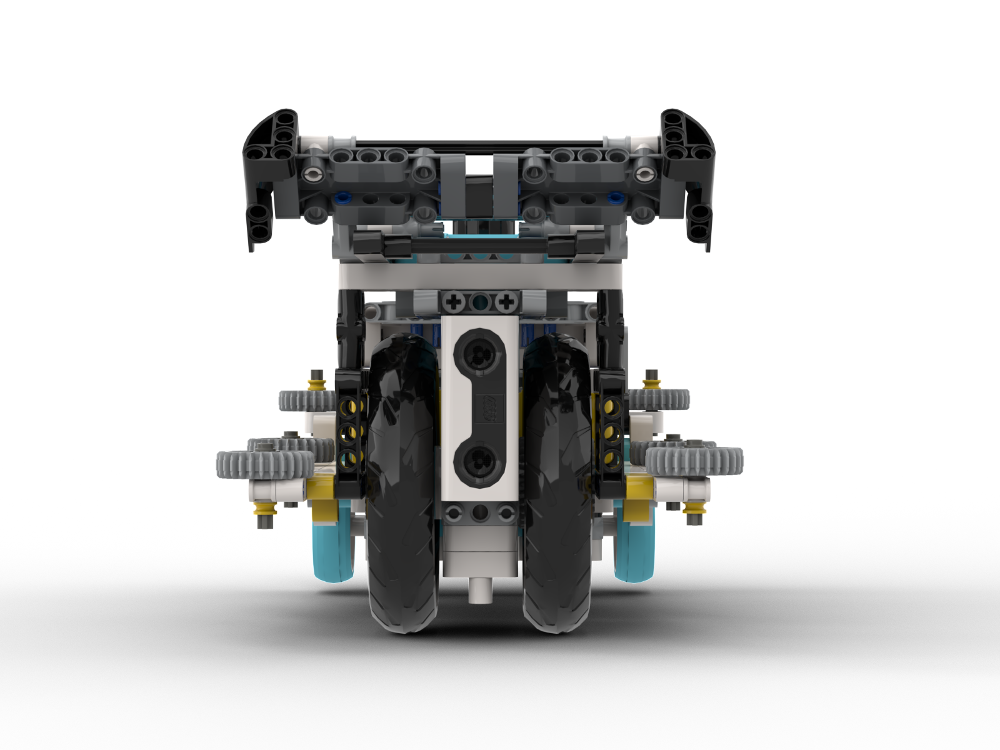 |
|:---------------------:| :---------------------:|
| <center> Front View </center> | <center> Rear View </center>|  

| 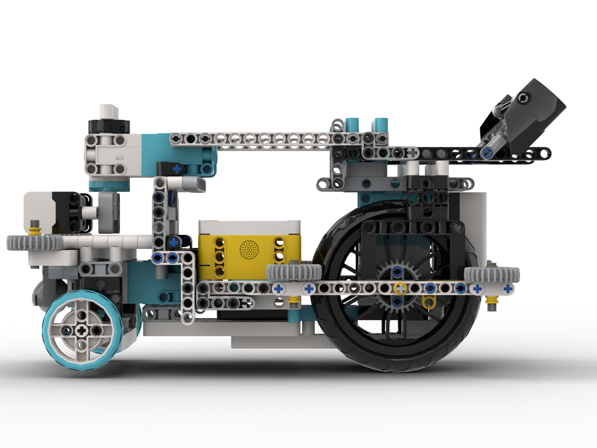 |  |
|:---------------------:| :---------------------:|
| <center> Left View </center> | <center> Right View </center>| 

| 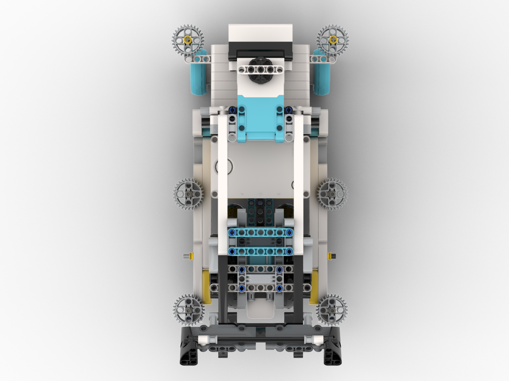 | 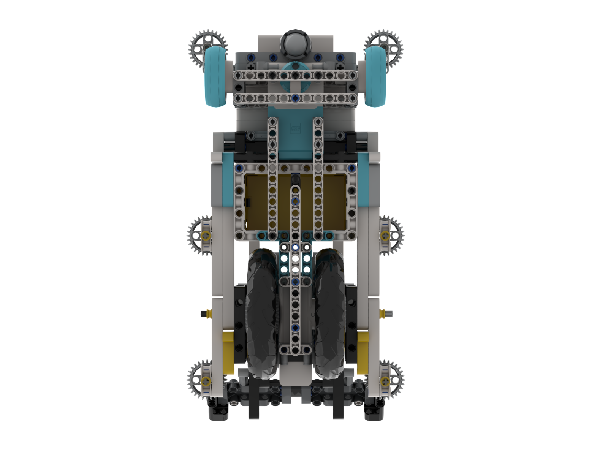 |
|:---------------------:| :---------------------:|
| <center> Top View </center> | <center> Bottom View </center>| 

---

### 11.3. Pictorial Wiring Diagram

<center>

| 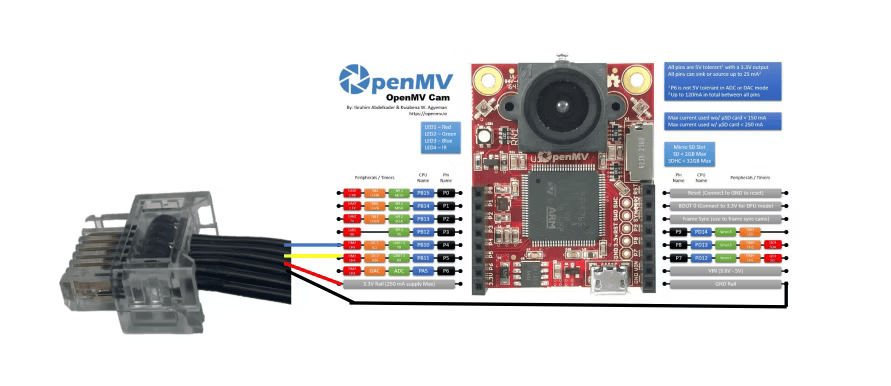 |
|:---------------------:|
| Figure 55. <br> Camera Connection Wiring Diagram

<center>

| 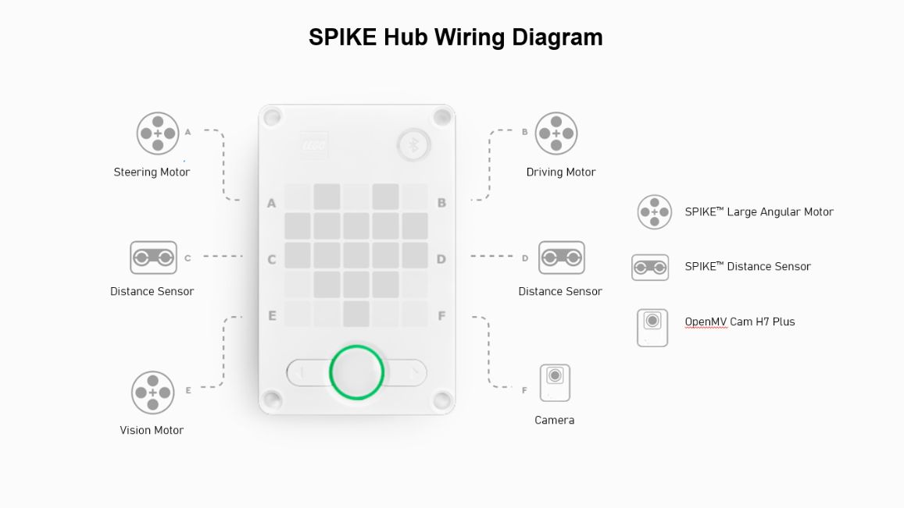 |
|:---------------------:|
| Figure 56. <br> SPIKE™ Prime Hub Wiring Diagram

</center>

---

### 11.4. Bills of Materials

| BILLS OF MATERIALS | | |
| ----- | ----- | ----- |
| **Material**  | **Quantity** | **Price** | 
| LEGO® Education SPIKE™ Prime Set | 1 pc | Php. 65,000.00 | 
| LEGO® Education SPIKE™ Prime Expansion Set | 1 pc | Php. 25,000.00 | 
| LEGO® Education SPIKE™ Essential Set | 1 pc | Php. 30,175.46 | 
| LEGO® MINDSTORMS® Education EV3 Core Set | 1 pc | Php. 50,000.00 | 
| LEGO® MINDSTORMS® Education EV3 Expansion Set | 1 pc | Php. 25,000.00 | 
| LEGO® Wheel 75 x 17mm with Motorcycle Tire 94.2 x 20 | 2 pcs | Php. 500.00 | 
| OpenMV Cam H7 Plus | 1 pc | Php. 6,784.15 | 
| LMS-ESP32 | 1 pc | Php. 3000.00 | 
| UPS-18650 | 1 pc | Php. 1768.51 | 
| HC-SR04 Ultrasonic Sensor | 3 pcs | Php. 147.00 | 
| PLA Filament | 1 pc | Php. 750.00 | 
| FlashForge 3D Printer Adventurer 4 | 1 pc | Php. 65,000.00 | 
| **Total Amount** |   | Php. 273,125.12 | 

---

### 11.5. Timeline

|  | 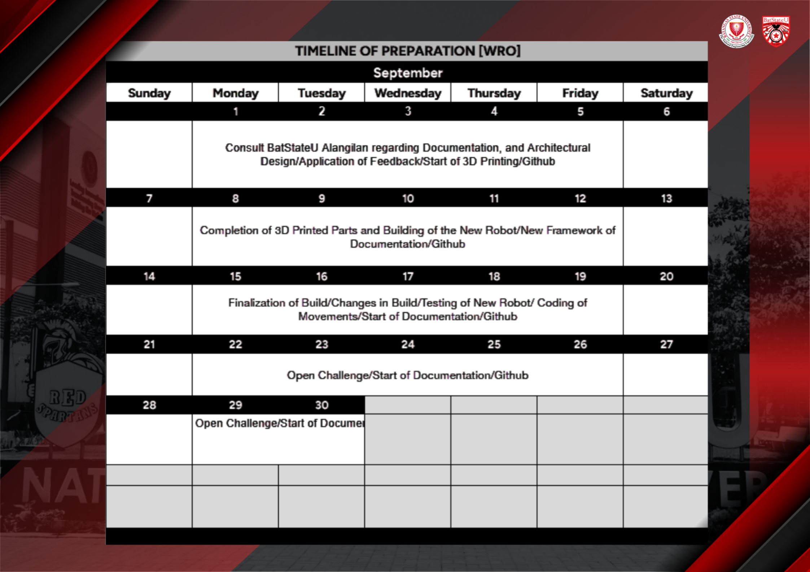 |
|:---------------------:| :---------------------:|

| 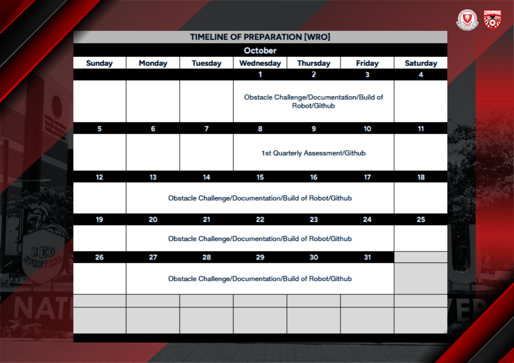 | 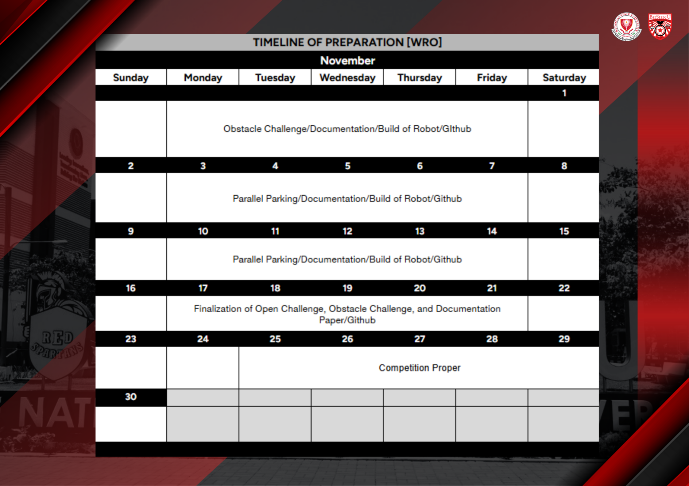 |
|:---------------------:| :---------------------:|

---

## 12. 📜 Robot Design History

&nbsp;&nbsp;&nbsp;&nbsp;&nbsp;&nbsp;&nbsp;&nbsp;&nbsp;&nbsp;From the initial concepts to the final build, the design of our self-driving robot evolved through multiple stages as we identified weaknesses, tested improvements, and made changes as a response to performance feedback during runs. This section documents the evolution of our design, discussing the key changes and the reasons behind them. It showcases how our team continuously applied engineering principles, adapted to mistakes, and made essential decisions to improve the robot’s structure, mobility, and overall functionality. 

---

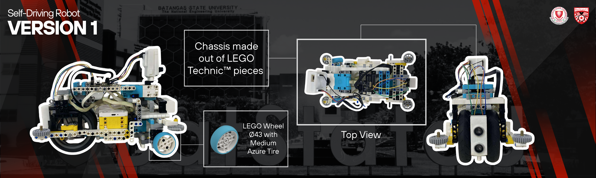

&nbsp;&nbsp;&nbsp;&nbsp;&nbsp;&nbsp;&nbsp;&nbsp;&nbsp;&nbsp;Our first version of the robot was where everything started. We built the chassis entirely out of LEGO® Technic™ parts, which gave us a strong and reliable base to begin testing our ideas. On top of the structure, we mounted the LMS-ESP32, and we added our very first 3D-printed camera case, our first move toward combining LEGO with custom-designed parts.

&nbsp;&nbsp;&nbsp;&nbsp;&nbsp;&nbsp;&nbsp;&nbsp;&nbsp;&nbsp;At this stage, our goal was simply to bring all components together and see how they worked as one system. It was our starting point for testing movement, wiring, and basic power connections. This version helped us understand the layout and interaction between parts, and while it wasn’t yet optimized, it gave us the direction we needed for our next builds.

---

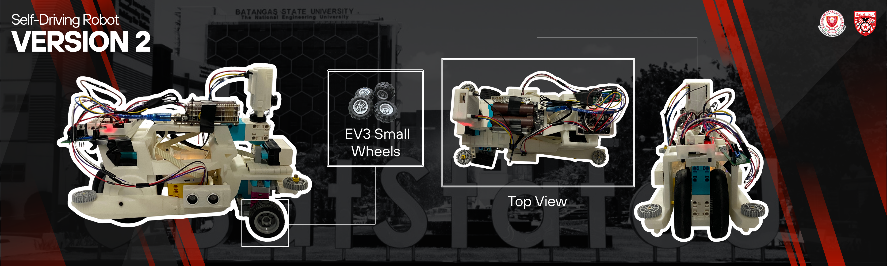

&nbsp;&nbsp;&nbsp;&nbsp;&nbsp;&nbsp;&nbsp;&nbsp;&nbsp;&nbsp;As our team had planned, Version 2 introduced a significant upgrade as this incorporated a 3D-printed chassis, in replace of the utilization of LEGO Technic™ pieces in constructing and developing the mechanical structure of the self-driving robot. Not only did it reduce the straints with the maintenance, but it also improved the weight distribution within the overall body of the self-driving robot. Consequently, this chassis was 3D-modeled in reference to our team's own preference with the design, while also giving importance in ensuring its compatibility with other electrical and mechanical components, making sure that other significant parts can be easily and efficiently integrated to the robot.  

&nbsp;&nbsp;&nbsp;&nbsp;&nbsp;&nbsp;&nbsp;&nbsp;&nbsp;&nbsp;While integrating these new features, Version 2 retained key elements from Version 1, such as the parallel front-wheel steering, rear-wheel drive (RWD) system, rotating vision sensor, LMS-ESP32, and UPS 18650 Raspberry pi power supply. These systems worked together to support smooth and precise movements across the field. Additionally, this version incorporated structural improvements to increase balance and accommodate the added weight from the battery and added microcontroller. 

&nbsp;&nbsp;&nbsp;&nbsp;&nbsp;&nbsp;&nbsp;&nbsp;&nbsp;&nbsp;As specified in the visual aid, the previous LEGO Wheel Ø43 with Medium Azure Tire attached in the parallel front-wheel steering mechanism were replaced with the LEGO® Wheel 30.4 mm D. x 20 mm with Black Tire 43.2 mm x 22 mm with a thicker tire to increase surface contact and enhance the grip on the surface of the field. This setup aimed to improve the robot's steering control and movement stability.  

&nbsp;&nbsp;&nbsp;&nbsp;&nbsp;&nbsp;&nbsp;&nbsp;&nbsp;&nbsp;Consequently, Version 2 became our first complete prototype that fully met the requirements of both the Open Challenge and Obstacle Challenge in the Future Engineers category. It established the foundation for the design we aimed to achieve.  

---


&nbsp;&nbsp;&nbsp;&nbsp;&nbsp;&nbsp;&nbsp;&nbsp;&nbsp;&nbsp;Our third version of the robot marked a big step forward in both design and identity. After finalizing most of the mechanical and electronic components, we decided to give our robot a distinct look inspired by the Filipino Jeepney—a cultural icon and symbol of creativity and resilience in the Philippines. Though the robot will still be subjected for some changes in the color and design, intially, we used a metallic gray spray paint and acrylic paints to apply a combination of yellow, blue, and red, representing the colors of the Philippine flag. This gave our robot not only a more striking appearance but also a deeper meaning, as it carried the same pride and character that Jeepneys symbolize in Filipino culture. 


&nbsp;&nbsp;&nbsp;&nbsp;&nbsp;&nbsp;&nbsp;&nbsp;&nbsp;&nbsp;In this version, we retained all the core components from our previous builds, which are the LMS-ESP32, UPS-18650 power module, Technic™ Distance Sensor, and OpenMV Cam H7, but we arranged them more neatly for better organization and maintenance. The 3D-printed camera case and other printed mounts were also refined and repainted to match the new color scheme. 

&nbsp;&nbsp;&nbsp;&nbsp;&nbsp;&nbsp;&nbsp;&nbsp;&nbsp;&nbsp;For us, Version 3 became more than just a technical upgrade; it was a reflection of who we are as a team. By combining functionality with our pride, we created a robot that not only performs well but also represents our identity as Filipinos competing on the global stage. 

---

## 13. 📑 References

<br><a id="ref1"></a> [1] “LEGO® TechnicTM Large Hub for SPIKETM Prime by LEGO Education,” LEGO® Education. https://education.lego.com/en-us/products/lego-technic-large-hub-for-spike-prime-/45601/
<br><a id="ref2"></a> [2] “Raspberry Pi UPS - 18650 HAT with RTC 5V Output for Raspberry Pi 4B, 3B+, 3B,” Arduitronics.com, 2025. https://www.arduitronics.com/product/2490/raspberry-pi-ups-18650-hat-with-rtc-5v-output-for-raspberry-pi-4b-3b-3b (accessed Nov. 08, 2025).
<br><a id="ref3"></a> [3] A. Pandžić, D. Hodžić, and A. Milovanović, "Influence of Material Colour on Mechanical Properties of PLA Material in FDM Technology," in *Proceedings of the 30th DAAAM International
Symposium on Intelligent Manufacturing and Automation*, Oct. 2019, pp. 526–531. DOI: 10.2507/30th.daaam.proceedings.075.
<br><a id="ref4"></a> [4] D. B. last updated, “Best Filaments for 3D Printing,” Tom’s Hardware, Oct. 08, 2022. https://www.tomshardware.com/best-picks/best-filaments-for-3d-printing
<br><a id="ref5"></a> [5] “LEGO® TechnicTM Medium Angular Motor by LEGO Education,” LEGO® Education. https://education.lego.com/en-us/products/lego-technic-medium-angular-motor/45603/
<br><a id="ref6"></a> [6] “LEGO® TechnicTM Large Angular Motor by LEGO Education,” LEGO® Education. https://education.lego.com/en-us/products/lego-technic-large-angular-motor/45602/
<br><a id="ref7"></a> [7] LEGO Education, “SPIKE™ Prime Technical Specifications,” The LEGO Group, 2019. [Online]. Available: https://assets.education.lego.com/v3/assets/blt293eea581807678a/bltb9abb42596a7f1b3/5f8801b5f4c5ce0e93db1587/le_spike-prime_tech-fact-sheet_45602_1hy19.pdf?locale=en-us. [Accessed: 08-Nov-2025].
<br><a id="ref8"></a> [8] D. Thompson, “Ackerman? Anti‑Ackerman? Or Parallel Steering?,” *Racing Car Technology*, [Online]. Available: https://courses.diyguru.org/wp-content/uploads/wplms_assignments_folder/20019/23944/Steering_Ackerman.pdf. [Accessed: 08‑Nov‑2025].
<br><a id="ref9"></a> [9] Napa BP, “How Does Rear-Wheel Drive Improve Handling Compared to Front-Wheel Drive? - Napa BP,” Napa BP, 2025. https://www.napabp.com/blog/how-does-rear-wheel-drive-improve-handling-compared-to-front-wheel-drive (accessed Nov. 08, 2025).
<br><a id="ref10"></a> [10] LEGO Education, “Technic™ Large Hub Rechargeable Battery – Technical Specifications,” The LEGO Group, 2019. [Online]. Available: https://assets.education.lego.com/v3/assets/blt293eea581807678a/bltb87f4ba8db36994a/5f8801b918967612e58a69a6/techspecs_techniclargehubrechargeablebattery.pdf?locale=en-us. [Accessed: 08‑Nov‑2025].
<br><a id="ref11"></a> [11] LEGO Education, “Technic™ Large Hub – Technical Specifications,” The LEGO Group, 2019. [Online]. Available: https://assets.education.lego.com/v3/assets/blt293eea581807678a/bltf512a371e82f6420/5f8801baf4f4cf0fa39d2feb/techspecs_techniclargehub.pdf?locale=en-us. [Accessed: 08‑Nov‑2025].
<br><a id="ref12"></a> [12] “LMS-ESP32 v2.0: Getting started with your new board – Antons Mindstorms,” Anton’s Mindstorms, Aug. 21, 2025. https://www.antonsmindstorms.com/docs/getting-started-with-your-new-lms-esp32v2-board/?srsltid=AfmBOoqZ-hFCR_lIKr4bML7mNgeRrvTN5nErwW44InpaUWPcQ7Dz8ce7 (accessed Nov. 08, 2025).
<br><a id="ref13"></a> [13] LEGO Education, “Technic™ Distance Sensor – Technical Specifications,” The LEGO Group, 2019. [Online]. Available: https://assets.education.lego.com/v3/assets/blt293eea581807678a/blt64c2b9534cf10f68/5f8801b8bc43790f5c4389ea/techspecs_technicdistancesensor.pdf?locale=en‑us. [Accessed: 08‑Nov‑2025].
<br><a id="ref14"></a> [14] LastMinuteEngineers, “How HC-SR04 Ultrasonic Sensor Works & How to Interface It With Arduino,” Last Minute Engineers, Mar. 29, 2019. https://lastminuteengineers.com/arduino-sr04-ultrasonic-sensor-tutorial/
<br><a id="ref15"></a> [15]  S. Seshan and A. Seshan, “Turning with the Gyro,” Prime Lessons, Jan. 2021. [Online]. Available: https://primelessons.org/en/ProgrammingLessons/GyroTurning.pdf. [Accessed: 08‑Nov‑2025].
<br><a id="ref16"></a> [16] “OpenMV Cam H7,” OpenMV, 2019. https://openmv.io/products/openmv-cam-h7?srsltid=AfmBOoo-gqtJ-Gy0xcJN3nz5UpxkGV2UsYwQVHN4q6NJd6Xx5jU9V2vo (accessed Nov. 08, 2025).
<br><a id="ref17"></a> [17] A. Chillingworth, “The Pros & Cons of Using Blender Software | Epidemic Sound,” This is the Epidemic Sound blog | Epidemic Sound, Mar. 30, 2023. https://www.epidemicsound.com/blog/blender-software/
<br><a id="ref18"></a> [18] FLASHFORGE Corporation, “User Guide – Software,” FLASHFORGE, [Online]. Available: https://en.fss.flashforge.com/10000/software/635e457a8071d9ccc1c37d1371145d02.pdf. [Accessed: 08‑Nov‑2025]. 
<br><a id="ref19"></a> [19] Bambu Lab, “X1‑Carbon – Technical Specifications,” Bambu Lab, [Online]. Available: https://public-cdn.bambulab.com/store/bambulab-X1-carbon-tech-specs.pdf. [Accessed: 08‑Nov‑2025].  


‌


