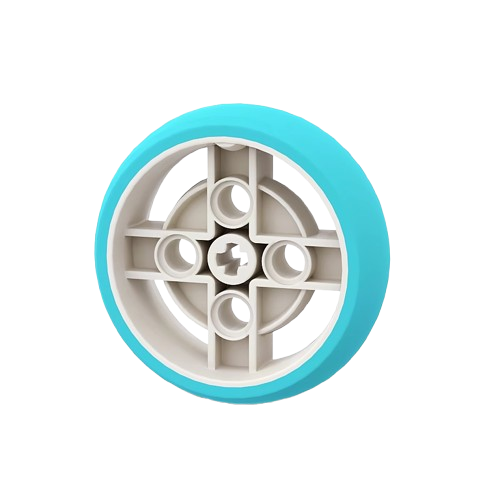

***

# 

<center>

[](https://wro-association.org/wp-content/uploads/WRO-2025-Future-Engineers-Self-Driving-Cars-General-Rules.pdf)
[](https://youtu.be/sFFOtyM4Csk)
[](https://youtu.be/ECOkZw3vB8I)
[](https://youtu.be/03gVkXfrZpo)

</center>

---

> [!NOTE]
> The team highly recommends the readers of this repository to use light default mode when viewing this engineering documentation.

## 🧭 Abstract

&nbsp;&nbsp;&nbsp;&nbsp;&nbsp;&nbsp;&nbsp;&nbsp;&nbsp;&nbsp;
This repository contains the comprehensive development of a **self-driving robot** engineered by 
**Junior Engineers Exploring Possibilities (J.E.E.P.)** from Batangas State University - Integrated School, representing **Philippines** for the [**2025 World Robot Olympiad**](https://wro-association.org/competition/2025-season/), 
under the **Future Engineers category**. Designed for **_autonomous navigation_**, 
**_obstacle avoidance_**, and **_traffic sign detection_**, the robot integrates [**LMS-ESP32**](https://www.antonsmindstorms.com/product/wifi-python-esp32-board-for-mindstorms/?srsltid=AfmBOopfdoKXv4-t9PTAc_VNohW6cx7w24SMns8QDY4nlufSxlDntJdL) as its microcontroller, allowing the **LEGO® SPIKE™ Prime** and **Arduino** electronics to communicate with one another. In addition, the robot ensures high precision detection with a vision system powered by the [**OpenMV Cam H7 Plus**](https://openmv.io/products/openmv-cam-h7-plus). Custom 3D-printed components were used to develop the chassis, serving as the main body of the self-driving robot, which better improved its mechanical structure, secured sensors, and optimized its internal space. Through iterative testing, the team enhanced its performance with innovated mechanism and steering geometry. Overall, this project showcases practical engineering, strategic design, and reliable performance under dynamic conditions.

<p align="justify"> You may view the full performance of our robot through the link provided below. Watching the complete run will offer a clear understanding of how our mechanical design, sensor integration, and code execution come together in real-time to accomplish each task.</p>  

<p align="justify"> The video showcases the inspiring journey of the Future Engineers team as they prepare for the upcoming 2025 World Robot Olympiad. It highlights the team members, the self-driving robot they built, and provides an in-depth look into its design, functionality, and programming. Featured segments include the Open Challenge and Obstacle Challenge, where the team's strategies and technical innovations are put to the test.</p>  

> [!IMPORTANT]
> ***[BSU-IS World Robot Olympiad - 2025 Future Engineers](https://youtu.be/03gVkXfrZpo)***

***

<!-- Table of Contents -->
<details>
<summary>
📑 Table of Contents (click to expand)
</summary>

- [📖 Introduction](#introduction)  
- [👥 Team Profile](#team-profile)  
- [🤖 Robot Specifications](#robot-specifications)  
- [1. ⚙️ Mobility Management](#1-mobility-management)  
  - [1.1. Motor Selection](#11-motor-selection)  
  - [1.2. Steering and Driving Mechanism](#12-steering-and-driving-mechanism)  
  - [1.3. Mechanical Design](#13-mechanical-design)  
- [2. 🔋 Power and Sense Management](#2-power-and-sense-management)  
  - [2.1. Power Management](#21-power-management)  
    - [2.1.1. Technic™ Prime Large Hub](#211-technic-prime-large-hub)  
    - [2.1.2. Technic™ Large Hub Rechargeable Battery](#212-technic-large-hub-rechargeable-battery)  
  - [2.2. Sense Management](#22-sense-management)  
    - [2.2.1. Technic™ Distance Sensor](#221-technic-distance-sensor)  
    - [2.2.2. Gyro Sensor](#222-gyro-sensor)  
    - [2.2.3. OpenMV Cam H7 Plus](#223-openmv-cam-h7-plus)  
- [3. 🚀 Open Challenge Strategy](#3-open-challenge-strategy)  
  - [3.1. Determining Drive Direction](#31-determining-drive-direction)  
  - [3.2. Wall Detection and Avoidance](#32-wall-detection-and-avoidance)  
- [4. 🚧 Obstacle Challenge Strategy](#4-obstacle-challenge-strategy)  
  - [4.1. Traffic Sign Detection](#41-traffic-sign-detection)  
  - [4.2. Traffic Sign Avoidance Strategy](#42-traffic-sign-avoidance-strategy)  
  - [4.3. Perpendicular Parking Strategy](#43-perpendicular-parking-strategy)
  - [4.4. Semi-Machine Learning Strategy](#44-semi-machine-learning-strategy)
- [5. 🐞 Problems Encountered](#5-problems-encountered)  
  - [5.1. Continuous Detection to Single-Instance Detection](#51-continuous-detection-to-single-instance-detection)  
  - [5.2. Frequent Disconnection of Camera Wiring](#52-frequent-disconnection-of-camera-wiring)  
  - [5.3. Uneven and Unclean Field](#53-uneven-and-unclean-field)  
  - [5.4. Constant Necessity of Cleaning the Wheels](#54-constant-necessity-of-cleaning-the-wheels)  
- [6. 🖨️ 3D Printing Management](#6-3d-printing-management)  
  - [6.1. 3D Modeling](#61-3d-modeling)  
  - [6.2. Material Selection](#62-material-selection)  
  - [6.3. 3D Printing Settings](#63-3d-printing-settings)  
  - [6.4. Printing](#64-printing)  
- [7. 📐 Engineering Factor](#7-engineering-factor)  
  - [7.1. 3D-Printed Camera Case](#71-3d-printed-camera-case)  
  - [7.2. Rotating Camera and Distance Sensor](#72-rotating-camera-and-distance-sensor)  
  - [7.3. Side Free Wheels](#73-side-free-wheels)
  - [7.4. Rear-Mounted Spoiler](#74-rear-mounted-spoiler)  
- [8. 🔧 Mechanical Improvements](#8-mechanical-improvements)  
  - [8.1. Testing of Perfect Size for Parking](#81-testing-of-perfect-size-for-parking)  
  - [8.2. Alter Differential Gear to Normal Driving](#82-alter-differential-gear-to-normal-driving)  
  - [8.3. Integrate Gears Around the Robot](#83-integrate-gears-around-the-robot)  
  - [8.4. Alter the Gears’ Size from Big to Medium](#84-alter-the-gears-size-from-big-to-medium)  
  - [8.5. Reposition the SPIKE™ Hub and Balance Rear Weight](#85-reposition-the-spike-hub-and-balance-rear-weight)  
  - [8.6. Testing of Perfect Wheels for Steering](#86-testing-of-perfect-wheels-for-steering)  
  - [8.7. Use Different Wheels for Steering](#87-use-different-wheels-for-steering)  
  - [8.8. Replace Color Sensor with Distance Sensor](#88-replace-color-sensor-with-distance-sensor)  
  - [8.9. Replace Wheels for Driving](#89-replace-wheels-for-driving)  
- [9. 🛠️  Construction Guide](#9-construction-guide)  
  - [9.1. Guide for Constructing the Robot](#91-guide-for-constructing-the-robot)  
  - [9.2. Guide for Programming the Robot](#92-guide-for-programming-the-robot)  
    - [9.2.1. Programming the OpenMV Cam H7 Plus](#921-programming-the-openmv-cam-h7-plus)  
    - [9.2.2. Programming the SPIKE™ Prime Large Hub](#922-programming-the-spike-prime-large-hub)  
  - [9.3. Final Reminders and Optimization Tips](#93-final-reminders-and-optimization-tips)  
- [10. 💡 Recommendations and Future Work](#10-recommendations-and-future-work)  
  - [10.1. Recommendations for Mobility Management](#101-recommendations-for-mobility-management)
  - [10.2. Recommendations for Power and Sense Management](#102-recommendations-for-power-and-sense-management)
  - [10.3. Recommendations for Strategies](#103-recommendations-for-strategies)
- [11. 📎 Appendices](#11-appendices)
  - [11.1. Robot Actual Photos](#111-robot-actual-photos)
  - [11.2. Robot 3D Model](#112-robot-3D-Model)
  - [11.3. Pictorial Wiring Diagram](#113-pictorial-wiring-diagram)
  - [11.4. Bills of Materials](#114-bills-of-materials)
  - [11.5. Timeline](#115-timeline)
- [12. 📜 Robot Design History](#12-robot-design-history)

</details>

***
## 📖 Introduction

<p align="justify"> &nbsp;&nbsp;&nbsp;&nbsp;&nbsp;&nbsp;&nbsp;&nbsp;&nbsp;&nbsp;Engineering is the heart of innovation that gives life to initiatives. It bridges science, technology, and creativity to provide solutions for real-world problems. In the field of robotics, engineering allows everyone to think and design beyond the current possibilities, highlighting that a future with numerous solutions can be made. Thus, through this, we were able to challenge ourselves to integrate various engineering concepts in autonomous navigation. As a team of student innovators and future engineers, we embraced this opportunity to create a self-driving robot that exemplifies the spirit of modern engineering.</p>  

<p align="justify"> &nbsp;&nbsp;&nbsp;&nbsp;&nbsp;&nbsp;&nbsp;&nbsp;&nbsp;&nbsp;This engineering documentation provides a comprehensive record of J.E.E.P. BatStateU-IS’s design process, program construction,  problem-solving strategies, and technical decisions throughout the development of our self-driving robot. This provides insight into our robot’s architecture, programming approach, strategies we came up with, and the challenges we encountered and overcame along the way. Intended for the Future Engineers Category in the 25th World Robot Olympiad, this documentation reflects the dedication and initiative of our team to produce an innovation that goes beyond the boundaries of autonomous technology.</p> 

<p align="justify"> &nbsp;&nbsp;&nbsp;&nbsp;&nbsp;&nbsp;&nbsp;&nbsp;&nbsp;&nbsp;We have featured key aspects involved in the development of our robot such as the Robot Specifications which provides information about the architecture of the robot, and selection of sensors, motors, and mechanical components with consideration to different aspects like speed, power, and specifications; Mobility Management that focuses on the specific movements that the robot can do; Power and Sense Management that is responsible for the description of the programming language and libraries utilized, algorithm explanations, and program logic flow; Challenge Strategies which features code snippets with explanations of its purpose, and the strategies we came up for the Open Challenge, Obstacle Challenge, traffic sign avoidance, and parking; and performance testings which includes setup conditions, observed issues, and video demonstrations. In addition, the engineering innovations integrated into the robot and a guide for its construction were added. To further support the technical information, the team added visual documentation that features actual and 3D model images of the robot. With these, the team aimed and continuously aims to demonstrate engineering discipline rooted in teamwork, determination, rigorous testing, and excellence with a purpose of being able to think of and design an innovative and modern solution as future engineers.</p> 

***

## 👥 Team Profile
<p align="justify"> &nbsp;&nbsp;&nbsp;&nbsp;&nbsp;&nbsp;&nbsp;&nbsp;&nbsp;&nbsp;Batangas State University - Integrated School is a group of passionate and curious young engineers driven by a shared goal: to innovate through robotics. Each member believes that learning through doing, as well as failing, has shaped us into better innovators, thinkers, and collaborators. Together, we have combined our skills and passion for robotics, engineering, and programming to create our own innovation of a self-driving robot for the Future Engineers category.</p>

<p align="justify"> &nbsp;&nbsp;&nbsp;&nbsp;&nbsp;&nbsp;&nbsp;&nbsp;&nbsp;&nbsp;The team came up with the name J.E.E.P. (BatStateU-IS), which stands for Junior Engineers Exploring Possibilities, as it symbolizes our journey during the preparation for one of the most prestigious robotics competitions, World Robot Olympiad International Finals 2025. It is inspired by the Filipino term “biyahe” as well as the traditional Filipino vehicle, Jeepney, which emphasizes the members’ path as we innovate and forge onward, excelling in engineering. Throughout, we held on to the belief that every route and stopover lets us grow and learn.</p>

<center>

| <center> **John Angelo M. Bautista** | |
| --------------------------- | ------ |
|  | Angelo is a Grade 12 student at Batangas State University - The National Engineering University - Integrated School and is currently 18 years old. This year marks his third time participating in the World Robot Olympiad (WRO) and his second time in the Future Engineers category. Drawing from his previous experiences, he ensures that the robot is built with consideration to its efficiency and functionality, making him a key pillar of the team. |

| <center> **Airvin James L. Medina** |  |
|----------------------------| ------ |
|  | Airvin is stepping into his first journey at World Robot Olympiad this year. At 15 years old, this Grade 10 student has shown a remarkable interest in robotics and programming. His enthusiasm for solving problems and thinking critically allow him to develop and troubleshoot codes effectively, bringing the robot’s function to life. |

| <center> **Cshenizylle Nicole M. Ligayada** </center> |  |
|------------------------------------| ------ |
|  | Cshenizylle is a 16-year-old Grade 11 student at Batangas State University - The National Engineering University - Integrated School who is also participating in the World Robot Olympiad for the first time. With a strong interest in research and writing, she takes on the role of documenting the team’s engineering journey. She looks forward to gaining new experiences and growing alongside her teammates. |

</center>

> The following pictures feature the members of J.E.E.P. (BatStateU-IS) participating in the Future Engineers category along with their robot.

|  |  |
|:---------------------:|:---------------------:|
| Formal Picture | Funny Picture |

**Team Members (Left to Right):**  
- **Airvin James L. Medina**, 15  
- **Cshenizylle Nicole M. Ligayada**, 16  
- **John Angelo M. Bautista**, 18

---

## 🤖 Robot Specifications

<p align="justify">&nbsp;&nbsp;&nbsp;&nbsp;&nbsp;&nbsp;&nbsp;&nbsp;&nbsp;&nbsp;Our team, J.E.E.P., introduces a self-driving robot that is developed for the 2025 World Robot Olympiad International Finals, under the Future Engineers category. This robot represents our vision of combining creativity and technical skill to design a robot capable of autonomous navigation and real-time decision-making. Through teamwork, perseverance, and continuous improvement that has shaped its development, we have ensured that this is carefully engineered to meet the demands of the competition.</p>

<p align="justify">&nbsp;&nbsp;&nbsp;&nbsp;&nbsp;&nbsp;&nbsp;&nbsp;&nbsp;&nbsp;The following specifications provide a detailed overview of the key physical and mechanical characteristics of our team’s self-driving robot. We designed this while giving importance to precision, agility, and durability, so the features of the robot have been carefully optimized to balance speed and stability during runs.</p>

<center>
  
| <center>Specification</center> | <center> Details </center> |
| ----- | ----- |
| Dimensions | 300 mm (L) x 150 mm (W) x 193 mm (H)  |
| Weight | 913.79 g |
| Maximum Speed | 837.6 mm/s |
| Maximum Steering Angle | + 45° and -49° |
| Steering Torque | 100 Ncm |
| Operating Voltage | 8.3V – 7.6V |
| Drive System | Rear-Wheel Drive (RWD) |
| Steering Geometry | Parallel Steering |
| Material | LEGO® Technic™ and PLA Filament |

</center>

 

</center>

<p align="justify">&nbsp;&nbsp;&nbsp;&nbsp;&nbsp;&nbsp;&nbsp;&nbsp;&nbsp;&nbsp;Additionally, the team’s selection of materials and electronic components is intended to create a rigid yet lightweight robot platform, designed to deliver both reliable and consistent performance. The list of the main components and its corresponding description presented in the table below emphasize these critical design choices and technical details that enhance the robot’s overall functionality.</p>

<center>

**Table 2\. Main Components**

| <center> Components </center> | <center>Quantity</center> | <center>Description</center> |
| :---: | :---: | ----- |
|  | 1 | The **Technic™ Large Hub** was chosen as the main controller because it can connect to multiple sensors and motors. Its support for Python-based programming made it easier to create accurate and flexible control systems for navigation and obstacle avoidance. |
|  | 1 | The **Raspberry pi UPS-18650-Lite** provides a stable 5 V regulated power supply for the LMS-ESP32, ensuring continuous operation during power fluctuations. It includes built-in protections against over-charge, over-discharge, over-current, and short circuits, making it a reliable and safe power source for the system. |
|  | 1 | The **Technic™ Distance Sensors** were used to measure how far the robot is from nearby walls. It helped the robot avoid collisions by detecting obstacles in front and behind the path of the robot and triggering turning or straight movements based on the distance detected. |
| | 3 | The **HC-SR04 Ultrasonic Distance Sensors** were added around the robot to allow for navigation in handling wall obstacles around the game field in the Open Challenge round. Meanwhile, it was used to provide vision for the robot to efficiently perform parallel parking without collisions with the parking walls in the Obstacle Challenge round. |
|   | 3 | The **Technic™ Large Angular Motor** is used to turn the steering wheel and drive the robot. Additionally, it controls the rotation of the distance sensor and camera, enabling the robot to scan its environment from different angles for obstacle detection and navigation. |
|   | 2 | The **LEGO Wheel 75 mm x 17mm with Motorcycle Tire 94.2 mm x 20 mm** is connected to one of the Large Angular Motors, providing stability for the robot. This setup ensures smooth and controlled movement as the motor powers the wheel to drive the robot forward and backward. |
|  | 2 | The **Technic™ White Wheel 43 mm  x 14 mm** is used as the steering wheel for the robot. It is connected to the Large Angular Motor, allowing the robot to make precise and smooth turns for better control during movement. |
|  | Multiple pieces were used | **LEGO® Technic™ Elements** such as beams, axles, gears, and multiple connectors were utilized to construct the steering and driving mechanism of the robot. Their precision, modularity, and durability makes them ideal for creating mechanically reliable structures while allowing easy integration with other electronic components.  |
| | 1 | The **LMS-ESP32** serves as an interface module between the Arduino ultrasonic sensors and the SPIKE™ Prime Hub, managing serial communication and data transfer. It ensures synchronized, low-latency transmission of distance readings to the main controller for accurate obstacle detection and responsive movement control. |
| | 1 | The **OpenMV Cam H7 Plus** was used as the robot’s vision system to detect traffic signs and understand its surroundings. It processed images in real time and sent data to the main controller, helping the robot decide when to turn or react to visual cues during the Obstacle Challenge. |
|  | 4 | **Jumper wires** were used to connect the OpenMV Cam H7 to the main controller, the SPIKE™ Prime Hub. They ensured that the data processed by the camera was transmitted to the Python-based program running on the hub.  |
|  | Multiple were used | **PLA 3D Printing Filament** was utilized to create the 3D-printed components of the robot, sepcifically the chassis, and the cases for the OpenMV Cam H7 Plus, HC-SR04 Ultasonic Distance Sensors, UPS-18650 Power Module, and LMS-ESP32. White filaments are said to produce designs with great strength. PLA filament is also popular in 3D printing because of its ease of use, biodegradability, and versatility.  |

</center>

---

## ⚙️ 1. Mobility Management

<p align="justify">&nbsp;&nbsp;&nbsp;&nbsp;&nbsp;&nbsp;&nbsp;&nbsp;&nbsp;&nbsp;This section will highlight the important aspects of the hardware system that constitutes the mobility and movement specifications of the self-driving robot that we have developed. This includes the reasons behind the selection of the drive system, steering mechanism, wheels, motor, and their respective placements, which all play a vital role in ensuring our robot moves smoothly, accurately, and reliably throughout the challenges.</p>


### 1.1. Motor Selection

<p align="justify">&nbsp;&nbsp;&nbsp;&nbsp;&nbsp;&nbsp;&nbsp;&nbsp;&nbsp;&nbsp;One of the most important things that we have considered to enhance the maneuverability of the self-driving robot is to properly select motors that meet the requirements needed for the Open Challenge and Obstacle Challenge. Within the LEGO® Education SPIKE™ Prime Set, we had two primary motor options to choose from: the Medium Angular Motor and the Large Angular Motor. To determine the most suitable motor, we evaluated key specifications such as speed (RPM), torque (rotational force), connectivity, and the intended application in our design.</p>

<center>

**Table 3\. Comparison of Motors**

| Specifications  7.2V power supply | Technic™ Large  Angular Motor | Technic™ Medium  Angular Motor |
| ----- | ----- | ----- |
| Voltage Range | Min: 5V and Max: 9V | Min: 5V and Max: 9V |
| Speed<sup>1</sup> (RPM) | 135 RPM to 175 RPM | 135 RPM to 185 RPM |
| Torque<sup>2</sup> (Ncm) | 8 Ncm to 25 Ncm | 3.5 Ncm to 18 Ncm  |
| Connectivity | Attachments on either side | Attachments to the front only |
| Applications | High-power, high-torque applications | Lower-load, fast-response applications |

<sup>1</sup> ***RPM*** = rotations per minute  
<sup>2</sup> ***Ncm*** = newton centimeter&nbsp;&nbsp;&nbsp;

---

</center>

&nbsp;&nbsp;&nbsp;&nbsp;&nbsp;&nbsp;&nbsp;&nbsp;&nbsp;&nbsp;Table 3 shows the difference between the large motor and medium motor in terms of different specifications, with all performance data being based on a <b>7.2V power supply</b>. The Technic™ Medium Motor, while more small and lightweight, offers faster rotation speeds but lower torque. This makes it ideal for lightweight mechanisms, low-profile design with limited space or tasks requiring quick response but low-resistance motion. In addition to wheels, it is ideal for driving attachments like arms, lifts, or actuators on robots. However, for driving the entire robot, where it must carry multiple components, handle tight turns, and maintain stability over long distances, more torque and control are required. This makes the Large Motor more appropriate for its strength and ability to handle resistance. 

<p align="justify">&nbsp;&nbsp;&nbsp;&nbsp;&nbsp;&nbsp;&nbsp;&nbsp;&nbsp;&nbsp;After comparing both options, we decided to integrate the Technic™ Large Angular Motor for our robot’s driving and steering system. This features a built-in advanced Rotation Sensor that can report speed, angle changes, and absolute position within a range of -180° to +180°. It can also sense direct user input or manual rotation which allows responsive input during calibration or testing. While powered by a 7.2V system, the motor can achieve a torque of 25 Ncm at stall, and performs most efficiently at 8 Ncm with 135 RPM. Its speed with no load reaches up to 175 RPM. Its sensor offers a resolution of 360 counts per revolution, an accuracy that is less than or equal to ±3 degrees, and a fast update rate of 100 Hz for real-time feedback. In terms of design, the motor has a Technic build geometry and includes a 250 mm LEGO® Power Functions 2.0 (LPF2) cable and dual crosshole outputs, making it easy to integrate securely into complex builds.</p>

<p align="justify">&nbsp;&nbsp;&nbsp;&nbsp;&nbsp;&nbsp;&nbsp;&nbsp;&nbsp;&nbsp;Overall, it provides higher torque which is essential for maintaining a consistent speed while carrying the weight of the hub, sensors, camera, and LEGO and 3D-printed components. This motor also offers smoother acceleration and deceleration, and more responsive driving system, helping the robot to maintain its stability when turning. Thus, we have utilized three Technic™ Large Angular Motor in our self-driving robot, with the first one being connected to the steering wheel, second for the drive system, and the third motor for the rotating camera and distance sensor.</p>

### 1.2. Steering and Driving Mechanism

<p align="justify">&nbsp;&nbsp;&nbsp;&nbsp;&nbsp;&nbsp;&nbsp;&nbsp;&nbsp;&nbsp;After carefully evaluating several options, our team decided to use a rear-wheel drive (RWD) system combined with a parallel steering mechanism. This combination closely resembles the movement of a real car, which can provide consistent and reliable results.</p>

<center>

|  |  |
|:---------------------:|:---------------------:|
| Figure 1.1 Robot's Steering Mechanism <br> Isometric View | Figure 1.2 Robot's Steering Mechanism <br> Bottom View |

|  |  |
|:---------------------:|:---------------------:|
| Figure 2.1 Robot's Driving Mechanism <br> Isometric View | Figure 2.2 Robot's Driving Mechanism <br> Rear View |

</center>

<p align="justify">&nbsp;&nbsp;&nbsp;&nbsp;&nbsp;&nbsp;&nbsp;&nbsp;&nbsp;&nbsp;For the robot’s steering mechanism, one Technic™ Large Angular Motor is integrated at the front of the self-driving robot to steer the front wheels, where they turn in the same direction at the same angle. This method is referred to as parallel steering and is similar to how steering works in real cars. We chose this steering geometry over other options such as Differential Steering, where one wheel moves faster than the other in order to turn; Ackermann, in which the inner wheel turns at a greater angle than the outer wheel, as well as the counterpart of Ackermann, Anti-Ackermann. It offers simplicity compared to other options that are more complex to build and control. Furthermore, both the Open and Obstacle Challenge requires maneuverability; thus, the smaller turning radius offered by parallel steering is advantageous especially for tight spaces like parking. This steering geometry also solves our problem with an uneven and irregular field as it improves the stability and handling of movement and turns of the self-driving robot.</p>

<p align="justify">&nbsp;&nbsp;&nbsp;&nbsp;&nbsp;&nbsp;&nbsp;&nbsp;&nbsp;&nbsp;Consequently, we selected rear-wheel drive (RWD) because it provides better traction, especially when the robot needs to travel consistently. Our team also believes that RWD is better than front-wheel drive (FWD), which can make the robot harder to balance, especially when it needs to carry sensors and components at the front.</p> 

<p align="justify">&nbsp;&nbsp;&nbsp;&nbsp;&nbsp;&nbsp;&nbsp;&nbsp;&nbsp;&nbsp;By combining RWD and parallel steering, we achieved a movement system that was both stable and precise. The rear wheels provided consistent driving force, while the front wheels helped for smooth turning without affecting the robot's balance. This setup made it easier for our robot to navigate around tight corners and spaces, maintain alignment, and avoid obstacles effectively.</p>

### 1.3. Mechanical Design

<p align="justify">&nbsp;&nbsp;&nbsp;&nbsp;&nbsp;&nbsp;&nbsp;&nbsp;&nbsp;&nbsp;The structure of our self-driving robot is made mostly out of PLA Filament that were 3D-printed based on the teams own preference, with a combination of LEGO® Technic™ elements. The mechanical design, as shown resembles the well-known and traditional vehicle used by commuters in the Philippines on a daily basis, which is the Jeepney. Aside from being just a vehicle, it's also the country's identity, serving a huge part in preserving the essential traditions and culture of the Philippines. The reason behind using this as our inspiration lies in our triumph in the national stage, which brought to us the opportunity to represent the Philippines in the global stage. Additionally, this vehicle also holds an immense value to our heart as it plays a big part in our journey; the vehicle that drove us back and forth from our home to our training grounds.</p> 

<p align="justify">&nbsp;&nbsp;&nbsp;&nbsp;&nbsp;&nbsp;&nbsp;&nbsp;&nbsp;&nbsp;Building on our previous year’s experience, where the robot was constructed solely from LEGO® Technic™ parts, we recognized the importance of integrating engineering principles with creativity and innovation. For the international stage of the competition, we enhanced our design by incorporating custom 3D-printed components that extend beyond the chassis, resulting in a more functional and distinctive build. For example, instead of using LEGO-based camera and sensor enclosures, we designed and printed custom cases that allows secure yet removable mounting of these modules, which offers something new, but still efficient, functional, and reliable for our team’s robot.</p>

<p align="justify">&nbsp;&nbsp;&nbsp;&nbsp;&nbsp;&nbsp;&nbsp;&nbsp;&nbsp;&nbsp;These design choices highlight the team’s growing proficiency in applying mechanical design concepts and engineering problem-solving to create practical yet original solutions. Further discussions and technical details about the 3D-printed components and their engineering factors are provided in <b>Chapter 5: Engineering Factor.</b></p>

|  |  |
|:---------------------:|:---------------------:|
| Figure 3.1 <br> Robot Chassis <br> Left Side View | Figure 3.2 <br> Robot Chassis with Electrical Components <br> Left Side View |

<p align="justify">&nbsp;&nbsp;&nbsp;&nbsp;&nbsp;&nbsp;&nbsp;&nbsp;&nbsp;&nbsp;Additionally, the length of the robot is built to be longer, given that while the length of the robot increases, the larger the space will be intended for the parking area. We have utilized two different materials for the robot's wheels: the LEGO Wheel 75 mm x 17mm with Motorcycle Tire 94.2 mm x 20 mm and Technic™ White Wheels with a diameter of 43 mm, which handles the driving and steering mechanism, respectively. The large wheels were used for the rear-wheel drive system since a larger wheel possesses a larger circumference, and thus, having the ability to travel longer distances per rotation. It also increases the maximum speed limit a robot can travel per unit of time. Consequently, smaller wheels were utilized for the steering mechanism since they have a smaller turning radius, which makes it easier for the robot to handle tight turns in navigating obstacles, corners, and small spaces. Moreover, larger wheels cannot be used at the front part of the robot as these can block the view of the distance sensor, disabling the sensor to detect objects properly and accurately. The Technic™ White Wheels also offer more precision and finer control, preventing slips that makes the robot’s movement smooth and quick.</p> 

<center>

|  |
|:---------------------:|
| Figure 4. <br> Robot's Wheels <br> Left Side View 

</center>

<p align="justify">&nbsp;&nbsp;&nbsp;&nbsp;&nbsp;&nbsp;&nbsp;&nbsp;&nbsp;&nbsp;To balance the weight distribution of the robot throughout its body and for easier management and maintenance, the Technic™ Large Hub and LMS-ESP32 was placed between the drive and steer system. This central placement evenly distributed the weight across all wheels, and significantly improved the robot’s overall stability, turning accuracy, and movement consistency.</p>

<p align="justify">&nbsp;&nbsp;&nbsp;&nbsp;&nbsp;&nbsp;&nbsp;&nbsp;&nbsp;&nbsp;In addition, during test runs, we noticed that adding a distance sensor to the rear caused an imbalance, making the front lighter and resulting in unstable movement. To solve this, we added an EV3 steel ball at the front to counterbalance the rear weight. This improved the robot’s overall stability, traction, and responsiveness during turns and directional changes.</p>

|  |
|:---------------------:|
| Figure 5. <br> Robot's Weight Distribution <br>

</center>

---

## 2. 🔋 Power and Sense Management

<p align="justify">&nbsp;&nbsp;&nbsp;&nbsp;&nbsp;&nbsp;&nbsp;&nbsp;&nbsp;&nbsp;The performance of our self-driving robot relies heavily on the integration of electrical components and the development of programs. Mainly developed with Python programming language, the robot was structured to carry out specific tasks for both the Open Challenge and Obstacle Challenge of the Future Engineers category. This section will discuss the elements that power and control the robot, including the power source, sensors, and its vision system. Each component that constitutes the robot was carefully selected and evaluated based on their specifications that meets the demand for ensuring real-time responsiveness, accuracy, and reliability during autonomous navigation and handling of obstacles.</p> 

### 2.1. Power Management

<p align="justify">&nbsp;&nbsp;&nbsp;&nbsp;&nbsp;&nbsp;&nbsp;&nbsp;&nbsp;&nbsp;A reliable power source is essential for the consistent and uninterrupted performance of the robot. In managing and choosing the right power system, our team ensured that all electrical components, such as the sensors and motors, will receive stable and sufficient energy throughout countless testings.  It is essentially what gives life to the robot. Consequently, this is the most important aspect to consider especially during competition runs, as we don’t want delays or power interruptions that could lead to performance issues. Our robot uses a rechargeable lithium-ion battery specifically designed for the SPIKE™ Prime Large Hub. This battery provides the necessary voltage and current to support motor movements and sensor readings.</p> 

<center>

|  |  |
|:---------------------:|:---------------------:|
| Figure 6.1 <br> SPIKE™ Prime Hub <br> Specification | Figure 6.2 <br> SPIKE™ Prime Hub <br> Dimensions |

</center>

### 2.1.1. Technic™ Prime Large Hub

<p align="justify">&nbsp;&nbsp;&nbsp;&nbsp;&nbsp;&nbsp;&nbsp;&nbsp;&nbsp;&nbsp;The SPIKE™ Prime Technic™ Large Hub is the main controller of our self-driving robot. It is a programmable control unit that connects to LEGO® motors and sensors through six input/output (I/O) ports, labeled A to F. These ports allow the hub to power motors, read sensor values, and control various functions of the robot.</p>

<center>

|  |
|:---------------------:|
| Figure 7. <br> Robot’s Technic™ Large Hub

</center>

<p align="justify">&nbsp;&nbsp;&nbsp;&nbsp;&nbsp;&nbsp;&nbsp;&nbsp;&nbsp;&nbsp;The hub runs on a MicroPython operating system, allowing us to write and execute advanced programs using Python. It features a built-in 6-axis Gyro Sensor with three-axis accelerometer and three-axis gyroscope that helps the robot detect rotation, orientation, and motion. This is especially useful for tracking turns and maintaining direction during navigation.</p>

<p align="justify">&nbsp;&nbsp;&nbsp;&nbsp;&nbsp;&nbsp;&nbsp;&nbsp;&nbsp;&nbsp;Physically, the hub includes a 5x5 LED matrix display, a three-button interface consisting of center, left, and right, and a speaker for feedback sounds. It supports both USB and Bluetooth connectivity, with Bluetooth 4.2 used for wireless communication and firmware updates. A rechargeable lithium-ion battery powers the hub, and it can be charged directly via a micro USB cable.</p>

<p align="justify">&nbsp;&nbsp;&nbsp;&nbsp;&nbsp;&nbsp;&nbsp;&nbsp;&nbsp;&nbsp;With its compact size of 88.0 mm x 56.0 mm x 32.0 mm and compatibility with LEGO® Technic™ building elements, the SPIKE™ Large Hub is ideal for building smart and responsive robots like our self-driving robot. It provides 32 MB memory which is enough for programs and data, as well as a processing power of 100MHz M4 320 KB RAM 1M FLASH to support real-time decision-making and multitasking during both Open and Obstacle Challenge runs.</p>

### 2.1.2. Technic™ Large Hub Rechargeable Battery

<p align="justify">&nbsp;&nbsp;&nbsp;&nbsp;&nbsp;&nbsp;&nbsp;&nbsp;&nbsp;&nbsp;The Technic™ Large Hub Rechargeable Battery is the partner and intended power source for the SPIKE™ Prime Hub. It is a lithium-ion polymer (Li-ion) battery with a capacity of 2100 mAh at 7.3 volts that provides enough energy to power the hub, motors, and connected sensors during the operation of the self-driving robot. This battery is designed with the perfect dimension and structure to fit securely inside the Technic™ Large Hub. One of its main advantages is that it can be charged directly while it is inside the hub via a standard micro USB cable. This way, there is no need for the battery to be removed during charging. However, when needed, the battery can also be removed easily without using any mechanical tools, which makes maintenance quick and easy for everyone to do.</p>

<center>

|  |  |
|:---------------------:|:---------------------:|
| Figure 8.1. <br> SPIKE™ Prime Hub Rechargeable Battery | Figure 8.2. <br> SPIKE™ Prime Hub Rechargeable Battery <br> Dimensions |

</center>

<p align="justify">&nbsp;&nbsp;&nbsp;&nbsp;&nbsp;&nbsp;&nbsp;&nbsp;&nbsp;&nbsp;The battery is built for durability, with a minimum lifespan of over 500 charge cycles. After 500 full charge/discharge cycles, it is expected to retain at least 30% of its original capacity, making it reliable for long-term use. This rechargeable battery supports the robot’s need for consistent and portable power, which is essential for the several autonomous tasks that the robot is programmed to do during both the Open and Obstacle Challenge rounds. Its high energy capacity, ease of use, and compatibility with the SPIKE™ system make it a critical component of our robot's electronics and system.</p>

### 2.1.3. Raspberry pi UPS-18650-Lite

<p align="justify">&nbsp;&nbsp;&nbsp;&nbsp;&nbsp;&nbsp;&nbsp;&nbsp;&nbsp;&nbsp;The Raspberry pi UPS-18650 HAT functions as a regulated power source for the robot’s auxiliary electronic systems, specifically supplying a stable 5 V DC output to the LMS-ESP32 microcontroller. Designed for use with a single 18650 lithium-ion cell, the module integrates a built-in charging circuit, automatic power switching between external and battery input, and multiple protection mechanisms including over-charge, over-discharge, over-current, and short-circuit protection. It also incorporates an onboard RTC (Real-Time Clock), ensuring uninterrupted timekeeping even when external power is disconnected. These features make it a reliable and safe power unit within the robot’s power management subsystem, which maintains consistent operation for all the processes that relies in the microcontroller. </p>

|  |  |
|:---------------------:|:---------------------:|
| Figure 12.1 <br> Robot’s OpenMV Cam H7 Plus | Figure 12.2 <br> Robot’s OpenMV Cam H7 Plus <br> Dimensions |

<p align="justify">&nbsp;&nbsp;&nbsp;&nbsp;&nbsp;&nbsp;&nbsp;&nbsp;&nbsp;&nbsp;As shown in the attached visual aid, the UPS-18650-Lite module’s compact design and labeled pin configuration show its dimensions and connection points, aiding accurate integration into the robot’s power circuit. The module connects to the LMS-ESP32 through a USB connector, providing a stable 5V regulated output directly to the ESP32’s power input port. Consequently, this connection ensures proper voltage delivery and simplifies wiring by eliminating the need for external converters. The ESP32 communicates with the SPIKE™ Prime Hub via a serial interface, where transistors and resistors are used for voltage level shifting and signal conditioning to maintain safe and reliable communication between the two controllers of the robot.</p>

<p align="justify">&nbsp;&nbsp;&nbsp;&nbsp;&nbsp;&nbsp;&nbsp;&nbsp;&nbsp;&nbsp;In accordance with the Future Engineers Rulebook, which specifies that the robot must utilize only one main power button for activation, the system was designed so that the SPIKE™ Prime Hub’s power button simultaneously powers the UPS-18650 module and the LMS-ESP32. This combined power management approach ensures a synchronized startup and shutdown across all electronic subsystems, preventing inconsistent power status or data transmission errors. Discussed at Section 7. Engineering Factor is the wiring diagram, detailing how the UPS-18650, LMS-ESP32, and SPIKE™ Prime Hub are interconnected, showing the power delivery path and serial communication interface integrated into the robot’s electrical architecture.</p>

### 2.2. Sense Management

<p align="justify">&nbsp;&nbsp;&nbsp;&nbsp;&nbsp;&nbsp;&nbsp;&nbsp;&nbsp;&nbsp;The self-driving robot wouldn’t be in its form and purpose without its sensors and vision system. These components serve as the robot’s eyes, allowing it to perceive and respond to its surroundings with accuracy and intelligence. Through sensors such as the distance sensor and built-in gyro, the robot can detect objects, measure distances, identify the distance from both sides to decide its path or direction, and maintain orientation. Additionally, the integration of the OpenMV Cam H7 enables the robot to recognize traffic signs and make real-time decisions during navigation. The proper selection and programming of these sensing devices are critical to ensure that the robot’s performance will be reliable.</p> 

<center>

|  |
|:---------------------:|
| Figure 9. <br> Robot’s Sensors and Vision System


</center>

### 2.2.1. Technic™ Distance Sensor

<p align="justify">&nbsp;&nbsp;&nbsp;&nbsp;&nbsp;&nbsp;&nbsp;&nbsp;&nbsp;&nbsp;The Technic™ Distance Sensors are one of the core components of our robot that makes navigation and obstacle detection possible. Equipped with Time-of-Flight (ToF) technology, it can measure the distance a nearby object is from itself. By integrating this at the front and rear part of our robot, the sensor allows it to detect walls, track spacing, and avoid collisions with boundary walls during both the Open and Obstacle Challenge. The sensor can measure distances from 50 to 2000 mm with a ±20 mm accuracy. For faster sensing, its range measures from 50 to 300 mm and an accuracy of ±15 mm.</p> 

<p align="justify">&nbsp;&nbsp;&nbsp;&nbsp;&nbsp;&nbsp;&nbsp;&nbsp;&nbsp;&nbsp;In addition to distance measurement, the sensor includes two built-in programmable LEDs that can also be viewed as its eyes. This can detect small objects or gestures when used at close range. However, in our application, the Distance Sensors are primarily used to detect obstacles and proximity from the boundary and parking walls. Consequently, the sensors communicate data to the hub at a frequency of up to 100 Hz, which allows the robot to quickly respond to changing surroundings. Its compact and design that is compatible with Technic build geometry makes it easy to integrate into the robot, and in our case, the first one is attached to a motor that rotates, similar to the eyes that can move sideways for a wider field of view and the second sensor is attached at the rear part of the robot to improve its capability to sense obstacles that are located behind it, specifically the parking wall. Overall, the two Technic™ Distance Sensors play a vital role in ensuring safe and accurate navigation by continuously monitoring the environment and helping the robot make decisions.</p>

<center>

|  |  |
|:---------------------:|:---------------------:|
| Figure 10.1 <br> Robot’s Technic™ Distance Sensor | Figure 10.2 <br> Robot’s Technic™ Distance Sensor <br> Dimensions |

</center>

### 2.2.2. HC-SR04 Ultrasonic Sensor

<p align="justify">&nbsp;&nbsp;&nbsp;&nbsp;&nbsp;&nbsp;&nbsp;&nbsp;&nbsp;&nbsp;Three HC-SR04 Ultasonic Sensors are attached around the robot, particularly with one at the rear part, one at the left and right side of the robot, which will ensure that the obstacles the the robot will be needing to navigate can properly be sensed by the self-driving robot. With regards to the technicalities of the sensor, the HC-SR04 Ultrasonic Sensor, in terms of its hardware, contains two ultasonic tansducer that works together, with one acting as a transmitter, changing electrical signals into 40 kHz ultasonic sound pulses, and with the other functioning as a receiver, which receives and listens for this pulses after they bounce back from an object.  

<center>

|  |  |
|:---------------------:|:---------------------:|
| Figure 10.1 <br> HC-SR04 Ultrasonic Sensor | Figure 10.2 <br> HC-SR04 Ultrasonic Sensor <br> Dimensions |

</center>

<p align="justify">&nbsp;&nbsp;&nbsp;&nbsp;&nbsp;&nbsp;&nbsp;&nbsp;&nbsp;&nbsp;After the returning sound waves are detected from an object, it creates an output signal, and the distance of this signal to the sensor detects and measures the length of of how far the object is. Through measuring this signal length, the Arduino can calculate the exact distance to the object. And its capacity measures objects between 2 cm and 400 cm away with an accuracy of about 3 millimeters. </p>

<center>
  
**Table 4\. HC-SR04 Technical Specifications**

| Specifications | HC-SR04 Ultrasonic Sensore |
| ----- | ----- |
| Operating Voltage | DC 5V | 
| Operating Current | 15 mA | 
| Operating Frequency | 40KHz |
| Maximum Range | 400 cm | 
| Minimum Range | 2 cm | 
| Ranging Accuracy | 3 mm |
| Measuring Angle | 15 degrees |
| Trigger Input Signal | 10µS TTL pulse |
| Dimension | 45 x 20 x 15 mm |

</center>

### 2.2.3. Gyro Sensor 

<p align="justify">&nbsp;&nbsp;&nbsp;&nbsp;&nbsp;&nbsp;&nbsp;&nbsp;&nbsp;&nbsp;In addition to external sensors, the SPIKE™ Prime Hub includes built-in motion sensors: a three-axis gyroscope and a three-axis accelerometer. These internal sensors play a crucial role in helping our self-driving robot detect its orientation, motion, and rotation during its operation. The accelerometer measures the direction of gravity along three axes — X, Y, and Z — allowing the hub to determine which side is facing up or down. This helps the robot identify its current orientation, such as whether it is upright, tilted, or falling. It also enables the detection of gestures such as taps, free fall, and shaking.</p>

<center>

|  |
|:---------------------:|
| Figure 11 <br> Robot’s Gyro Sensor

</center>

<p align="justify">&nbsp;&nbsp;&nbsp;&nbsp;&nbsp;&nbsp;&nbsp;&nbsp;&nbsp;&nbsp;The gyro sensor measures the robot’s angular rotation across the three axes. It tracks changes in pitch (forward or backward tilt), roll (side-to-side tilt), and yaw (rotational direction). Furthermore, it can also provide both the rate of rotation in degrees per second and the total angle turned in degrees. This makes it possible for the robot to perform accurate turns, such as 90° or 180° rotations, and maintain straight paths when necessary. Together, the built-in gyroscope and accelerometer improve our robot’s ability to move precisely and respond to different conditions, especially in tasks that require accuracy in reading directions like wall avoidance, alignment, and parking.</p> 

### 2.2.4. OpenMV Cam H7 Plus 

<p align="justify">&nbsp;&nbsp;&nbsp;&nbsp;&nbsp;&nbsp;&nbsp;&nbsp;&nbsp;&nbsp;The OpenMV Cam H7 Plus serves as the self-driving robot’s vision system, enabling it to detect and interpret visual cues such as traffic signs in the Obstacle Challenge. This camera is small, low-power microcontroller, compact, and programmable with high-level Python scripts, allowing us to easily implement applications using machine vision in the real world.</p>

<p align="justify">&nbsp;&nbsp;&nbsp;&nbsp;&nbsp;&nbsp;&nbsp;&nbsp;&nbsp;&nbsp;The camera features an STM32H7 Arm® Cortex® M7 processor running at 480 MHz, with 512 KB of RAM and 2 MB of flash memory. It is equipped with an image sensor capable of taking 2592 x 1944 (5MP) images.  Our team chose to work on LAB thresholding because it works best under different lighting conditions, separating values based on human perception rather than raw RGB. To be able to identify objects based on the density of color pixels detected, the camera analyzes pixel density, which results in a more precise detection. A higher pixel density of the nearby object reveals its color, allowing the robot to evaluate this information, convey it through the central hub, and take the necessary action to avoid the obstacle.</p>

<p align="justify">&nbsp;&nbsp;&nbsp;&nbsp;&nbsp;&nbsp;&nbsp;&nbsp;&nbsp;&nbsp;In our setup, the OpenMV Cam H7 is mounted at the front of the robot, enclosed within a 3D-printed case that we designed ourselves. It is positioned and aligned to directly face the traffic signs that it will encounter across its laps. When the camera detects a traffic sign that is colored red or green, it processes the image and determines the appropriate direction where the robot should turn; left for green and right for red. We also programmed the camera to send its output by flashing a specific LED color (red or green). This helps us identify what the camera is seeing, allowing for easy and quick troubleshooting.</p>

<center>

|  |  |
|:---------------------:|:---------------------:|
| Figure 12.1 <br> Robot’s OpenMV Cam H7 Plus | Figure 12.2 <br> Robot’s OpenMV Cam H7 Plus <br> Dimensions |

</center>

---

## 3. 🚀 Open Challenge Strategy 

<p align="justify">&nbsp;&nbsp;&nbsp;&nbsp;&nbsp;&nbsp;&nbsp;&nbsp;&nbsp;&nbsp;The Open Challenge Round of the Future Engineers category requires the self-driving robot to autonomously travel and complete three full laps around the game field with random placements of the inside track walls while ensuring that the robot will not make any contact with the outer boundary wall. The goals that we have established for our robot to accomplish in this round is to be able to accurately determine its driving direction at the beginning, maintain a stable motion and control across the entire loop, consistently avoid collisions with both the inner and outer walls, and successfully complete three full laps by making the turns, movement, and counter precise. Thus, we have considered various techniques and movement strategies for determining driving direction, wall detection and avoidance, and lap counting.</p> 

<center>

|  |
|:---------------------:|
| Figure 13 <br> Open Challenge Flowchart

</center>

<p align="justify">&nbsp;&nbsp;&nbsp;&nbsp;&nbsp;&nbsp;&nbsp;&nbsp;&nbsp;&nbsp;In line with the flowchart above, the starting condition we implemented for the Open Challenge round involves the self-driving robot resetting its sensors and heading, then beginning its movement by driving forward at a constant speed, specifically 500 degrees per second. It continues this motion until its front-facing distance sensor detects a wall closer than a preset threshold. This initial forward movement ensures that the robot consistently reaches a defined checkpoint before making any directional decisions.</p>

<p align="justify">&nbsp;&nbsp;&nbsp;&nbsp;&nbsp;&nbsp;&nbsp;&nbsp;&nbsp;&nbsp;Once this threshold is met, the robot stops and proceeds to determine its driving direction: either clockwise or counterclockwise. To do this, the sensor mounted on a rotating motor scans both directions — first rotating to the left, measuring the distance, and then to the right. The robot then compares the measured values. If the right side has a greater distance, it sets the direction clockwise; otherwise, it sets it counterclockwise. This step is essential for adjusting the robot's path depending on the randomized starting location and ensuring that the robot follows the correct path and direction around the field.</p>

<p align="justify">&nbsp;&nbsp;&nbsp;&nbsp;&nbsp;&nbsp;&nbsp;&nbsp;&nbsp;&nbsp;However, before turning, the rotating sensor must rotate along with the chosen direction to signal the upcoming turn. This can also assist with determining mistakes and debugging since it can communicate its movement with us. After performing the 90-degree turn, the sensor motor will then return to its original position — facing forward — to indicate that the turn has been completed and is prepared for the next turn or section. Moreover, while driving forward after each section and checking the distance from the preceding wall, the Technic™ Distance Sensor’s LEDs are programmed to light up on the side based on its direction. This action functions as a visual cue for the team, assisting in debugging and monitoring direction.</p>

<p align="justify">&nbsp;&nbsp;&nbsp;&nbsp;&nbsp;&nbsp;&nbsp;&nbsp;&nbsp;&nbsp;The robot then enters the lap execution loop, where it repeats a drive-turn sequence until it completes three full laps. As it moves forward, the robot uses PID control (as outlined in the flowchart) to maintain smooth and accurate motion, adjusting based on real-time distance measurements. When the front distance falls below the target proximity, the robot resets its PID settings, updates its target heading by 90 degrees (multiplied by its set direction), executes the turn, and increments the lap counter by 0.25, representing one segment of a full lap. This loop continues until the lap counter reaches 3.0, signaling that the three laps are complete.</p>

<p align="justify">&nbsp;&nbsp;&nbsp;&nbsp;&nbsp;&nbsp;&nbsp;&nbsp;&nbsp;&nbsp;To finish, the robot executes a final command to drive straight to the center of the starting section using its distance sensor and then stops, completing the Open Challenge run. This process ensures both consistency and accuracy in lap tracking and navigation, allowing the robot to adapt to changing conditions while maintaining reliable performance.</p>

### 3.1. Determining Drive Direction 

<p align="justify">&nbsp;&nbsp;&nbsp;&nbsp;&nbsp;&nbsp;&nbsp;&nbsp;&nbsp;&nbsp;At the start of the Open Challenge, the self-driving robot must decide which direction it should take around the field, which is either clockwise or counterclockwise. This decision that the robot will make depends on its position and surroundings at the beginning of the run. This step is one of the most crucial tasks, as it sets the course of the robot. Therefore, our team made sure to select the most appropriate strategy and components to ensure that the detection of direction will be accurate and consistent. This involved integrating the necessary sensors and programming logic that would allow the robot to make the correct decision.</p> 

```python
## Pseudocode for determining direction

def determineDir():
    lookDir(90)
    distRight = distSensor.distance()

    lookDir(-90)
    distLeft = distSensor.distance()

    if distLeft > distRight:
        direction = -1  # Counterclockwise
    else:
        direction = 1   # Clockwise
        
    return direction

```
<p align="justify">&nbsp;&nbsp;&nbsp;&nbsp;&nbsp;&nbsp;&nbsp;&nbsp;&nbsp;&nbsp;Once arrived on a certain position away from the wall, the robot executes a scanning sequence — rotating the sensor motor to the left, recording the measured distance, then repeating the process to the right. These two values are compared to determine which direction offers more open space. If the left side has more distance, meaning it's farther to a wall, the robot infers that this side is clearer and sets its course counterclockwise. Conversely, if the right distance is greater or larger, the robot will move clockwise.</p>

<p align="justify">&nbsp;&nbsp;&nbsp;&nbsp;&nbsp;&nbsp;&nbsp;&nbsp;&nbsp;&nbsp;As explained in [Section 2.2.1](#221-technic-distance-sensor): Technic™ Distance Sensor under the Sense Management section, this distance sensor setup expands the robot’s field of view and enables it to assess space on both sides before beginning full movement. This strategy allows the robot to adapt to varying starting positions and ensures accurate detection into its navigation sequence.</p>

### 3.2. Wall Detection and Avoidance

```python
# Pseudocode for Wall Detection and Avoidance
while distanceFromWall() > targetProximity:
  # Calculate deviation from target heading
    error = targetHeading - currentHeading
    
    # Use PID with error to increase its reliability
    errorSum, prevError, correction = pid(KP, KI, KD, error, errorSum, prevError)

    # Apply Correction to center the Robot
    move(MAXSPEED, correction)

targetHeading += 90 * direction
turn(targetHeading)
```

<p align="justify">&nbsp;&nbsp;&nbsp;&nbsp;&nbsp;&nbsp;&nbsp;&nbsp;&nbsp;&nbsp;To ensure that the robot can properly avoid collisions with both the randomly placed inner wall and the outer boundary walls of the game field, we implemented a dynamic wall detection strategy using a Technic™ Distance Sensor mounted on a Technic™ Large Angular Motor. We thought that giving it the ability to rotate sideways is a better technique for detection instead of keeping the sensor fixed, thus the robot’s field of view is increased, allowing it to detect walls in multiple directions without requiring the robot to physically change its orientation. Moreover, this design allows the robot to scan its surroundings at key decision points such as straight paths or before a turn, and determine the relative position of nearby walls. It allows the robot to compensate for the limitations of a fixed-sensor design, especially when the robot is driving alongside long stretches of wall or in unpredictable inner wall placements.</p> 


```python
# Make the sensor face forward again
lookDir(0, speed=200)

# Keep moving forward while the sensor returns to center
while abs(senseMotor.angle()) > 5:
    correction = calculateHeadingCorrection()
    move(MAXSPEED, correction)
```

<p align="justify">&nbsp;&nbsp;&nbsp;&nbsp;&nbsp;&nbsp;&nbsp;&nbsp;&nbsp;&nbsp;To ensure consistency and accuracy, the sensor resets to its original position; it faces forward after each detection cycle. The scanning movement is also synchronized with the robot’s movement speed, so that sensor rotation does not delay navigation or cause imbalance. This wall detection system is one of the key innovations that makes our robot's Open Challenge performance more reliable and intelligent, especially under randomized field conditions.</p>

---

## 4. 🚧 Obstacle Challenge Strategy

<p align="justify">&nbsp;&nbsp;&nbsp;&nbsp;&nbsp;&nbsp;&nbsp;&nbsp;&nbsp;&nbsp;After completing the Open Challenge, our team moved on to accomplishing the Obstacle Challenge, one of the main tasks in the Future Engineers category. In this round, the robot must autonomously complete three laps around the game field while avoiding randomly placed obstacles. Consequently, the placement of the obstacles will be determined before the commencement of the challenge. These obstacles include traffic signs colored red or green, which the robot must detect and respond to correctly. When a green traffic sign is detected, the robot is required to pass on the left side, while a red traffic sign indicates that it must pass on the right. In addition to obstacle avoidance, the robot must also begin the lap by moving out of the parking space and perform parallel parking at the end of the third lap. Additionally, the size of the parking space is based on the length of the robot and must be entered precisely without touching the boundary walls. This round tests the robot’s ability to recognize colors, make  real-time decisions according to what was detected, and move accurately under changing conditions. The following aspects described below are the essential techniques and movement strategies that we have considered for this challenge.</p> 

<p align="justify">&nbsp;&nbsp;&nbsp;&nbsp;&nbsp;&nbsp;&nbsp;&nbsp;&nbsp;&nbsp;Based on the strategy we have implemented in the Obstacle Challenge which is outlined in the flowchart below, our robot begins by initializing its sensors. After that, the robot rotates its distance sensor to the left to measure the distance and stores the value in a variable called left. It then does the same to the right and stores that value in right. Consequently, the robot compares the two distances; if the left side has more space, it sets the direction clockwise; if the right side has more, it sets the direction counterclockwise. And this is significantly similar to how we begin and determine the drive direction in the Open Challenge.</p> 

|  |
|:---------------------:|
| Figure 14.1 <br> Obstacle Challenge Flowchart <br> Start |

|  |
|:---------------------:|
| Figure 14.2 <br> Obstacle Challenge Flowchart <br> From Start |

<p align="justify">&nbsp;&nbsp;&nbsp;&nbsp;&nbsp;&nbsp;&nbsp;&nbsp;&nbsp;&nbsp;After deciding the direction, the robot proceeds to exit the parking area by turning 90 degrees based on the chosen direction and reverses until it stalls against the wall. Once in position, the robot begins scanning the lap to detect obstacles and stores them based on the direction of movement. Then, it identifies the first obstacle it needs to avoid and uses this to decide the proper avoidance function or decision as it leaves the parking area. Depending on whether the obstacle is red or green, it runs a specific function to safely pass it.</p>

|  |
|:---------------------:|
| Figure 14.3 <br> Obstacle Challenge Flowchart <br> From Exit Parking |

<p align="justify">&nbsp;&nbsp;&nbsp;&nbsp;&nbsp;&nbsp;&nbsp;&nbsp;&nbsp;&nbsp;Once it’s out of the parking lap, the robot enters the recording phase, where it scans and avoids obstacles section by section. It rotates the sensor motor to face the straight section, records the color of the first obstacle, avoids it accordingly, then continues to detect and respond to the next one. After passing each obstacle, it updates the recorded information and continues this loop up to three times. Finally, when the recording phase ends, the robot uses the stored movement patterns to replay its actions. It now proceeds to perform the laps based on pre-recorded data instead of re-scanning.</p>

|  |
|:---------------------:|
| Figure 14.4 <br> Obstacle Challenge Flowchart <br> From Recording |

<p align="justify">&nbsp;&nbsp;&nbsp;&nbsp;&nbsp;&nbsp;&nbsp;&nbsp;&nbsp;&nbsp;Finally, when the recording phase ends, the robot uses the stored movement patterns to replay its actions. It now proceeds to perform the laps based on pre-recorded data instead of re-scanning.</p> 

### 4.1. Traffic Sign Detection	
<p align="justify">&nbsp;&nbsp;&nbsp;&nbsp;&nbsp;&nbsp;&nbsp;&nbsp;&nbsp;&nbsp;The OpenMV Cam H7 Plus serves as the self-driving robot’s vision to be able to detect and classify traffic signs, represented by Green and Red colored obstacles that are randomly placed around the field. We implemented in our strategy that the obstacle detection process occurs primarily during the first lap, which is treated as a learning and recording phase. During this lap, the robot pauses at key positions or checkpoints and rotates the camera to identify obstacles that are placed along its path. If a green pillar is detected, the robot is programmed to avoid it by turning left; if a red pillar is detected, it turns right. If no color or obstacle is detected, due to occlusion or lighting issues, a default response (typically treating the obstacle as red) is triggered to ensure the robot still avoids a potential collision.</p>

<p align="justify">&nbsp;&nbsp;&nbsp;&nbsp;&nbsp;&nbsp;&nbsp;&nbsp;&nbsp;&nbsp;To detect traffic signs accurately, the OpenMV Cam H7 Plus is programmed to use the LAB color space instead of the standard RGB. LAB is more effective for color-based object detection under varying lighting conditions because it separates the lightness (L) from the color channels (A and B). This allows for more stable detection of red and green objects even if the lighting changes during the run.</p>

<p align="justify">&nbsp;&nbsp;&nbsp;&nbsp;&nbsp;&nbsp;&nbsp;&nbsp;&nbsp;&nbsp;The camera scans the environment by capturing real-time image frames and applying color blob detection using predefined LAB thresholds for green and red pillars. We determined these thresholds through trial and error, using the OpenMV IDE’s built-in color thresholding tool. Adjusting these values while observing the live feed helps us fine-tune detection until the desired color is consistently recognized without false positives. For example, a snippet of the LAB threshold values used by our team looks like this:</p>

```py
# === Color Thresholds (LAB) ===
greenThreshold = (0, 60, -128, -15, -128, 127)
redThreshold = const((0, 35, 0, 127, 1, 127))

# Format: (L Min, L Max, A Min, A Max, B Min, B Max)
```

<p align="justify">&nbsp;&nbsp;&nbsp;&nbsp;&nbsp;&nbsp;&nbsp;&nbsp;&nbsp;&nbsp;When the camera detects a blob (a region in the image that matches the threshold), it returns the blob’s position and size. The robot then uses this information to classify the obstacle as green or red, and respond accordingly (e.g., turn left for green, right for red).</p>

<!-- Camera's View -->

|<center>  </center> |
|:---------------------:|
| Raw Image |

|<center>  </center> | <center>  </center> |
|:---------------------:|:---------------------:|
| Green Threshold | Red Threshold |

After processing the image and finding the group of pixels or blobs of the image that meets the **certain thresholds** for ***Green*** or ***Red***, the data (the position and size) of these blobs is then transferred onto the Hub.

First the `PUPRemoteSensor` class is created and the channel in which the data will be transfered onto the hub:

```py
from pupremote import PUPRemoteSensor

camera = PUPRemoteSensor(power=True)
camera.add_channel('blob', to_hub_fmt='hhhhhh')  # channel name and format
```

The first arguement of the `add_channel` method is the name of the channel, and the second the format of the data. In this case we are sending 6 short integers which is represented by `h`. To learn more, see [Format Characters](https://docs.python.org/3/library/struct.html#format-characters)

Then, in every loop cycle, the camera detects color blobs and sends the processed data to the hub:

```py
camera.update_channel('blob', greenCx, greenCy, greenPixels, redCx, redCy, redPixels)
camera.process()
```

The data sent can then be read from the Hub using this code:
```py
data = camSensor.call("blob")
```
Which reads from the channel that we created earlier.

### 4.2. Traffic Sign Avoidance Strategy

<p align="justify">&nbsp;&nbsp;&nbsp;&nbsp;&nbsp;&nbsp;&nbsp;&nbsp;&nbsp;&nbsp;The entire program for the robot is designed around single-instance detection of obstacles, rather than the commonly used continuous detection method for this category. This means that the robot captures data from the camera only at specific intervals, instead of constantly monitoring its surroundings. The team chose this approach because it simplifies debugging during the official competition.</p>

<p align="justify">&nbsp;&nbsp;&nbsp;&nbsp;&nbsp;&nbsp;&nbsp;&nbsp;&nbsp;&nbsp;The main strategy behind the robot's programming is determined by navigating based on the color of traffic signs—whether both signs are the same color or different. However, it also includes the driving direction required in the challenge round, exiting the parking area at the start of the round, and detecting and responding to the presence of a parking lot.</p>

<p align="justify">&nbsp;&nbsp;&nbsp;&nbsp;&nbsp;&nbsp;&nbsp;&nbsp;&nbsp;&nbsp;Take, for example, a clockwise direction as shown in the illustration below. If both detected traffic signs are green, the robot will follow a straight path along the left side, passing the traffic signs on its left. If both traffic signs are red, the robot will move straight along the right side, passing the traffic signs on its right.</p>

<p align="justify">&nbsp;&nbsp;&nbsp;&nbsp;&nbsp;&nbsp;&nbsp;&nbsp;&nbsp;&nbsp;In another case, if both detected signs are green and a parking lot is also detected, the robot will drive between the parking lot and the traffic signs, effectively avoiding both. The same strategy applies if both signs are red and a parking lot is detected.</p>

_You may refer to the accompanying illustration for better visualization; the arrows indicate the route the robot takes in each possible scenario._


<p align="justify">&nbsp;&nbsp;&nbsp;&nbsp;&nbsp;&nbsp;&nbsp;&nbsp;&nbsp;&nbsp;Another route, also in a clockwise direction, is shown in the illustration below. In this path, the robot begins by scanning the nearby traffic sign to detect their colors. If it detects a green traffic sign, it turns left to go around it; if it detects red, it turns right. If no color is detected, the robot defaults to a pre-set color, usually red. After maneuvering around the first obstacle, the robot stops and scans for a second one. Based on the color of the traffic sign it detects, it proceeds in the corresponding direction. However, if the section contains a parking lot, it uses a different route. The robot follows an alternate route, moving between the parking area and the traffic sign, depending on the color it previously recorded.</p>

_You may refer to the accompanying illustration for a clearer understanding; the arrows indicate the robot’s route in each scenario._


_Here is another path the robot takes in a clockwise direction when the first detected color is green and a parking lot is present.
Refer to the illustration below._


### 4.3. Perpendicular Parking Strategy

<p align="justify">&nbsp;&nbsp;&nbsp;&nbsp;&nbsp;&nbsp;&nbsp;&nbsp;&nbsp;&nbsp;For the Perpendicular Parking scenario, the illustration will be based again on the clockwise direction. If the first detected obstacle is red, the robot will move to the right of the traffic sign, make a 90-degree turn going to the left, and continue moving forward until it reaches the outer wall, where it will come to a stop.</p>

_You may refer to the accompanying illustration for a clearer understanding; the arrows indicate the robot’s route for red first and green second perpendicular parking scenarios._


<p align="justify">&nbsp;&nbsp;&nbsp;&nbsp;&nbsp;&nbsp;&nbsp;&nbsp;&nbsp;&nbsp;However, if the first detected obstacle is green, the robot will pass to the left of the traffic sign, then make a 90-degree right turn and move forward until it reaches the inner wall. Once it detects this, the robot will reverse until it reaches the outer wall, where it will come to a complete stop.</p>

_You may refer to the accompanying illustration for a clearer understanding; the arrows indicate the robot’s route for the green-first and red-second perpendicular parking scenarios._


### 4.4. Semi-Machine Learning Strategy

<p align="justify">&nbsp;&nbsp;&nbsp;&nbsp;&nbsp;&nbsp;&nbsp;&nbsp;&nbsp;&nbsp;The robot’s semi-machine learning approach follows a record-and-replay strategy, similar to basic imitation learning. It "learns" from the first lap by recording inputs such as the colors of the pillars and associating them with predefined actions or routes. This information is then reused in subsequent laps to navigate the course without needing to scan again.</p>

<p align="justify">&nbsp;&nbsp;&nbsp;&nbsp;&nbsp;&nbsp;&nbsp;&nbsp;&nbsp;&nbsp;In the first lap, the robot focuses on data collection. It scans the environment using a camera, detects the colors of the traffic sign, and stores them in memory along with the corresponding lap segment, for example, lap `0.25`: `["Red", "Green"]`. During this phase, the robot essentially gathers input-output pairs: the detected traffic sign colors (inputs) determine the chosen path or movement (outputs). These mappings such as `"red = right"` or `"green = left"` are stored in memory for future reference.</p>

```py
# Recording Pseudocode
def record():
    pillarColor = detectFirstPillar()
    currentLapRecord = []

    # turn based on first pillar
    if pillarColor == "Green":
        goToGreenSide()
        prevTurn = "LEFT"
    else:
        goToRedSide()
        prevTurn = "RIGHT"

    currentLapRecord.append(pillarColor)

    # look for second pillar after turning
    if pillarColor == "Green":
        pillarColor = lookAround(RIGHT to LEFT)
    else:
        pillarColor = lookAround(LEFT to RIGHT)

    # second turn if needed
    if pillarColor == "Green" and prevTurn != "LEFT":
        adjustToGreenSide()
    elif pillarColor == "Red" and prevTurn != "RIGHT":
        adjustToRedSide()
    else:
        doNeutralAction()
        if currentLapRecord[0] == "Green":
            greenEnding()
        else:
            redEnding()

    finalDrive()
    # save lap data
    recordLap(currentLap, currentLapRecord)
```

<p align="justify">&nbsp;&nbsp;&nbsp;&nbsp;&nbsp;&nbsp;&nbsp;&nbsp;&nbsp;&nbsp;In the second and third laps, the robot no longer performs scans. Instead, it relies on the stored data and executes the corresponding pre-programmed movement routines. It calls a function named runRecord(), which loads the recorded memory of the previously detected pillar colors and directs the robot to follow the appropriate path. The logic is straightforward: if the stored data is "Red", the robot uses the right-side obstacle path; if it's "Green", it uses the left-side obstacle path; and if both "Red" and "Green" are stored for the same lap, it follows a more advanced route designed to navigate around both obstacles.</p>

```py
def runRecord(currentLap):
    # align at wall
    doWallTurn()

    lapID = getLapID()
    currentObstacles = remember(lapID)

    isParkingLap = lapID == PARKINGLAP

    # decide path based on obstacles
    if onlyGreen(currentObstacles):
        doGreenPath(isParkingLap)

    elif onlyRed(currentObstacles):
        doRedPath(isParkingLap)

    elif greenThenRed(currentObstacles):
        doGreenRedPath(isParkingLap)

    elif redThenGreen(currentObstacles):
        doRedGreenPath(isParkingLap)

    # finish by driving to wall
    finalDrive()
```

---

## 5. 🐞 Problems Encountered

<p align="justify">&nbsp;&nbsp;&nbsp;&nbsp;&nbsp;&nbsp;&nbsp;&nbsp;&nbsp;&nbsp;The process of developing and improving our robot would not be complete without encountering difficulties that tested both its mechanical and technical capabilities. However, these challenges became a valuable learning experience that pushed us to improve our strategies. This section will describe the most significant issues we faced and how we addressed them to improve the robot’s performance and reliability during the Open and Obstacle Challenge.</p>

### 5.1. Improper Printing
<p align="justify">&nbsp;&nbsp;&nbsp;&nbsp;&nbsp;&nbsp;&nbsp;&nbsp;&nbsp;&nbsp;Throughout the fabrication process, our team encountered several challenges while 3D printing the custom parts for our robot. One of the most common issues we faced was inaccurate measurements that led to misaligned or ill-fitting components. Some parts, such as sensor mounts and connector holes, were slightly off by a few millimeters, causing difficulties during assembly. These errors often resulted from minor mistakes in scaling or from the printer’s tolerance differences, which we only noticed after testing the actual fit.</p>

<p align="justify">&nbsp;&nbsp;&nbsp;&nbsp;&nbsp;&nbsp;&nbsp;&nbsp;&nbsp;&nbsp;We also experienced failed and stopped prints, especially during longer print jobs. In some cases, prints detached from the build plate or the filament jammed mid-process, wasting both our materials, which can be a little expensive, as well as our time. These interruptions required us to recheck the printer’s settings and occasionally restart from scratch.</p>

<p align="justify">&nbsp;&nbsp;&nbsp;&nbsp;&nbsp;&nbsp;&nbsp;&nbsp;&nbsp;&nbsp;Another recurring problem was the wrong alignment of holes and connectors. A few designs had holes that did not perfectly match the sizes of LEGO Technic connectors, which forced us to manually adjust the parts using a file or reprint them after correcting the CAD model. In other instances, improper dimensions led to overly tight or loose fits—some mounts couldn’t hold sensors securely, while others had excessive gaps that affected the stability of the integration.</p>

<p align="justify">&nbsp;&nbsp;&nbsp;&nbsp;&nbsp;&nbsp;&nbsp;&nbsp;&nbsp;&nbsp;Despite these setbacks, the challenges taught us the importance of careful calibration and iterative design. Each failed print became an opportunity to refine our process and improve the accuracy of our models before printing again. These experiences strengthened our team’s problem-solving skills and patience, making the successful prints even more rewarding.</p>

### 5.1. Faulty Power Source
<p align="justify">&nbsp;&nbsp;&nbsp;&nbsp;&nbsp;&nbsp;&nbsp;&nbsp;&nbsp;&nbsp;During testing, our team also encountered recurring problems with the power source, particularly with the UPS-18650 power module and its connected battery. At times, the module would suddenly fail to supply stable power, causing the ESP32 and sensors to shut down unexpectedly. In several instances, the 18650 battery itself became partially drained or “dead”, even after charging, leading to inconsistent startup behavior and communication loss between the ESP32 and the SPIKE™ Prime Hub.</p>
    
### 5.3. Uneven and Unclean Field

<p align="justify">&nbsp;&nbsp;&nbsp;&nbsp;&nbsp;&nbsp;&nbsp;&nbsp;&nbsp;&nbsp;As previously mentioned, the Obstacle and Open Challenge requires extreme focus in improving the robot’s precision in movement, obstacle detection, and turning. However, one of the problems we encountered during testing was the uneven, unclean, and unstable surface of the game field.  Certain areas, especially near the corners, had noticeable bumps, accumulated dust, gaps, or slight inclines that affected the robot’s movement. These surface irregularities caused unexpected tilting, loss of balance, and occasional slipping, particularly when the robot was executing tight turns or moving in a straight path.</p>

<p align="justify">&nbsp;&nbsp;&nbsp;&nbsp;&nbsp;&nbsp;&nbsp;&nbsp;&nbsp;&nbsp;This issue made it difficult for the robot to follow a consistent path and it occasionally interfered with the camera’s sensing and reading accuracy. To solve this issue, we performed several troubleshooting and adjustments in the values of our program and we also made structural modifications to improve the robot’s stability and ground contact, such as choosing the best wheels for both the steering and driving mechanism of the robot. These changes helped reduce the impact of the uneven field and allowed the robot to maintain smoother, more stable movement during its run.</p>

### 5.4. Constant Necessity of Cleaning the Wheels

<p align="justify">&nbsp;&nbsp;&nbsp;&nbsp;&nbsp;&nbsp;&nbsp;&nbsp;&nbsp;&nbsp;During the whole process, our team observed how the performance of the robot varied significantly on how clean and how dirty the wheels are. When the wheels accumulated dirt, the robot became more prone to drifting, especially during sharp or narrow turns. However, when the wheels were too clean, they caused slipping due to reduced friction which led to less reliable movement and poorer traction. We considered this as an issue since it is difficult to maintain the robot’s state where it performs well. Additionally, with continuous runs, the wheels naturally picked up dust and debris from the surface of the field, gradually affecting the robot’s ground contact and stability. This made it harder to maintain smooth and consistent movement throughout each test. As a result, we had to frequently check and clean the wheels to reduce the impact of this issue and ensure the robot could perform accurately and reliably.</p>

---

## 6. 🖨️ 3D Printing Management

<p align="justify">&nbsp;&nbsp;&nbsp;&nbsp;&nbsp;&nbsp;&nbsp;&nbsp;&nbsp;&nbsp;Dedicated not only in improving the aesthetics of the self-driving robot, but also in enhancing its innovative principles, we have integrated multiple 3D-printed components that our team designed ourselves. Every part was thoughtfully engineered based on the specific requirements that we want to achieve for the improvement of our robot. This section will discuss and enumerate the process we underwent for designing and developing 3D-printed components that promotes the robot’s engineering factor.</p> 

### 6.1. 3D Modeling

<p align="justify">&nbsp;&nbsp;&nbsp;&nbsp;&nbsp;&nbsp;&nbsp;&nbsp;&nbsp;&nbsp;To design our 3D-printed parts, we used Blender, an open-source 3D modeling software known for its powerful tools for creating animation, visual effects, and accurate models suitable for 3D printing. We chose Blender because it allowed us to build detailed and customized components that were not possible using standard LEGO parts alone. The parts we created were carefully dimensioned to fit securely with existing LEGO Technic elements.</p> 


<center>

|  |
|:---------------------:|
| Figure 15. <br> 3D Modelling in Blender

</center>

<p align="justify">&nbsp;&nbsp;&nbsp;&nbsp;&nbsp;&nbsp;&nbsp;&nbsp;&nbsp;&nbsp;In our workflow, we started by sketching the design based on the robot’s needs, then used Blender’s modeling tools to build the 3D geometry. We paid close attention to scale and alignment especially for parts that needed tight fits or moving mechanisms. Blender’s precise measurement tools and modifier system helped us refine each model before exporting them as STL files for slicing and 3D printing.</p>

<p align="justify">&nbsp;&nbsp;&nbsp;&nbsp;&nbsp;&nbsp;&nbsp;&nbsp;&nbsp;&nbsp;Overall, Blender was a great tool for us to quickly iterate, visualize, and finalize our parts with control and creativity. It played a crucial role in enhancing the robot’s functionality and design, making our build more advanced and innovative.</p>

### 6.2. Material Selection 

<p align="justify">&nbsp;&nbsp;&nbsp;&nbsp;&nbsp;&nbsp;&nbsp;&nbsp;&nbsp;&nbsp;We selected FlashForge PLA filament with a 1.75 mm diameter as the primary material for all 3D-printed components because it is easy to print and provides reliable accuracy. PLA is one of the most commonly used filaments in 3D printing, and it offers several advantages that make it ideal for our robot design. First, PLA is easy to print with and has excellent dimensional accuracy, which is important for parts that need to fit precisely with LEGO elements and electronic components, such as the OpenMV Cam H7. It also has a low tendency to warp, allowing for reliable printing even on standard, non-heated surfaces.</p>

<p align="justify">&nbsp;&nbsp;&nbsp;&nbsp;&nbsp;&nbsp;&nbsp;&nbsp;&nbsp;&nbsp;Another advantage of PLA is its rigidity. This helps maintain the alignment and stability of mounted structural parts. While it is not as flexible or impact-resistant as materials like PETG or ABS, its stiffness is an important element for components that require shape retention under load. PLA is also biodegradable and more environmentally friendly than many other plastics, which aligns with responsible engineering practices. Given its ease of use, good surface finish, and suitability for fine details, PLA was the most practical and efficient choice for producing custom parts quickly and reliably throughout our development process.</p>

### 6.3. 3D Printing Settings

<p align="justify">&nbsp;&nbsp;&nbsp;&nbsp;&nbsp;&nbsp;&nbsp;&nbsp;&nbsp;&nbsp;After designing our custom components in Blender, we prepared them for printing using slicing software, FlashPrint 5 configured with optimized settings for PLA filament. Our goal in printing the components was to achieve a balance between strength, accuracy, weight, and print time while ensuring each part met the functional requirements of our robot.</p>

<center>

|  |
|:---------------------:|
| Figure 16. <br> Print Settings Z |

</center>

<p align="justify">&nbsp;&nbsp;&nbsp;&nbsp;&nbsp;&nbsp;&nbsp;&nbsp;&nbsp;&nbsp;In the setting, we’ve set the FlashForge PLA filament (1.75 mm) and a 0.4 mm nozzle throughout all prints. For layer height, we selected 0.2 mm, which provided a good compromise between surface quality and print speed. This layer height also helped maintain tight tolerances that are important for components like the slide-lock camera case that required precise fits with LEGO Technic parts. (Edit for other possible 3D-printed parts to be printed) Our infill density was set to 15% using a concentric pattern. This level of infill was strong enough for most structural parts while keeping the prints lightweight.</p>

<p align="justify">&nbsp;&nbsp;&nbsp;&nbsp;&nbsp;&nbsp;&nbsp;&nbsp;&nbsp;&nbsp;Print orientation was carefully chosen to improve strength. For example, parts that would experience vertical stress were printed lying flat so that the layer lines ran perpendicular to the direction of the force, reducing the risk of cracking. When prints involved overhangs or bridging, such as on the holes of the camera case, we used custom support structures enabled directly in the slicer, ensuring they were easy to remove without damaging critical surfaces. With these printing settings and careful preparation, we were able to produce durable, accurate, and functional parts that integrated seamlessly into the robot's structure and performance.</p>

### 6.4. Printing

<p align="justify">&nbsp;&nbsp;&nbsp;&nbsp;&nbsp;&nbsp;&nbsp;&nbsp;&nbsp;&nbsp;We used the FlashForge Adventurer 4 3D printer to print all the parts we have created and spliced. This printer was chosen for its reliability, ease of use, and compatibility with PLA filament. It features a fully enclosed printing chamber, which helps maintain a stable temperature during prints and reduces the risk of warping, especially useful when printing parts with larger surface areas or fine details.</p>

<center>

|  |
|:---------------------:|
| Figure 17. <br> FlashForge Adventurer 4 |
</center>

<p align="justify">&nbsp;&nbsp;&nbsp;&nbsp;&nbsp;&nbsp;&nbsp;&nbsp;&nbsp;&nbsp;The Adventurer 4’s built-in camera and touchscreen interface allowed us to monitor progress in real time, making it easy to pause or stop a print if an error was detected. Its removable build plate also simplified part removal, reducing the risk of damaging delicate components. The use of the FlashForge Adventurer 4 played a key role in bringing our 3D designs to life and maintaining the overall quality of the robot’s construction.</p>

<center>

|  |  |
|:---------------------:| :---------------------:|
| <center> Figure 18.1 <br> 3D Printing </center> | <center> Figure 18.2 <br> 3D Printing </center>|  

</center>

---

## 7. 📐 Engineering Factor

<p align="justify">&nbsp;&nbsp;&nbsp;&nbsp;&nbsp;&nbsp;&nbsp;&nbsp;&nbsp;&nbsp;Behind every successful robot is a series of problems, decisions, creative solutions, and innovative engineering. As a team of student innovators, we didn’t just focus on making the robot work—we focused on making it work smarter. Every engineering factor described in this section represents a solution that makes our robot more efficient, consistent, reliable, and adaptable, just as great engineering should.</p>

### 7.1. 3D-Printed OpenMV Cam H7 Plus Case 

<p align="justify">&nbsp;&nbsp;&nbsp;&nbsp;&nbsp;&nbsp;&nbsp;&nbsp;&nbsp;&nbsp;One of the key engineering features we developed was a 3D-printed case for the OpenMV Cam H7, which serves as one of the robot’s vision. We created this case to hold the camera securely while also making it easy to access and remove when necessary. Instead of using a fixed mount that would waste time for disassembling, we designed a slide-lock mechanism. This lets us attach or remove the camera quickly, which is very helpful during testing, troubleshooting, or rewiring. The slide-lock also protects the camera from movement or shaking during runs, keeping it stable throughout each challenge.</p>

<p align="justify">&nbsp;&nbsp;&nbsp;&nbsp;&nbsp;&nbsp;&nbsp;&nbsp;&nbsp;&nbsp;The process involved several iterations to ensure that the case we create is both secure and easy to use. We began by creating a basic design of the case. The original plan was to use a simple screw to hold the camera in place. However, we couldn’t find the right screw size that could perfectly close the camera case. To solve this, we decided to redesign a case with a slide-lock mechanism. This would let us attach and remove the camera more easily without needing any mechanical materials or tools. The second version with a slide-lock design was printed, but the dimensions were slightly off compared to the actual size of the camera. However, we used this initial print to test the locking mechanism, and we found that it functioned properly.</p> 

<center>

|  |  |
|:---------------------:| :---------------------:|
| <center> Figure 19. <br> First Trial </center> | <center> Figure 19. <br> Second Trial </center> |

</center>

<p align="justify">&nbsp;&nbsp;&nbsp;&nbsp;&nbsp;&nbsp;&nbsp;&nbsp;&nbsp;&nbsp;In our third attempt, we carefully measured the dimensions of the camera and adjusted the case with slide-lock design to ensure a more accurate fit. A 3D-printed beam was attached at the bottom of this case  to be able to mount it on the LEGO-built structure of the robot. This version successfully held the camera in place, allowed quick access, and ensured the wiring remained manageable and secure.</p>


<center>

|  |
|:---------------------:|
| Figure 20. <br> Third Trial |

</center>

<p align="justify">&nbsp;&nbsp;&nbsp;&nbsp;&nbsp;&nbsp;&nbsp;&nbsp;&nbsp;&nbsp;We created all designs using Blender, a 3D modeling software. Once the design was complete, we sliced the file using FlashPrint, and then printed the case using a FlashForge Adventurer 4 3D printer. Using 3D printing allowed us to customize the case that fits the camera perfectly. This step-by-step design process helped us build a camera case that was functional, durable, and easy to maintain.</p>

### 7.2. 3D-Printed LMS-ESP 32 Case

<p align="justify">&nbsp;&nbsp;&nbsp;&nbsp;&nbsp;&nbsp;&nbsp;&nbsp;&nbsp;&nbsp;The 3D-printed LMS-ESP32 case was designed as a key engineering improvement that enhances the functionality and reliability of the robot’s electronic system. During early testing, the team observed that the ESP32 board was prone to movement and potential disconnections when mounted openly on the chassis. To address this, a custom enclosure was modeled in Blender and fabricated using PLA filament, which provided a secure structure that both protects and organizes the component within the robot.</p>

<p align="justify">&nbsp;&nbsp;&nbsp;&nbsp;&nbsp;&nbsp;&nbsp;&nbsp;&nbsp;&nbsp;The case was dimensioned precisely to fit the LMS-ESP32 board and its USB connection to the UPS-18650 power module, while maintaining adequate space for signal and power cables. The model features ventilation slots strategically positioned to allow passive heat dissipation, ensuring the board remains within safe operating temperatures during extended use. Additionally, the printed case integrates mounting points that align perfectly with the LEGO® Technic™ frame, allowing it to attach seamlessly without the need for adhesives or permanent fasteners.</p>

<center>

|  |  |
|:---------------------:| :---------------------:|
| <center> Figure 19. <br> First Trial </center> | <center> Figure 19. <br> Second Trial </center> |

</center>

<p align="justify">&nbsp;&nbsp;&nbsp;&nbsp;&nbsp;&nbsp;&nbsp;&nbsp;&nbsp;&nbsp;Several iterations were printed to achieve proper alignment of holes and connectors, as initial prototypes showed minor mismatches between the ESP32’s pin layout and the robot’s structural frame. Adjustments to thickness and hole diameter were made after each test print, improving both the mechanical strength and ease of access for maintenance. The final version of the case achieved a balance between rigidity and light weight.

### 7.2. Rotating Camera and Distance Sensor

<p align="justify">&nbsp;&nbsp;&nbsp;&nbsp;&nbsp;&nbsp;&nbsp;&nbsp;&nbsp;&nbsp;To maximize the functionality of both the camera and the distance sensor, the robot is equipped with a Technic™ Large Angular Motor that enables these sensors to rotate approximately (degrees) in both directions from a central starting position. This rotational mechanism significantly expands the sensors' field of view, allowing the robot to better observe its surroundings, detect walls and obstacles from multiple angles, and respond more accurately to changes in the environment. This feature was developed in response to the limited number of available ports on the Technic™ Large Hub, which restricted the number of sensors that could be connected at once. By mounting both the OpenMV Cam H7 and the Technic™ Distance Sensor on a rotating platform powered by a single motor, we were able to simulate the presence of multiple sensors while conserving ports. The rotating sensor system plays a key role in obstacle detection, wall tracking, and situational awareness across both the Open and Obstacle Challenge rounds.</p>

<center>

|  |  |
|:---------------------:| :---------------------:|
| <center> Figure . <br> Robot's Rotating Mechanism <br> Front View </center> | <center> Figure . <br> Robot's Rotating Mechanism <br> Side View </center> |

</center>

### 7.3. Side Free Wheels

<p align="justify">&nbsp;&nbsp;&nbsp;&nbsp;&nbsp;&nbsp;&nbsp;&nbsp;&nbsp;&nbsp;To enhance the safety, stability, and wall-tracking performance of the self-driving robot, the team integrated six medium-sized gears along the left and right sides of its frame. These gears function as free-rolling support wheels, strategically placed to help the robot maintain smooth movement when traveling close to walls. Unlike having a frame without these gears, these rotate freely, enabling the robot to glide alongside the walls without resistance.</p>

<p align="justify">&nbsp;&nbsp;&nbsp;&nbsp;&nbsp;&nbsp;&nbsp;&nbsp;&nbsp;&nbsp;This design allows the robot to self-correct its path by using the gears as passive alignment guides. When slight contact with a wall occurs, the gears help redirect the robot without causing it to tilt, stop, or lose speed. This is especially valuable in narrow spaces or during tight turns, where precise positioning is essential. Additionally, by minimizing the risk of direct collision between the robot’s core components and the wall, the system becomes more robust and consistent—even when facing unexpected environmental shifts or alignment errors. This solution significantly contributes to the robot’s overall reliability and control during both Open and Obstacle Challenge rounds.</p>

<center>

|  |
|:---------------------:|
| Figure . <br> Robot's Side Free Wheels <br> Front View|

</center>

### 7.4. Rear-Mounted Spoiler

<p align="justify">&nbsp;&nbsp;&nbsp;&nbsp;&nbsp;&nbsp;&nbsp;&nbsp;&nbsp;&nbsp;One of the most unique engineering features in our robot is the rear-mounted spoiler. At first glance, it might look like just a visual add-on, but it actually serves a strategic purpose. Instead of using it for aerodynamics like in real cars, we designed the spoiler to increase the robot’s length. Doing this gave us a larger parking space to work with. This helped improve the robot’s alignment, positioning, and overall success rate during the parking task. We originally planned to 3D print the spoiler for a cleaner finish and a better fit with the existing chassis. However, due to limitations in time and available material, we decided to construct it manually using Technic™ parts instead. This alternative approach still met the design requirement, adding the necessary length, without compromising the robot’s balance or movement.</p> 

<center>

|  |
|:---------------------:|
| Figure . <br> Robot's Spoiler <br> Isometric View|

</center>

---

## 8. 🔧 Mechanical Improvements

<p align="justify">&nbsp;&nbsp;&nbsp;&nbsp;&nbsp;&nbsp;&nbsp;&nbsp;&nbsp;&nbsp;Throughout the development of our self-driving robot, we have considered various mechanical and technical aspects that will improve its functionality and accuracy in terms of movements, navigation, and such. Each component and configuration was carefully tested, altered, or replaced to improve the robot’s performance in tasks such as movement, turning, wall avoidance, and parking. These iterative improvements allowed us to enhance the robot’s reliability across both the Open Challenge and Obstacle Challenge rounds. Below are the major mechanical changes that we have implemented to reach the robot’s full potential.</p> 

### 8.1. Testing of Perfect Size for Parking

---

## 9. 🛠️ Construction Guide

<p align="justify">&nbsp;&nbsp;&nbsp;&nbsp;&nbsp;&nbsp;&nbsp;&nbsp;&nbsp;&nbsp;This section outlines a detailed instruction and guide on how we constructed and programmed our self-driving robot. This includes a specific set of steps to follow and a video presentation of how the robot is assembled. Above all, our team wishes that this will serve as an inspiration for everyone because the essence of engineering is not only about innovating and creating solutions, but rather sharing insights and ideas that will drive the future forward. Thus, [Section 10: Recommendations and Future Work](#10-recommendations-and-future-work) may help you think outside the box and create an advancement from what we have developed.</p> 

### 9.1. Guide for Constructing the Robot

### **_Step 1. Prepare the necessary kits and components._**
The checklist below may serve as your guide for preparing the materials. *To check the price of each, you may refer to the Bills of Materials detailed at [Section 11: Appendices.](#11-appendices)*


**Table 4. Checklist of Materials**

| CHECKLIST OF MATERIALS |  |
| ----- | :---- |
|  **Material** | <center> **Quantity** </center> | 
| LEGO® Education SPIKE™ Prime Set | <center> 1 pc |
| LEGO® Education SPIKE™ Prime Expansion Set | <center>  1 pc |
| LEGO® Education SPIKE™ Essential Set | <center>   1 pc |
| LEGO® MINDSTORMS® Education EV3 Core Set  | <center>  1 pc |
| LEGO® MINDSTORMS® Education EV3 Expansion Set  | <center>  1 pc |
| LEGO® Wheel 75 x 17mm with Motorcycle Tire 94.2 x 20  | <center>  2 pcs |
| OpenMV Cam H7 Plus  | <center>  1 pc |
| PLA Filament  | <center>  1 pc |
| 3D Printer  | <center>  1 pc |

### **_Step 2. Start Building the Robot._** 
A specific and detailed list of parts and step-by-step instructions of constructing it can be found by scanning the ***QR code*** below or by clicking this [link](https://drive.google.com/file/d/1no6-Ziz5b2zDsR3MFzkWGNEyoSrwSkGQ/view).

<center>


</center>

### **_Step 3. Ensure that electrical connections are properly wired and connected._** 
You may use these pictorial diagrams as reference for connecting the ***OpenMV Cam H7 Plus*** and the ***Spike™ Prime Sensors*** to the ***Technic™ Large Hub.***

</center>

|  |
|:---------------------:|
| Figure . <br> Connection Pictorial Diagram

---

## 9.2. Guide for Programming the Robot

## 💻 Software and Tools Used

| Tool / Program                              | Purpose                                          |
|---------------------------------------------|--------------------------------------------------|
| [Pybricks](https://pybricks.com/)           | Custom MicroPython firmware for SPIKE™ Prime     |
| [Pybricks App](https://code.pybricks.com/)           | Used to program and upload code to the Hub wirelessly via browser  |
| [OpenMV IDE](https://openmv.io/pages/download) | Programming and debugging OpenMV Cam             |
| [Blender](https://www.blender.org/)         | 3D modeling of mechanical components             |
| [FlashPrint](https://www.flashforge.com/download-center) | Slicing and exporting 3D print models           |
| [Git](https://git-scm.com/) / [GitHub](https://github.com/) | Version control and collaboration              |
| [Markdown](https://www.markdownguide.org/)  | Formatting this documentation |


### 9.2.1. Programming the [OpenMV Cam H7 Plus](https://openmv.io/products/openmv-cam-h7-plus)

### **_Step 1. Install OpenMV IDE._** 
Begin by installing the [OpenMV IDE](https://openmv.io/pages/download), the official development environment for the OpenMV Cam H7 Plus. This will be used for writing, uploading, and testing vision-based programs directly on the camera.


### **_Step 2. Prepare the Required Libraries._**
Ensure that any external libraries needed for the communication of the hub and camera are added to your environment. The libraries include:

* [antonvh/PUPRemote](https://github.com/antonvh/PUPRemote)

Copy `lpf2.py` and `pupremote.py` from the `src` folder into the camera

### **_Step 3. Connect the Camera to the Computer._** 
Use a *USB A to USB Micro* cable to connect the OpenMV camera. The LED indicators on the camera will blink green and flash white when successfully connected. In the IDE, click the “Connect” button (or press `Ctrl+E`) to connect.

> [!NOTE]
> The *USB A to USB Micro* cable ***must*** have **data transfer** capabilities or it will not work.

### **_Step 4. Load and Edit the Program._** 
Before starting, it is recommended to read how we worked on the OpenMV Cam in [Section 4: Obstacle Challenge Strategy](#4-obstacle-challenge-strategy) to understand how its features and code work. The OpenMV IDE comes with a default sample program that you can edit. The team also provided a program `main.py` found in `src/camera` , which shows how the camera detects obstacles during the challenge. Test the program live using the `Run` button or `Ctrl+R`.

### **_Step 5. Upload the Program to the Camera._** 
Once the program performs as expected, go to `Tools > Save` open script to OpenMV Cam as `main.py`. This ensures the script runs automatically each time the camera is powered on during competition.

---

### 9.2.2. Programming the SPIKE™ Prime Large Hub

### **_Step 1. Install Pybricks Firmware on  SPIKE™ Prime Large Hub._**
Before programming the hub, install the Pybricks firmware using the instructions provided on the official Pybricks website. You may open the link below to access the complete instruction. This firmware allows for MicroPython programming directly on the SPIKE™ Large Hub. You may open this link for the complete instruction. https://pybricks.com/learn/getting-started/install-pybricks/

> [!IMPORTANT]  
> When installing the Pybricks firmware onto your SPIKE™ Prime Hub, It is important to keep in mind that after this process is done, you will not be able to use the original SPIKE™ App to be able to run code on that hub while Pybricks is installed!
>
> If you wish to revert your SPIKE™ Large Hub back to the original firmware, Just navigate to the online [Pybricks IDE](https://code.pybricks.com) and click the gear icon, next press the option labeled `Restore official LEGO® Firmware` then just follow the instructions from there.

### **_Step 2. Prepare the Programming Environment._** 
Open the [Pybricks Code Editor](https://code.pybricks.com), which is used to write and compile programs for the Pybricks firmware the we have installed on the SPIKE™ Prime Hub.

### **_Step 3. Learn the Basics._**
To get started, it is recommended to read the [Pybricks Documentation](https://docs.pybricks.com/en/stable/). You can also follow the guide Creating and running Pybricks programs from the Pybricks website to understand how to control motors and sensors using MicroPython.*

### **_Step 4. Use our Team’s Code for Reference._**
The team has provided sample programs under the folder `src/hub`, which can serve as a reference for obstacle handling, walling, and parking logic. 

We also used the library [PUPRemote](https://github.com/antonvh/PUPRemote) by antonvh for the hub to be able to recieve the data from the camera.

To use it with our code, create new files named `lpf2.py` and `pupremote.py` and copy the contents of the same files from the `src` folder, or alternatively, download said files and just import them in the IDE.

### **_Step 5. Connect the Hub via Bluetooth._**
Turn on your SPIKE™ Hub and open the Pybricks Editor. Click the Bluetooth icon at the top-right, select the correct hub from the list, and then click Pair to connect.*


|:---------------------:|
| Figure . <br> Bluetooth Connection

### **_Step 6. Run and Upload the Program._** 
To run your script on the hub, click the “Run this program” button or press `F5`. To stop the program, click “Stop everything” or press `F6`. Pybricks automatically saves the program to the hub once it is run, so there's no need for a separate upload step.

> [!Note]
> We recommend to ***regularly backup*** your code in the event that your code dissappears or if you wish to revert your code to a previous version

---

### 9.3. Final Reminders and Optimization Tips

&nbsp;&nbsp;&nbsp;&nbsp;&nbsp;&nbsp;&nbsp;&nbsp;&nbsp;&nbsp;Before finalizing your robot for testing or competition, it is important to carry out a few final checks and apply optimization strategies to ensure a reliable performance. These reminders are based on our experience and are intended to help you improve consistency and reduce avoidable errors:

- **Double-Check All Connections**  
  - Ensure that all motors and sensors are connected to the correct ports as defined in the program. Loose or incorrect wiring may result in failure during operation.

- **Secure Structural Components**  
  - Inspect the robot for any unstable or misaligned LEGO® parts and 3D printed parts. Reinforce weak joints, especially around the steering and drive systems, to maintain structural integrity throughout the run.

- **Clean the Wheels Regularly**  
  - Dirt and debris on the wheels can affect traction and movement accuracy. Clean the tires whenever necessary to maintain reliable surface contact.

- **Review Sensor Alignment**  
  - Confirm that distance and color sensors, as well as the camera, are positioned and angled correctly. A small misalignment can result in incorrect readings and responses.

- **Test Before Final Run**  
  - Perform a short test run on the actual field or a close replica. This helps identify last-minute issues in movement, detection, or turning behavior.

- **Fine-Tune Code Parameters**  
  - Adjust speed values, turning angles, and detection thresholds based on field conditions. Even small changes can significantly improve accuracy and performance.

- **Monitor Battery Levels**  
  - Ensure both the SPIKE™ Prime Hub and the camera are fully charged before every session. Low battery levels can reduce motor power and sensor performance.

- **Stay Adaptable**  
  - Be prepared to adjust strategies or mechanics when necessary. Field conditions may vary, and flexibility is key to maintaining performance under pressure.

---

## 10. 💡 Recommendations and Future Work

&nbsp;&nbsp;&nbsp;&nbsp;&nbsp;&nbsp;&nbsp;&nbsp;&nbsp;&nbsp;A robot may be able to perform and execute its tasks successfully; however, there is always room for improvement. To enhance a robot’s performance, functionality, and reliability, it is important to first identify the limitations that restrict its full potential. Some of the limitations involve constraints in mobility and sense management, few environmental challenges that were discussed in [Section 5: Problems Encountered](#5-problems-encountered), or time restrictions during development.

&nbsp;&nbsp;&nbsp;&nbsp;&nbsp;&nbsp;&nbsp;&nbsp;&nbsp;&nbsp;In our case, while the robot demonstrated excellent performance in both the Open and Obstacle Challenge rounds, we identified specific areas where performance could be further optimized. These include improving sensor accuracy, refining the strategies, enhancing component selection, and reducing response time under changing field conditions. This section will discuss the recommendations and future work that will not only benefit the current version but also set a stronger foundation for future self-driving robot development.

### 10.1. Recommendations for Mobility Management

&nbsp;&nbsp;&nbsp;&nbsp;&nbsp;&nbsp;&nbsp;&nbsp;&nbsp;&nbsp;To further improve the movement and control of the self-driving robot, our team recommends several enhancements to the mobility management system. These recommendations are based on our design experiences, testing feedback, and identified areas for improvement during the preparation process.

- **Incorporating a Differential Gear**  
  - One key recommendation is to incorporate a differential gear in the driving mechanism, as our team had explored in our initial design. This is significant because, for example, in a right turn, the left wheel must travel a greater distance along the circular path than the right wheel in the same amount of time, since it is farther from the turn's center. In short, it allows the left and right wheels to rotate at different speeds, which is especially beneficial when the robot is turning. Additionally, it performs well in maintaining traction, stability, and reducing wheel slips during sharp or tight turns. Although we removed the differential gear in later versions due to various concerns, a properly tuned, tested, and incorporated differential mechanism could enhance the robot’s  turning precision, when combined also with effective programming and mobility control. 

- **Exploring Different Steering Geometry**  
  - It is also significant to evaluate other steering geometry, specifically the Ackermann steering mechanism. Due to its complexity, as well as time constraints, we have utilized Parallel steering into our robot since this is more manageable and controllable within the time that we have for preparation. Consequently, the Ackermann steering mechanism, though it is not easy to implement, allows for better control when performing critical and sharp turning. 

- **Exploring Different Driving Mechanism**  
  - Both all-wheel drive (AWD) and rear-wheel drive (RWD) have their own strengths and weaknesses, and the best choice depends on the driver’s priorities and the conditions in which the vehicle will be driven. In our case, we selected the RWD since it is easier to build and manage. On the other hand, the all-wheel drive (AWD) transmission's potential to increase the robot's speed, acceleration, and stability should be evaluated. This is because it lessens the possibility of wheels losing grip at fast acceleration by distributing power throughout all four wheels. Nevertheless, it should be remembered that AWD systems usually weigh more than RWD, which may decrease the robot’s maximum speed. 

- **Improving the Selection of Wheels**  
  - Lastly, one of the limitations we have assessed is the concern that we have encountered with our wheels, for instance is its inconsistency. Due to lack of accessibility, our team has limited options to choose from; thus, restricting our ability to evaluate more wheels that will perform better than what we have. We recommend exploring more on various wheels with appropriate dimensions and tires for excellent traction and stability in driving and steering. Wheel grip plays a significant role in how the robot accelerates, turns, and stops. Using wheels with rubberized surfaces or custom 3D-printed patterns could improve traction and reduce slipping, especially on uneven or dusty field surfaces.

### 10.2. Recommendations for Power and Sense Management

&nbsp;&nbsp;&nbsp;&nbsp;&nbsp;&nbsp;&nbsp;&nbsp;&nbsp;&nbsp;Responsible for the robot’s execution of tasks, the power and sense management is one of the key aspects that allows it to function. Thus, recommending several enhancements to the power and sense management would further improve its overall performance. The listed recommendations here are based on testing feedback, connection restrictions, and identified areas of improvement during the planning and preparation process. 

- **Consider Upgrading to More Advanced Microcontrollers**
  - The current Technic™ Large Hub supports only up to six combined motors and sensors, which limits the number of components that can be simultaneously controlled. For more complex applications, we recommend exploring microcontrollers such as the Arduino Uno, Raspberry Pi, or similar components. These systems offer more I/O ports, greater processing flexibility, and support for a wider range of electrical modules and connections. With additional ports, others can attach extra motors to improve drive performance or include more sensors to improve environmental awareness and decision-making. 

- **Explore Cameras with Greater Capacity**
  - In our case, we have utilized the OpenMv Cam H7 Plus, since we have considered conditions, such as accessibility, ease of use, compactness, power consumption, and cost effectiveness. While the existing camera setup has served its purpose, upgrading to more advanced vision systems, such as Raspberry Pi Camera and Pixii Camera could provide higher resolution images and faster image processing speed. These modules or components are better suited for real-time object detection and tasks that require having a vision system, such as obstacle detection in the Open and Obstacle Challenge.  

- **Utilize More Advanced and Responsive Sensors**
  - To improve the robot’s sensing reliability, especially in tasks like parking or detecting walls, we recommend switching to sensors with high-precision of detection, capable of delivering accurate readings with minimal delay. In our experience, the sensors we have tried and utilized, such as the Technic™ Color Sensor and Technic™ Distance Sensor, sometimes failed to provide consistent data, which affected the robot’s ability to detect the obstacles or signs that it needs to detect, hindering it from performing its tasks reliably. Using advanced ultrasonic or LiDAR-based sensors with faster refresh rates and better range accuracy would enhance the robot’s sensing capabilities without significantly increasing power consumption.

### 10.3. Recommendations for Strategies

&nbsp;&nbsp;&nbsp;&nbsp;&nbsp;&nbsp;&nbsp;&nbsp;&nbsp;&nbsp;In addition to mechanical and electrical improvements, enhancing the strategies used in programming and task execution, plays a critical role in improving the robot’s overall performance. Based on testings that we have done, we recommend the following approaches to further optimize the development of strategies for better performance. 

- **Implement Continuous Detection**
  - To improve performance efficiency and reduce unnecessary delays, we recommend implementing continuous detection during the Obstacle Challenge round. This strategy allows the robot to actively scan and read its surroundings, real time, while moving, rather than stopping to scan or respond only when reaching specific points. By continuously detecting the traffic signs, the robot can make faster decisions, avoid interruptions, and respond immediately to changing field conditions. This helps minimize unneeded actions such as stopping or walling, which allows for smoother navigation and better time management throughout the run. 

- **Utilize Color Sensor in Open Challenge**
  - Instead of using Technic™ Distance Sensor for identifying the robot’s drive direction, it is also recommended to consider using a Technic™ Color Sensor, as we have previously implemented in the earlier versions. The color sensor has the ability to detect the colored lines in the field, allowing it to determine its driving direction: if the color sensor detects an orange line, then the driving direction is clockwise, otherwise, if it is a blue line, the robot will move in a counterclockwise direction. Additionally, it is best to position the color sensor at the front-bottom part of the robot for faster and more reliable detection, minimizing the delay in responding and determining the direction that it should take. 

---

## 11. 📎 Appendices

&nbsp;&nbsp;&nbsp;&nbsp;&nbsp;&nbsp;&nbsp;&nbsp;&nbsp;&nbsp;This section contains supplementary materials that support the content presented in this documentation. Included in the appendices are diagrams, tables, timeline, and additional visual documentation that provide deeper insight into the design and development of the self-driving robot. These materials serve as references for illustrating the progress made throughout the project. 

### 11.1. Robot Actual Photos

|  |  |
|:---------------------:| :---------------------:|
| <center> Front View </center> | <center> Rear View </center>|  

|  |  |
|:---------------------:| :---------------------:|
| <center> Left View </center> | <center> Right View </center>| 

|  |  |
|:---------------------:| :---------------------:|
| <center> Top View </center> | <center> Bottom View </center>| 

---

### 11.2. Robot 3D Model

|  |  |
|:---------------------:| :---------------------:|
| <center> Front View </center> | <center> Rear View </center>|  

|  |  |
|:---------------------:| :---------------------:|
| <center> Left View </center> | <center> Right View </center>| 

|  |  |
|:---------------------:| :---------------------:|
| <center> Top View </center> | <center> Bottom View </center>| 

---

### 11.3. Pictorial Wiring Diagram

<center>

|  |
|:---------------------:|
| Figure . <br> Camera Connection Wiring Diagram

<center>

|  |
|:---------------------:|
| Figure . <br> SPIKE™ Prime Hub Wiring Diagram

</center>

---

### 11.4. Bills of Materials

| BILLS OF MATERIALS | | |
| ----- | ----- | ----- |
| **Material**  | **Quantity** | **Price** | 
| LEGO® Education SPIKE™ Prime Set | 1 pc | Php. 65,000.00 | 
| LEGO® Education SPIKE™ Prime Expansion Set | 1 pc | Php. 25,000.00 | 
| LEGO® Education SPIKE™ Essential Set | 1 pc | Php. 30,175.46 | 
| LEGO® MINDSTORMS® Education EV3 Core Set | 1 pc | Php. 50,000.00 | 
| LEGO® MINDSTORMS® Education EV3 Expansion Set | 1 pc | Php. 25,000.00 | 
| LEGO® Wheel 75 x 17mm with Motorcycle Tire 94.2 x 20 | 2 pcs | Php. 500.00 | 
| OpenMV Cam H7 Pluss | 1 pc | Php. 6,784.15 | 
| PLA Filament | 1 pc | Php. 750.00 | 
| FlashForge 3D Printer Adventurer 4 | 1 pc | Php. 65,000.00 | 
| **Total Amount** |   | Php. 268,209.61 | 

---

### 11.5. Timeline


---

## 12. 📜 Robot Design History

<p align="justify">&nbsp;&nbsp;&nbsp;&nbsp;&nbsp;&nbsp;&nbsp;&nbsp;&nbsp;&nbsp;From the initial concepts to the final build, the design of our self-driving robot evolved through multiple stages as we identified weaknesses, tested improvements, and made changes as a response to performance feedback during runs. This section documents the evolution of our design, discussing the key changes and the reasons behind them. It showcases how our team continuously applied engineering principles, adapted to mistakes, and made essential decisions to improve the robot’s structure, mobility, and overall functionality.</p>

---


&nbsp;&nbsp;&nbsp;&nbsp;&nbsp;&nbsp;&nbsp;&nbsp;&nbsp;&nbsp;The first version of our robot primarily focused on the conceptualization and testing of the mechanical design. One of the earliest features implemented was the parallel front-wheel steering mechanism, where we used an EV3 Small Wheel with a thicker tire to increase surface contact and enhance grip. This setup aimed to improve steering control and movement stability. In line with real-world cars design, we also incorporated a Rear-Wheel Drive (RWD) system to deliver consistent forward propulsion and better handling.

&nbsp;&nbsp;&nbsp;&nbsp;&nbsp;&nbsp;&nbsp;&nbsp;&nbsp;&nbsp;A Technic™ Color Sensor was integrated into the front-bottom part of the robot, making it ready to be programmed for the Open Challenge, specifically for detecting the orange and blue directional lines. Additionally, we experimented with a differential gear placed at the rear axle where the driving wheels are connected. This allowed the left and right wheels to rotate at different speeds during turns, which we believed would help maintain traction and balance while cornering. This initial version laid the groundwork for our mechanical structure and served as a platform for evaluating essential components that will improve the robot’s mobility system.

---


<p align="justify">&nbsp;&nbsp;&nbsp;&nbsp;&nbsp;&nbsp;&nbsp;&nbsp;&nbsp;&nbsp;As our team had planned, Version 2 introduced a significant upgrade as this incorporated a 3D-printed chassis, in replace of the utilization of LEGO Technic™ pieces in constructing and developing the mechanical structure of the self-driving robot. Not only did it reduce the straints with the maintenance, but it also improved the weight distrbiution within the overall body of the self-driving robot. Consequently, this chassis was 3D-modeled in reference to our team's own preference with the design, while also giving importance in ensuring its compatibility with other electrical and mechanical components, making sure that other significant parts can be easily and efficiently integrated to the robot.</p> 

<p align="justify">&nbsp;&nbsp;&nbsp;&nbsp;&nbsp;&nbsp;&nbsp;&nbsp;&nbsp;&nbsp;While integrating these new features, Version 2 retained key elements from Version 1, such as the parallel front-wheel steering, rear-wheel drive (RWD) system, rotating vision sensor, LMS-ESP32, and UPS 18650 Raspberry pi power supply. These systems worked together to support smooth and precise movements across the field. Additionally, this version incorporated structural improvements to increase balance and accommodate the added weight from the camera and rotating motor.</p>

<p align="justify">&nbsp;&nbsp;&nbsp;&nbsp;&nbsp;&nbsp;&nbsp;&nbsp;&nbsp;&nbsp;As specified in the visual aid, the previous Technic White Wheels attached in the parallel front-wheel steering mechanism were replaced with the EV3 Small Wheels with a thicker tire to increase surface contact and enhance the grip on the surface of the field. This setup aimed to improve the robot's steering control and movement stability.</p> 

<p align="justify">&nbsp;&nbsp;&nbsp;&nbsp;&nbsp;&nbsp;&nbsp;&nbsp;&nbsp;&nbsp;Consequently, Version 2 became our first complete prototype that fully met the requirements of both the Open Challenge and Obstacle Challenge in the Future Engineers category. It established the foundation for the design we aimed to achieve.</p> 

---


&nbsp;&nbsp;&nbsp;&nbsp;&nbsp;&nbsp;&nbsp;&nbsp;&nbsp;&nbsp;For Version 3, we implemented several sudden yet necessary changes as a result of observational errors, identified weaknesses, and opportunities for improvement that would help the self-driving robot operate at its full potential. As shown in the provided images, one of the key enhancements was the integration of additional gears around the robot. These gears were strategically placed to promote smoother and more stable movement, especially when driving alongside the walls. This modification allowed the robot to gently adjust its path without losing balance or halting unexpectedly when placed in a position with a high risk of making contact with the boundary walls. 

&nbsp;&nbsp;&nbsp;&nbsp;&nbsp;&nbsp;&nbsp;&nbsp;&nbsp;&nbsp;Another major change was the removal of the differential gear from the rear drive system. While initially intended to improve turning stability, the differential gear was found to reduce control and torque during sharp turns. After eliminating it, we have found that the robot performed more synchronized wheel movement and improved consistency during turns. Overall, Version 3 focused on increasing the robot’s reliability and responsiveness, especially in narrow or tasks that involve obstacles. 

---


&nbsp;&nbsp;&nbsp;&nbsp;&nbsp;&nbsp;&nbsp;&nbsp;&nbsp;&nbsp;In Version 4.1, we introduced a series of mechanical upgrades to enhance the robot’s stability, movement precision, and performance. One of the first changes was replacing the previous EV3 Small Wheels for steering with Technic™ White Wheels, which is highlighted in the first picture given above. This provided better surface grip and smoother turning, especially during sharp directional changes. Additionally, the large gears extended beyond the body of the robot sometimes led to contact with the parking walls. From the second image, we replaced them with medium-sized gears, making the robot more compact and easier to align within the parking area to address this issue. This change improved space management and reduced the risk of receiving penalties. 

&nbsp;&nbsp;&nbsp;&nbsp;&nbsp;&nbsp;&nbsp;&nbsp;&nbsp;&nbsp;Consequently, in Version 4.2, we replaced the OpenMV Cam H7 case made in LEGO® Technic™ parts with  3D-printed case, offering both security, accessibility, and   In addition, To support the weight distribution, particularly with more components mounted toward the front, we added a gyro steel ball beneath the rear of the robot. This allowed for more stable movement and prevented tilting during various movements.

&nbsp;&nbsp;&nbsp;&nbsp;&nbsp;&nbsp;&nbsp;&nbsp;&nbsp;&nbsp;Altogether, these refinements in Version 4 addressed several problems, which in return, brought the robot closer to its ideal form — reliable, consistent, and responsive — preparing it for a good performance in both the Open and Obstacle Challenges.


---


&nbsp;&nbsp;&nbsp;&nbsp;&nbsp;&nbsp;&nbsp;&nbsp;&nbsp;&nbsp;The changes we made in Version 5 were based on several issues we observed after our robot began performing inconsistently, particularly with walling, turning, and obstacle detection. In the first image provided, the custom 3D-printed camera case is shown, along with the additional beams placed beneath the Technic™ Distance Sensor. We redesigned the camera case because the previous version was poorly sized, which made it difficult for the camera to fit securely. In this version, the case was carefully measured to hold the OpenMV Cam H7 Plus properly, while also keeping the wires neatly in place. The design remained compact and lightweight to avoid affecting the robot’s balance. The added beams were meant to provide better support for the rotating motor mechanism that holds both the camera and the distance sensor.

&nbsp;&nbsp;&nbsp;&nbsp;&nbsp;&nbsp;&nbsp;&nbsp;&nbsp;&nbsp;The second image shows the EV3 Steel Ball, which we added to the rear of the robot to improve weight distribution. This small adjustment helped enhance the robot’s stability and movement, especially when turning or making sharp maneuvers. As a result, the robot's rear traction became more consistent and precise.

&nbsp;&nbsp;&nbsp;&nbsp;&nbsp;&nbsp;&nbsp;&nbsp;&nbsp;&nbsp;In the third image, we extended the front gears slightly forward. Previously, the distance sensor was placed ahead of the front gears, which made it hit the wall before the gears could provide protection. This often caused inaccurate walling movements and disrupted the robot’s path. By repositioning the gears, the robot is now better protected from direct contact, allowing the sensor to function more effectively and improving the overall walling performance.

---


&nbsp;&nbsp;&nbsp;&nbsp;&nbsp;&nbsp;&nbsp;&nbsp;&nbsp;&nbsp;The Technic™ Color Sensor that is placed in the previous versions plays a key role in the self-driving robot’s ability to recognize colors and respond based on the corresponding movement that it should perform. It was utilized to primarily detect colored lines, such as the orange and blue colored markers, which are essential for the robot to be able to determine its driving direction: if the color sensor detected an orange line, then the driving direction is clockwise, otherwise, if it is a blue line, the robot will move in a counterclockwise direction. However, with limited connection for integrating components in the hub, we are faced with two options: first, keeping the Color Sensor mounted at the bottom part for efficient and accurate checking of colored lines in the Open Challenge and second, replacing the Technic™ Color Sensor with another Technic™ Distance Sensor that will be placed at the rear part, facing the path behind the robot to keep track of the proximity of the walls that is beyond the robot’s front vision. After a thoughtful comparison of the two components and their purpose, we decided to integrate a second Technic™ Distance Sensor at the back as shown in Version 6. Our reason is that it has more purpose than the Color Sensor, since it can be programmed for both determining the driving direction in the Open Challenge and performing a safe alignment for parallel parking in the Obstacle Challenge. 

&nbsp;&nbsp;&nbsp;&nbsp;&nbsp;&nbsp;&nbsp;&nbsp;&nbsp;&nbsp;Additionally, as highlighted in Version 6, we placed a steel ball at the front part of the robot to add more weight to the front section. We made this adjustment to improve the robot’s overall weight balance and distribution, especially after previous modifications from the former versions had made the rear side heavier. By redistributing or adding some weight to the front, the robot achieved better stability and traction, particularly during sharp turns and sudden stops.

&nbsp;&nbsp;&nbsp;&nbsp;&nbsp;&nbsp;&nbsp;&nbsp;&nbsp;&nbsp;Lastly, Version 6 introduced the use of different driving wheels for the rear-wheel drive (RWD) mechanism, specifically the LEGO® Wheel with Motorcycle Tire.  This modification was made to improve the robot’s driving performance, both in straight and turning paths in the Open and Obstacle Challenge. The updated wheels provided better speed, traction, and handling, which contributed to more reliable and consistent movements, further achieving the progress that we need for a greater overall performance.  

---


&nbsp;&nbsp;&nbsp;&nbsp;&nbsp;&nbsp;&nbsp;&nbsp;&nbsp;&nbsp;In Version 7, a key addition to the robot’s design was a rear-mounted spoiler, inspired by the function of spoilers in real cars. While it does not generate aerodynamic downforce in the traditional sense, this spoiler serves a practical role in the robot’s structure. This was mainly done to increase the robot’s total length, which also increases the allowed parking space due to the 1.5× multiplier in the rules. By making the robot longer, the allowed parking space also becomes wider, which makes it easier to fit and align properly during the parking challenge. The spoiler helped extend the robot without changing its main structure or performance, and it gave us more room to work with when moving backward or forward while parking inside the designated parking area. This addition was part of our effort to explore both aesthetic and functional enhancements that contribute to the robot’s overall performance.
