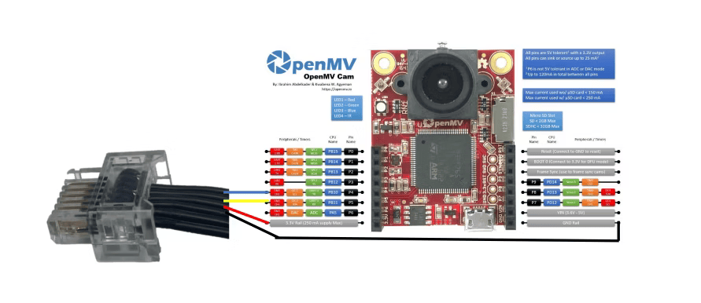
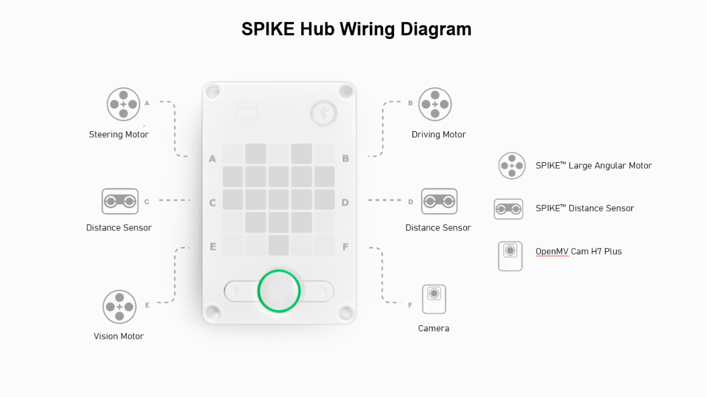

Electromechanical diagrams
====

## 🔌 Hardware Connection: UART via SPIKE Port

  
|  |
|:---------------------:|
| Figure .   Camera Connection Wiring Diagram

Wire Connection is as follows: 

---

|  |
|:---------------------:|
| Figure .   SPIKE™ Prime Hub Wiring Diagram

