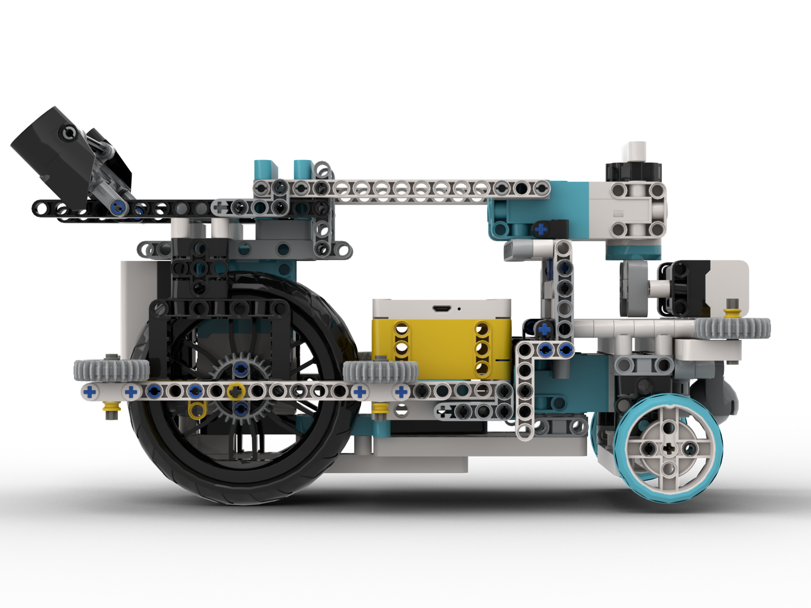

Vehicle's photos
====

### Robot Actual Photos

|  |  |
|:---------------------:| :---------------------:|
| 
 Front View 
 | 
 Rear View 
|  

|  |  |
|:---------------------:| :---------------------:|
| 
 Left View 
 | 
 Right View 
| 

|  |  |
|:---------------------:| :---------------------:|
| 
 Top View 
 | 
 Bottom View 
| 

---

### Robot 3D Model

|  |  |
|:---------------------:| :---------------------:|
| 
 Front View 
 | 
 Rear View 
|  

|  |  |
|:---------------------:| :---------------------:|
| 
 Left View 
 | 
 Right View 
| 

|  |  |
|:---------------------:| :---------------------:|
| 
 Top View 
 | 
 Bottom View 
| 
